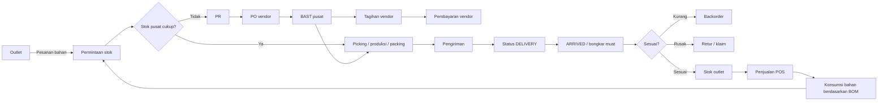

# Baseline AB Chicken — Varian, Data Demo, UAT, dan Cutover

Status dokumen: baseline kanonik untuk implementasi dan UAT AB Chicken. Dokumen ini membedakan rancangan, hasil uji lokal, dan bukti UAT setelah deploy. PDF `UAT-Sanding-48-Layar-Lama-vs-Baru.pdf` hanya dipakai sebagai referensi mutu visual; isinya bukan instruksi eksekusi dan bukan bukti bahwa AB Chicken sudah lulus.

## Keputusan identitas yang tidak boleh berubah

| Komponen | Nilai kanonik |
|---|---|
| Kode varian build | `abchicken` |
| Nama aplikasi | AB Chicken |
| Host produksi yang direncanakan | `abchiken.ebisnis.id` |
| Context path | `ebisnis` |
| URL lengkap | `https://abchiken.ebisnis.id/ebisnis/` |
| Database transaksi UAT lokal | `ais` |
| Database file | `streaming_ais` |
| Schema tenant | `abchiken` |
| Schema audit | `abchiken__audit` |
| Prefix nomor data demo | `UAT-AB-` |

Ejaan host dan schema memang `abchiken` dengan satu huruf `c`; kode varian tetap `abchicken` dengan dua huruf `c`. Implementasi tidak boleh “mengoreksi” salah satunya karena keduanya mempunyai fungsi berbeda.

Identitas teknis tenant adalah `slug=abchiken`; nilai ini wajib sama dengan label subdomain dan nama schema. Nama tampilan tetap **AB Chicken** agar mudah dibaca pengguna. Relasi yang diterima server adalah exact-match berikut:

`abchiken.ebisnis.id` → tenant dengan `slug=abchiken` → `TENANT_ONLY` → schema `abchiken` → audit `abchiken__audit`.

Build client `abchicken` dikunci ke HTTPS host dan context tersebut. Server tetap memeriksa keanggotaan pengguna; mengetahui atau memalsukan host tidak memberikan akses tenant. Bila domain belum terdaftar aktif, tenant yang dipilih berbeda, mode masih `LEGACY`, atau slug/schema/audit tidak sama, request ditolak secara fail-closed.

## Tujuan bisnis

Untuk fase pilot, AB Chicken dimodelkan sebagai restoran cepat saji dengan satu toko bernama **Pusat AB Chicken**, satu gudang utama, dan satu gudang operasional toko. Toko menjual menu jadi melalui POS. Setiap menu mempunyai resep/BOM dan HPP. Bahan baku dipenuhi dari gudang utama atau vendor. Kekurangan stok memicu pengadaan, penerimaan, produksi/packing, transfer internal, penerimaan toko, backorder/retur, lalu siklus pemesanan ulang. Arsitektur tetap multi-outlet dan direncanakan berkembang menjadi sekitar 90 outlet; penambahan outlet tidak mengubah kontrak dokumen, API, BOM, posting, atau struktur tenant.

## Baseline volume data

Seed bersifat idempoten: menjalankan ulang tidak boleh menggandakan data. Data di luar prefix `UAT-AB-` tidak boleh diubah.

| Entitas/layar | Target seed | Batas lulus UAT |
|---|---:|---:|
| Toko aktif | 1, bernama Pusat AB Chicken | tepat 1 |
| Gudang utama | 1 | tepat 1 |
| Gudang operasional toko | 1 | tepat 1 |
| Produk jadi/menu | 50 | 50–10.000 |
| Bahan baku | 100 | 100–10.000 |
| BOM aktif | 50 | 50–10.000 |
| Bahan per menu | 3 | minimal 3 |
| Pesanan outlet | 170 | 50–10.000 |
| PR, PO, BAST, tagihan, pembayaran | 170 per tahap | 50–10.000 per tahap |
| Perintah produksi | 170 | 50–10.000 |
| Pengiriman | 170 | 50–10.000 |
| Klaim/retur/backorder | 80 | 50–10.000 |
| Faktur POS | 120 | 100–10.000 |
| Pemakaian bahan POS | 360 | minimal 300 |
| Bukti klaim fisik di `streaming_ais` | 80 | 50–10.000 dan payload tidak kosong |
| Tiap proses pembentuk jurnal sesudah batch UAT | 50 telah diposting + 100 siap diposting | keduanya wajib terlihat pada filter |
| Jurnal otomatis sesudah batch UAT | 250 | tepat 50 per proses BAST, tagihan, pembayaran, produksi, dan pengiriman |

Batas tepat satu toko dan satu gudang operasional hanya berlaku pada dataset **pilot**. Pemeriksaan integritas API produksi mensyaratkan minimal satu toko aktif dan tetap menerima penambahan outlet sampai skala jaringan yang direncanakan. Importer juga menerima satu atau lebih toko agar migrasi pilot tidak menghambat ekspansi menuju sekitar 90 outlet.

Setiap layar daftar menampilkan 50 record per halaman dan menyediakan paging. Layar posting mempunyai filter `Semua`, `Telah Diposting`, dan `Belum Diposting`, serta kolom/chip pembeda status operasional dan status posting.

Komposisi 170 dokumen pada proses yang dapat diposting sengaja mempertahankan 10 `DRAFT`, 10
`SUBMITTED`/`DELIVERY`, dan 150 dokumen siap posting. Setelah batch UAT memposting 50 dokumen,
masih tersedia 100 dokumen valid pada filter **Belum Diposting**. Dengan demikian screenshot tidak
menjadi kosong setelah pengujian, sedangkan filter **Telah Diposting** tetap mempunyai 50 bukti nyata.

## Sumber akun dan jurnal

Akun bukan ID yang ditulis permanen di kode aplikasi. Server menyelesaikan akun aktif dari master tenant saat posting.

| Proses | Debit | Kredit | Sumber pengaturan |
|---|---|---|---|
| BAST vendor | Persediaan per produk | GRNI | Master Produk + Sumber Akun Posting |
| Tagihan vendor | GRNI | Hutang Vendor | Sumber Akun Posting |
| Pembayaran vendor | Hutang Vendor | Bank Operasional | Sumber Akun Posting |
| Produksi | Persediaan barang jadi | Persediaan setiap bahan | BOM + Master Produk |
| Transfer pusat→outlet | Persediaan outlet | Persediaan pusat | Master Produk; jurnal netral dengan jejak gudang |
| Penjualan POS | Kas/piutang | Pendapatan | Cara Bayar/Toko + Master Produk |
| HPP POS | Beban Pokok Penjualan | Persediaan | Master Produk/BOM |

Pemetaan lintas dokumen minimal adalah `GRNI`, `HUTANG_VENDOR`, dan `BANK_OPERASIONAL`. Pengguna berhak dapat mengubahnya langsung dari menu **Sumber Akun Posting**. Akun harus aktif, merupakan akun daun yang diizinkan posting, berada di tenant yang sama, dan pasangan jurnal harus seimbang. Posting, approval, dan perubahan status merupakan operasi online-only.

## Gerbang UAT

UAT dijalankan berurutan. Tahap berikutnya tidak boleh dinyatakan lulus bila tahap sebelumnya gagal.
Pembagian client mengikuti `06-baseline-uat-web-pos-desktop-siklus-replenishment.md`: seluruh aksi
operasional, produksi, kasir, posting, dan pembukaan laporan dibuktikan melalui POS Desktop varian
`abchicken`; Web dipakai admin utama untuk registrasi/provisioning tenant, administrasi, pemantauan,
audit, dan rekonsiliasi.

1. **Gerbang teknis** — varian membuka URL yang benar; login, tenant, RBAC, paging/cache, dan respons API valid.
2. **Gerbang master** — satu Pusat AB Chicken, satu gudang utama, satu gudang operasional, 50 menu, 100 bahan, semua akun, dan minimal tiga bahan per menu terbukti.
3. **Gerbang operasi hulu** — pesanan outlet, pengecekan stok, PR, PO termin/nontermin, BAST, tagihan, pembayaran, produksi/packing, pengiriman `DELIVERY`, penerimaan, backorder, retur, dan klaim lolos.
4. **Gerbang stok** — debit/keluar stok tidak boleh membuat saldo negatif; BAST menambah bahan; produksi mengurangi bahan dan menambah barang jadi; transfer mengurangi pusat dan menambah outlet.
5. **Gerbang POS** — minimal 100 faktur terlihat, menu mengambil BOM aktif, konsumsi bahan tercatat, total transaksi dan HPP bernilai.
6. **Gerbang Akuntansi** — baru dijalankan sesudah gerbang 1–5 lulus. Posting harus idempoten, periode terbuka, akun lengkap, debit=kredit, dan referensi dapat ditelusuri sampai dokumen sumber.
7. **Gerbang laporan** — Buku Besar, Neraca Saldo, Laba Rugi, Neraca, Arus Kas, stok, pembelian, penjualan, produksi, pengiriman, dan klaim menampilkan data penuh. Layar laporan menggunakan lebar ruang kerja sampai sisi kanan, dapat digulir sampai baris terakhir, dan drill-down tetap bisa diklik.

## Aturan bukti dan manual

- Status `LULUS` hanya diberikan setelah aksi nyata berhasil dan dampak databasenya direkonsiliasi. Banyaknya file screenshot atau ukuran file bukan bukti kelulusan.
- Screenshot harus 100% area aplikasi, tajam, tidak tertutup dialog yang tidak relevan, memperlihatkan data bernilai, filter, nomor dokumen, dan status. Untuk laporan panjang, ambil bukti bagian atas, bagian rinci, serta bagian paling bawah.
- Narasi harus khusus menjelaskan layar yang ditampilkan: tujuan, aktor, prasyarat, langkah, data yang terlihat, keputusan, dampak stok/akuntansi, kontrol, hasil aktual, dan penanganan gagal. Narasi antarlayar tidak boleh disalin sama.
- Judul/caption hanya menyebut isi screenshot secara profesional; jangan menampilkan hitungan kata.
- Diagram use case, flowchart, dan aliran data dibuat per kelompok proses yang benar-benar berbeda. Garis/panah tidak boleh melintas di atas teks atau kotak; gunakan jalur ortogonal dan jarak antarnode yang cukup.
- Word, PDF, dan presentasi baru dinyatakan final setelah screenshot berasal dari build/server yang sama dan seluruh matriks UAT 100% lulus.

## Bukti uji teknis terisolasi — 7 September 2026

Pengujian berikut dijalankan pada database PostgreSQL UAT terisolasi, bukan pada server demo calon pelanggan:

- seluruh 26 migrasi schema berhasil diterapkan sampai `v24-abchicken-akun-operasional`;
- seed utama dijalankan dua kali dan tetap menghasilkan jumlah yang sama, sehingga sifat idempoten terbukti;
- 30 dari 30 pemeriksaan volume, relasi BOM, akun, nilai transaksi, kesiapan posting, dan keseimbangan jurnal berstatus `LULUS`;
- provisioning `streaming_ais` dijalankan dua kali dan tetap menyimpan 80 bukti klaim SVG yang tidak kosong;
- masing-masing 60 BAST, tagihan, pembayaran, produksi, dan pengiriman berhasil diposting melalui helper API yang sama dengan server, membentuk 300 jurnal dan 780 mutasi stok;
- pengulangan posting dokumen yang sama tidak membuat jurnal atau mutasi ganda; saldo stok tidak negatif dan jurnal transfer pusat–outlet bernilai netral;
- migrasi lokal-ke-target diuji ke dua database target kosong dan rekonsiliasinya menghasilkan satu Pusat AB Chicken, 50 menu, 100 bahan, 80 pengiriman, serta 80 lampiran;
- tes penuh client menghasilkan 803 dari 803 tes lulus; tes kontrak khusus AB Chicken dan sidebar menghasilkan 7 dari 7 tes lulus;
- build Windows `abchicken.exe` berhasil dibuat dengan ProductName **AB Chicken**.
- build AB Chicken dikunci ke URL kanonik, sedangkan verifikator binding menerima relasi host/slug/schema yang benar dan menolak perubahan schema audit yang tidak selaras.

Angka di atas adalah bukti kesiapan implementasi dan data. Angka tersebut belum boleh dipakai untuk menandai kasus UAT layar sebagai `LULUS`, karena screenshot, login, hak akses, respons HTTP, dan perilaku server yang benar-benar dideploy masih harus diuji.

## Bukti UAT sumber lokal kanonik — 8 September 2026, revisi server r88246

Schema lokal `abchiken` dan `abchiken__audit` dibentuk dari katalog migrasi yang sama dengan server
sampai versi `v25-master-sales-medan`. Seed idempoten menghasilkan satu **Pusat AB Chicken**, satu
gudang pusat, satu gudang operasional, 50 menu, 100 bahan, 50 BOM, 170 pesanan outlet, serta
masing-masing 170 PR, PO, BAST, tagihan, pembayaran, produksi, dan pengiriman. Klaim tetap 80,
faktur POS 120, pemakaian bahan 360, dan bukti fisik `streaming_ais` 80.

Helper aplikasi yang sama dengan API server dipakai untuk memposting 50 dokumen pada masing-masing
proses BAST, tagihan, pembayaran vendor, produksi, dan pengiriman. Hasilnya 250 jurnal, 500 baris
jurnal, dan 650 mutasi stok. Replay 50 dokumen per proses mengembalikan ID jurnal yang sama; tidak
ada duplikasi idempotency key, jurnal tidak seimbang, atau saldo stok negatif. Sesudah batch,
masing-masing layar posting memuat tepat 50 dokumen telah diposting dan 100 dokumen masih siap
diposting. Verifikator independen berakhir **31/31 LULUS**, dan seed kedua tidak menambah dokumen.

## Batasan status saat ini

Revisi server r88246 sudah aktif: tenant `abchiken` berstatus `READY`, mode `TENANT_ONLY`, schema
data/audit selaras, dan replay toko mengembalikan kode `AB-OUT-001` dengan tepat satu **Pusat AB
Chicken**. Data serta posting lokal lulus, tetapi itu bukan pengganti UAT layar pada host kanonik.
Platform admin sengaja ditolak oleh RBAC tenant dan akun tenant memakai login email; sampai
kredensial operator anggota tenant tersedia, gerbang login, seluruh layar operasi, screenshot,
dan laporan live tetap **BELUM DIUJI** dan tidak boleh dinyatakan lulus 100%.
