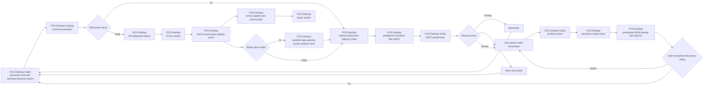
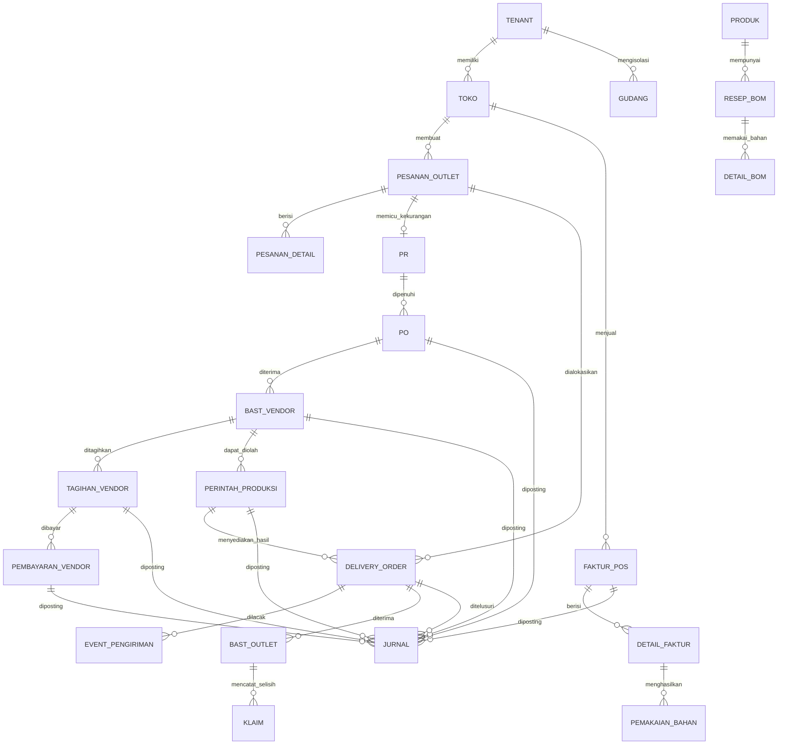

# Baseline UAT POS Desktop dan Web Admin Siklus Replenishment AB Chicken

Dokumen ini menetapkan urutan pengujian dan standar bukti untuk siklus operasional AB Chicken dari
permintaan bahan baku sampai penjualan di kasir, posting akuntansi, laporan, kemudian kembali ke
permintaan berikutnya. Dokumen ini menggantikan pembagian client pada baseline sebelumnya: seluruh
proses operasional dijalankan dan dibuktikan melalui aplikasi **POS Desktop** varian `abchicken`.
Aplikasi Web hanya digunakan oleh admin utama untuk registrasi/provisioning tenant, pengaturan
administratif, pemantauan proses, audit, dan rekonsiliasi. Web tidak menjadi jalur alternatif untuk
menyelesaikan transaksi UAT operasional.

UAT Desktop baru dimulai setelah master dan data contoh dinyatakan settle pada tenant. Screenshot
hanya boleh diberi status lulus setelah tindakan nyata berhasil, status proses berubah, dampak stok
atau jurnal dapat ditelusuri, dan hasilnya terbaca kembali dari server. Seluruh bukti dirangkai menjadi
manual pengguna Word dan PDF yang mengikuti alur kerja pengguna Desktop.

Baseline identitas tenant tetap mengikuti `00-baseline-rencana-dan-uat.md`: host
`abchiken.ebisnis.id`, context path `ebisnis`, slug dan schema `abchiken`, audit
`abchiken__audit`, mode `TENANT_ONLY`, dan toko pilot **Pusat AB Chicken**. Ejaan teknis tersebut
tidak boleh diubah oleh client Web maupun Desktop.

## Urutan gerbang

| Gerbang | Client | Ruang lingkup | Syarat beralih ke gerbang berikutnya |
|---|---|---|---|
| A1 | Web Admin | Registrasi/provisioning tenant, verifikasi, role, toko pilot, dan pemantauan | Tenant `abchiken` terisolasi; Pusat AB Chicken serta seluruh master bernilai |
| D1 | POS Desktop | Aktivasi endpoint, login, cache, toko, katalog, akun, BOM, dan sinkronisasi | Binding client tepat; 50 menu dan 100 bahan berasal dari tenant |
| D2 | POS Desktop | Outlet membuat dan mengajukan pesanan bahan ke gudang pusat | Sedikitnya 50 dokumen bernilai dan dapat ditelusuri berdasarkan nomor referensi |
| D3 | POS Desktop | Gudang memeriksa stok; cabang stok cukup atau PR–PO–BAST–tagihan–pembayaran | Dokumen dan status antartahap cocok; tidak ada mutasi parsial |
| D4 | POS Desktop | Produksi/packing pusat bila diperlukan, picking, BAST gudang, Delivery Order, dan DELIVERY | Stok, hasil produksi, koli, tujuan, dan riwayat pengiriman konsisten |
| D5 | POS Desktop | BAST outlet, backorder/retur/klaim, produksi outlet, dan penjualan kasir | Stok baik bertambah; konsumsi BOM dan faktur server terbukti |
| D6 | POS Desktop | Posting, jurnal, Buku Besar, Laba Rugi, Neraca, Arus Kas, dan laporan operasional | Debit sama dengan kredit; drill-down mencapai dokumen sumber dan baris terbawah terlihat |
| R1 | Siklus ulang | Stok mencapai reorder point dan membentuk pesanan berikutnya | Tidak ada permintaan atau jurnal ganda |
| W2 | Web Admin | Memantau status akhir, audit, dan rekonsiliasi lintas proses | Web menampilkan hasil server yang sama tanpa mengubah transaksi operasional |

Kegagalan satu gerbang menahan gerbang setelahnya. Pengujian tidak boleh melewati langkah gagal
dengan mengubah tabel langsung atau memberi status lulus berdasarkan respons API saja. Web boleh
dipakai untuk membaca status dan audit, tetapi bukan untuk menggantikan tindakan yang seharusnya
dilakukan oleh operator POS Desktop.

## Pembagian tanggung jawab client

| Fungsi | POS Desktop | Web Admin |
|---|---|---|
| Pesanan bahan outlet | Menjalankan seluruh aksi dan menyimpan bukti | Memantau status dan audit |
| Pemenuhan gudang dan pengadaan | Stok, PR, PO, BAST, tagihan, dan pembayaran | Memantau antrean dan pengecualian |
| Produksi/packing | Membuat perintah, konsumsi bahan, hasil, dan penutupan | Memantau hasil dan stok |
| Delivery Order dan penerimaan outlet | Picking, kirim, DELIVERY, BAST, backorder, retur/klaim | Memantau perjalanan status |
| Produksi outlet dan penjualan kasir | Menjalankan BOM, transaksi, pembayaran, dan sinkronisasi | Memantau omzet serta anomali |
| Akuntansi dan laporan | Pratinjau, posting, jurnal, serta membuka laporan | Rekonsiliasi/audit oleh admin utama |
| Registrasi dan administrasi tenant | Tidak tersedia | Fungsi utama Web |

Pemisahan ini mencegah bukti UAT tercampur. Nomor dokumen tetap boleh diperiksa dari Web oleh admin,
namun screenshot langkah pengguna, tombol yang diklik, dan hasil operasional harus berasal dari POS
Desktop.

## Alur bisnis yang diuji



Cabang stok cukup membuktikan bahwa Delivery Order tidak selalu menunggu pengadaan. Cabang stok
tidak cukup membuktikan rantai PR, PO, BAST, tagihan, dan pembayaran vendor. Cabang produksi pusat
dipakai untuk bahan yang harus dikemas atau diolah lebih dahulu, misalnya saus curah menjadi kemasan
operasional. Ketiga cabang wajib mempunyai nomor dokumen sendiri dan tetap menelusur ke pesanan
outlet yang sama.

Web Admin berada di luar jalur transaksi di atas. Web membaca status server untuk pengawasan dan
audit, sehingga penggunaan Web tidak mengubah siapa yang menjalankan langkah operasional.

## Aliran data dan relasi utama



Relasi tersebut adalah model bisnis ringkas, bukan salinan skema fisik. Kunci pembuktian berada pada
nomor referensi: pesanan outlet harus ditemukan pada alokasi atau PR; PO harus ditemukan pada BAST;
BAST harus ditemukan pada stok dan tagihan; Delivery Order harus ditemukan pada BAST outlet; faktur
POS harus ditemukan pada pemakaian bahan dan jurnal. Semua entitas wajib berasal dari schema tenant
yang sama.

## Skenario UAT end-to-end

### 1 Pesan bahan baku outlet ke gudang pusat

Di POS Desktop, operator outlet memilih Pusat AB Chicken sebagai tujuan, menambahkan bahan dan kuantitas, menyimpan
draft, lalu mengajukan pesanan. Daftar harus menampilkan sedikitnya 50 record bernilai dengan kolom
nomor, tanggal, outlet, tujuan, jumlah baris, nilai, dan status. Uji negatif memastikan outlet tidak
dapat memilih gudang tenant lain atau mengajukan detail kosong.

### 2 Pemenuhan atau pengadaan di gudang pusat

Di POS Desktop, petugas gudang menerima pesanan dan memeriksa saldo. Sampel pertama memakai bahan yang tersedia dan
langsung membentuk alokasi serta Delivery Order. Sampel kedua memakai bahan yang kurang dan harus
membentuk PR, PO termin atau nontermin, BAST vendor, penerimaan tagihan, serta pembayaran. Setiap
halaman menampilkan minimal 50 record; halaman posting juga memperlihatkan filter Semua, Telah
Diposting, dan Belum Diposting beserta kolom status pembeda.

### 3 Produksi atau packing di gudang pusat

Melalui POS Desktop, operator memilih BOM aktif untuk bahan yang perlu diolah, memeriksa bahan tersedia, menjalankan
perintah produksi, mencatat hasil dan susut, kemudian menutup proses. Uji contoh menggunakan saus
curah yang diubah menjadi kemasan outlet. Stok bahan harus turun sesuai konsumsi dan stok hasil harus
naik sesuai kuantitas baik. Kekurangan bahan, BOM tidak aktif, atau hasil negatif wajib ditolak tanpa
mutasi parsial.

### 4 Delivery Order dan pengiriman

Di POS Desktop, Delivery Order mengambil alokasi dari pesanan yang sah. Petugas melakukan picking, pemeriksaan,
packing, lalu mengubah status menjadi DELIVERY. Bukti harus menampilkan asal, tujuan, kendaraan atau
petugas, jumlah koli, item, waktu kirim, dan riwayat status. Desain menyisakan integrasi GPS sebagai
pengembangan; status UAT sekarang tidak boleh mengklaim pelacakan realtime bila belum tersedia.

### 5 BAST penerimaan outlet

Operator outlet membuka Delivery Order yang sama di POS Desktop dan mencatat kuantitas baik, kurang, serta rusak. Stok outlet
hanya bertambah sebesar jumlah baik. Kekurangan membentuk backorder, sedangkan kerusakan membentuk
retur atau klaim dengan bukti. Jumlah dikirim harus dapat direkonsiliasi menjadi jumlah baik,
kekurangan, dan rusak tanpa selisih tersembunyi.

### 6 Produksi outlet dan penjualan POS

Outlet memakai POS Desktop untuk memproduksi atau merakit menu dari bahan yang diterima ketika ada pesanan pelanggan.
POS harus menampilkan tepat toko aktif, empat kategori menu, 50 produk jadi, harga tenant, dan status
stok berdasarkan BOM. Kasir menambahkan menu, memilih pembayaran, menerima uang, dan menyelesaikan
checkout. Server harus membentuk faktur, detail faktur, serta minimal tiga pemakaian bahan per menu
tanpa mempercayai harga, akun, atau total yang dihitung client.

### 7 Posting dan kembali ke pemesanan

Akuntansi bekerja dari POS Desktop untuk memeriksa sumber akun, memuat pratinjau, lalu memposting
penjualan dan HPP. Jurnal penjualan
mendebet kas atau piutang dan mengkredit pendapatan; jurnal HPP mendebet beban pokok dan mengkredit
persediaan. Buku Besar dan laporan keuangan dibuka dari POS Desktop dan harus menampilkan dampaknya
sampai baris terbawah. Setelah saldo bahan melewati
titik minimum, sistem membentuk kebutuhan pemesanan berikutnya tanpa menggandakan permintaan yang
masih terbuka. Siklus baru kembali ke langkah pertama dengan nomor dokumen berbeda.

## Kontrol POS Desktop dan rekonsiliasi Web Admin

| Kontrol | POS Desktop | Pemeriksaan Web Admin | Kriteria lulus |
|---|---|---|---|
| Endpoint | Varian `abchicken` terkunci ke host kanonik | Domain dan tenant terlihat benar | Tidak memakai endpoint varian lain |
| Tenant dan toko | Diselesaikan server setelah aktivasi/login | Admin memeriksa slug, schema, status, dan toko | Hanya Pusat AB Chicken pada pilot |
| Katalog | Cache lokal dari payload tenant-native | Admin memeriksa master sumber | 50 produk, empat kategori, tanpa produk global |
| Harga | Server memvalidasi saat checkout/sinkronisasi | Admin meninjau anomali | Manipulasi harga client ditolak |
| Stok dan BOM | Cache untuk tampilan; mutasi dikirim ke server | Admin merekonsiliasi saldo dan audit | Penjualan mengurangi minimal tiga bahan |
| Idempotensi | Kunci stabil selama retry sinkronisasi | Admin memastikan satu dokumen server | Klik/retry ganda menghasilkan satu faktur |
| Offline | Transaksi yang diizinkan antre lokal dengan status transparan | Web hanya membaca dokumen yang sudah diterima server | Approval/posting tetap online-only |
| Riwayat | Sesudah sinkron menampilkan nomor server | Admin menelusuri nomor yang sama | Total, cara bayar, status, dan referensi sama |

## Standar screenshot dan anotasi

Screenshot proses operasional wajib berasal dari POS Desktop dan memakai area aplikasi penuh pada
resolusi yang dapat dibaca. Screenshot Web hanya dipakai untuk registrasi/provisioning tenant,
administrasi utama, pemantauan, audit, dan rekonsiliasi. Bukti daftar harus
menampilkan data, filter, paging, serta status; bukti laporan panjang diambil pada bagian atas,
bagian detail, dan baris paling bawah. Gambar tidak boleh menggunakan layar kosong sebagai bukti
kelulusan.

Anotasi manual menggunakan nomor langkah, garis tepi, dan panah berwarna kontras. Ujung panah harus
berhenti di sisi luar tombol atau field yang dijelaskan, tidak melintang di atas teks, angka, atau
ikon. Nomor anotasi dipasangkan dengan penjelasan tepat di bawah gambar: tindakan pengguna, alasan
tindakan, hasil yang diharapkan, dan cara menangani pesan gagal. Satu gambar boleh memiliki beberapa
penanda bila semua berada pada satu konteks kerja; gambar dipecah bila penanda mulai menutupi data.

Narasi wajib spesifik terhadap layar. Narasi menjelaskan tujuan, aktor, prasyarat, tombol yang
diklik, nilai contoh, perubahan status, dampak stok atau akuntansi, hasil aktual, serta hubungan ke
langkah sebelum dan sesudahnya. Narasi tidak boleh disalin antarscreenshot dan tidak menampilkan
hitungan kata pada judul atau caption.

## Struktur bukti dan keluaran

Bukti kerja disiapkan di `E:\opt\Codex-Worspace\abchicken-uat-r88343` agar tidak menimpa workspace
sesi lain. Artefak final dan source dokumentasi ditempatkan di
`C:\opt\AIS\ais\src\main\docs\abchicken\`. Struktur yang digunakan:

```text
abchicken/
  evidence-web-admin/
  evidence-desktop/
  diagrams/
  hasil-uat-pos-desktop-dan-monitoring-web.md
  Manual-UAT-E2E-AB-Chicken-POS-Desktop.docx
  Manual-UAT-E2E-AB-Chicken-POS-Desktop.pdf
```

File final hanya dibuat setelah seluruh matriks mempunyai bukti aktual. DOCX dirender ke gambar per
halaman dan ditinjau agar tidak ada teks, tabel, gambar, atau panah yang terpotong dan saling tumpang
tindih. PDF ditinjau ulang pada seluruh halaman. Seluruh file source, bukti terpilih, dan artefak
final kemudian di-commit ke SVN secara terkontrol.

## Status pelaksanaan 9 September 2026

Baseline ini telah dijalankan melalui POS Desktop Windows varian `abchicken` versi 1.34.27 build 190.
Gate kontrak client lulus 33 dari 33 pengujian. Gate data lulus 19 dari 19 pemeriksaan dengan 50 produk,
100 bahan baku, 50 relasi BOM, dan sedikitnya 50 record bernilai pada setiap halaman proses. Gate aksi
memproses pesanan outlet, PR, PO, BAST vendor, tagihan, pembayaran, produksi, pengiriman, klaim, dan
penjualan POS dari dokumen DRAFT sampai status akhir yang sah. Enam jurnal baru terbentuk dengan ID
301 sampai 306.

Gate laporan juga lulus. Keseluruhan Jurnal dan Buku Besar masing-masing menampilkan 594 baris; Neraca
Saldo, Laba Rugi, Neraca, serta Arus Kas dapat dibuka dari POS Desktop. Total debit dan kredit sama
sebesar Rp1.422.723.912,50 dan Neraca mempunyai selisih nol. Arus Kas menghitung benar, namun saldo
akhir kas/bank pilot negatif karena saldo awal belum dimuat. Saldo awal wajib dimasukkan sebelum data
pilot digunakan sebagai pembukuan produksi.

Bukti lengkap, manual Word/PDF, screenshot asli dan beranotasi, diagram, CSV hasil otomasi, serta
script reproduksi tersedia di folder `uat-pos-desktop-e2e-20260909`. Perubahan pengaman respons
asinkron pada halaman Pusat Operasi perlu disertakan pada build POS Desktop berikutnya; perbaikan ini
tidak memerlukan deploy ulang Tomcat eBisnis.
