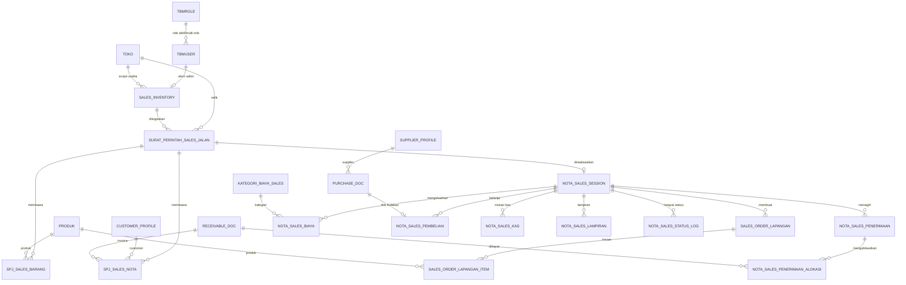

# ERD DAN SPESIFIKASI DATA
## POS Inventory & Sales Lapangan — Flutter + Server Java AIS

**Workspace Flutter:** `C:\opt\CodeBaseDesktopDanMobile\`  
**Repository Flutter:** `Zishof/zishof-platform`  
**Server Java:** repository `Zishof/AIS`, target branch harus diverifikasi sebelum eksekusi  
**Tujuan:** menambah varian `inventory_sales` tanpa membuat backend atau aplikasi POS kedua yang terpisah secara logika.

---

## 1. Prinsip pemodelan

1. Reuse `Tbmuser`, `Tbmrole`, `Toko`, `Produk`, `AnggotaKoperasi`/customer existing, `PemasokProduk`/supplier existing, cara pembayaran, sesi kas, dan transaksi existing apabila semantiknya benar.
2. Jangan menambahkan kolom ke entitas existing hanya karena nama tampak mirip. Buat profil/extension entity bila semantik berbeda.
3. Seluruh entity transaksi baru:
   - `@Audited`;
   - `dynamicInsert=true`, `dynamicUpdate=true`;
   - uang/kuantitas memakai `BigDecimal`;
   - tanggal bisnis dan timestamp teknis dipisahkan;
   - status berupa konstanta teks yang tervalidasi;
   - mempunyai `version`, `createdBy`, `updatedBy`, `correlationId`, dan `idempotencyKey` bila relevan.
4. Gunakan schema existing yang telah dipakai domain POS/Inventory setelah audit lokal. Rekomendasi awal adalah schema `koperasi`; jangan membuat schema baru tanpa keputusan arsitektur.
5. Penghapusan fisik transaksi posted dilarang. Gunakan `CANCELLED`, `REVERSED`, atau record pembalik.
6. Nomor dokumen adalah teks dan tidak boleh dibentuk dari `MAX+1` tanpa penguncian/sequence.

---

## 2. ERD target



Nama `CUSTOMER_PROFILE`, `SUPPLIER_PROFILE`, `RECEIVABLE_DOC`, dan `PURCHASE_DOC` bersifat konseptual. Codex/Claude wajib memetakan ke entity existing setelah audit. Jangan membuat duplikat bila entity existing sudah memadai.

---

## 3. Tabel inti

### 3.1 `sales_inventory`

| Kolom | Tipe rekomendasi | Aturan |
|---|---|---|
| `id` | BIGINT | PK |
| `kode` | VARCHAR(30) | unik per toko, dipertahankan sebagai teks |
| `nama` | VARCHAR(255) | wajib |
| `tbmuser_id` | VARCHAR(255) | FK ke `Tbmuser.userId`; satu akun aktif maksimal satu profil sales per toko |
| `toko_id` | BIGINT | FK ke Toko; wajib |
| `nomor_perkiraan` | VARCHAR(50) | nullable sampai mapping COA disetujui |
| `area` | VARCHAR(255) | wilayah kerja |
| `telepon`, `alamat` | VARCHAR/TEXT | identitas |
| `target_bulanan` | NUMERIC(19,2) | default 0 |
| `limit_penagihan` | NUMERIC(19,2) | kontrol risiko |
| `aktif` | BOOLEAN | default true |
| `version` | BIGINT | optimistic locking |
| audit fields | berbagai | Envers + metadata aplikasi |

**Keamanan penting:** user Sales yang tidak memiliki `Pedagang` tidak boleh dianggap Admin. Resolver konteks harus menentukan admin dari role/privilege, bukan dari `toko == null`.

### 3.2 `surat_perintah_sales_jalan`

| Kolom | Tipe | Aturan |
|---|---|---|
| `id` | BIGINT | PK |
| `nomor` | VARCHAR(60) | nomor otomatis, unik, sequence aman |
| `toko_id` | BIGINT | scope |
| `sales_id` | BIGINT | sales ditugaskan |
| `tanggal_berangkat_rencana` | DATE/TIMESTAMP | wajib |
| `tanggal_mulai_aktual` | TIMESTAMP | saat sales menekan Mulai |
| `tanggal_kembali_aktual` | TIMESTAMP | saat kembali |
| `rute` | TEXT | wilayah/customer tujuan |
| `kendaraan` | VARCHAR(100) | opsional |
| `uang_muka_operasional` | NUMERIC(19,2) | kas awal |
| `catatan` | TEXT | permintaan user |
| `status` | VARCHAR(30) | state machine |
| `dibuat_oleh`, `disetujui_oleh` | FK Tbmuser | audit operasional |
| `version` | BIGINT | optimistic lock |
| `correlation_id` | VARCHAR(64) | penelusuran |
| `idempotency_key` | VARCHAR(80) | unik per command create |

**Rekomendasi nomor:** `SPJ-SLS/{KODE_TOKO}/{YYYYMM}/{000001}`. Bila bisnis menghendaki nomor Nota Sales terpisah, tambahkan `nomor_nota_sales`; jangan menggandakan dokumen sebelum UAT memutuskan.

### 3.3 `spj_sales_barang`

Memuat `produk_id`, lokasi asal, batch, expiry, kuantitas rencana, dimuat, terjual, kembali, rusak, hilang, HPP snapshot, harga jual default snapshot, status, alasan selisih, dan approval. Invariant:

```text
qty_dimuat = qty_terjual + qty_kembali + qty_rusak + qty_hilang + qty_masih_dibawa
```

Barang berpindah dari gudang/toko ke **lokasi stok mobil sales** melalui inventory movement, bukan sekadar catatan bebas.

### 3.4 `spj_sales_nota`

Menyimpan referensi invoice/piutang existing, customer, nilai awal, saldo saat assignment, jatuh tempo, sales snapshot, status assignment, hasil kunjungan, janji bayar, alasan gagal, dan nilai tertagih. Satu invoice tidak boleh aktif dibawa dua sesi berbeda kecuali ada approval eksplisit.

### 3.5 `nota_sales_session`

Satu realisasi untuk satu SPJ. Kolom: nomor, SPJ, status, waktu mulai/kembali/tutup, saldo kas awal, total penerimaan tunai/non-tunai, total biaya, total pembayaran pembelian, total setoran, selisih kas, catatan penutupan, dan approval owner.

### 3.6 `sales_order_lapangan` dan item

Gunakan wrapper/link ke draft/order existing bila memungkinkan. Status:

```text
DRAFT
PESAN
CONFIRMED
READY_TO_DELIVER
DELIVERED
INVOICED
READY_TO_COLLECT
PARTIAL_PAID
PAID
OVERDUE
CANCELLED
RETURNED
```

Order tidak menambah piutang sampai invoice/posting. Pengiriman menimbulkan movement stok sesuai kebijakan. Invoice menyimpan snapshot customer, sales, harga, HPP, batch, expiry, termin, dan due date.

### 3.7 `nota_sales_penerimaan` dan alokasi

Header menyimpan metode, akun kas/bank, nilai diterima, bukti, koordinat opsional, local ID, server ID, status sync. Detail alokasi menghubungkan satu penerimaan ke satu atau banyak invoice. Total alokasi tidak boleh melebihi total penerimaan maupun saldo invoice.

### 3.8 `nota_sales_biaya`

Kolom minimal: sesi, kategori, tanggal/waktu, uraian, nilai, metode bayar, penerima, nomor bukti, lampiran, koordinat opsional, status approval, akun beban, dibuat oleh, reversed by.

Kategori awal:

- Bensin/BBM
- Tol
- Parkir
- Makan/uang harian
- Bongkar muat
- Penginapan
- Servis darurat
- Administrasi
- Lain-lain

Kategori harus configurable; jangan membuat enum tertutup yang mengharuskan rilis aplikasi.

### 3.9 `nota_sales_pembelian`

Link ke Kulakan/Purchase existing. Menyimpan sesi, supplier, faktur, total faktur, nilai dibayar saat sesi, DP, sisa hutang, termin, jatuh tempo, tujuan stok (`MOBIL_SALES` atau gudang/toko), dan status. Hanya **nilai aktual dibayar/DP** yang mengurangi hasil bersih sesi; bagian kredit dilaporkan sebagai hutang baru.

### 3.10 `nota_sales_kas`

Ledger kas append-only: `OPENING_ADVANCE`, `COLLECTION_CASH`, `CASH_SALE`, `EXPENSE_CASH`, `PURCHASE_PAYMENT`, `OWNER_DEPOSIT`, `REFUND`, `ADJUSTMENT`, `REVERSAL`. Jangan menyimpan hanya total agregat tanpa ledger sumber.

---

## 4. Rumus laporan sesi

### 4.1 Rumus bisnis yang diminta

```text
HASIL_BERSIH_SESI =
    TOTAL_PIUTANG_BERHASIL_DIBAYAR
  - TOTAL_BIAYA_SESI
  - TOTAL_PEMBAYARAN_AKTUAL_PEMBELIAN_SALES
```

Catatan:
- Untuk pembelian kredit, jangan mengurangi seluruh nilai faktur; kurangi hanya kas/transfer/DP yang benar-benar dibayar pada sesi.
- Tampilkan `Total Nilai Pembelian`, `Dibayar/DP`, dan `Sisa Hutang` secara terpisah.
- Penerimaan transfer langsung ke rekening pemilik masuk hasil penagihan, tetapi tidak masuk kas fisik sales.

### 4.2 Rekonsiliasi kas

```text
KAS_FISIK_SEHARUSNYA =
    UANG_MUKA_AWAL
  + PENERIMAAN_PIUTANG_TUNAI
  + PENJUALAN_TUNAI
  + REFUND_TUNAI
  - BIAYA_TUNAI
  - PEMBAYARAN_PEMBELIAN_TUNAI
  - SETORAN_KE_PEMILIK

SELISIH_KAS = KAS_FISIK_AKTUAL - KAS_FISIK_SEHARUSNYA
```

Rumus hasil bisnis dan rekonsiliasi kas adalah dua hal berbeda; keduanya wajib ditampilkan.

---

## 5. Indeks dan constraint minimum

- unique `sales_inventory(toko_id, kode)`;
- unique partial/validated active `sales_inventory(toko_id, tbmuser_id, aktif=true)`;
- unique nomor SPJ;
- unique idempotency key per command type/scope;
- index SPJ `(toko_id, sales_id, status, tanggal_berangkat_rencana)`;
- index nota assignment `(invoice_id, status)`;
- index session `(sales_id, status, tanggal_mulai_aktual)`;
- index outbox `(status, next_retry_at)`;
- FK tidak boleh cascade-delete transaksi;
- check amount >= 0 kecuali ledger reversal yang eksplisit;
- optimistic locking pada master dan dokumen draft;
- posted snapshot immutable.

---

## 6. State machine

### Surat Perintah Sales Jalan

```text
DRAFT -> SUBMITTED -> APPROVED -> DISPATCHED/ACTIVE
ACTIVE -> RETURNED -> RECONCILING -> CLOSED
DRAFT/SUBMITTED -> CANCELLED
APPROVED -> CANCELLED hanya sebelum DISPATCHED dan dengan alasan
```

### Invoice/Nota dibawa

```text
READY -> ASSIGNED -> CARRIED
CARRIED -> UNPAID | PROMISE_TO_PAY | PARTIAL_COLLECTED | PAID | RETURNED | DISPUTED | LOST
PARTIAL_COLLECTED -> CARRIED | PAID | RETURNED
semua hasil -> RECONCILED -> CLOSED
```

### Barang dibawa

```text
PLANNED -> LOADED -> SOLD | RETURNED | DAMAGED | LOST | STILL_ON_HAND
semua hasil -> RECONCILED
```

### Sesi

```text
NOT_STARTED -> ACTIVE -> RETURNED -> RECONCILING -> CLOSED
ACTIVE -> SUSPENDED (exception)
```

Final `CLOSED` memerlukan online, rekonsiliasi, dan persetujuan Pemilik/Admin secara default.

---

## 7. Audit dan bukti

Setiap create/update/transition/print/export/reversal harus menyimpan:
- user, role aktif, sales, toko;
- device ID, local command ID, server command ID;
- waktu perangkat dan waktu server;
- sebelum/sesudah;
- alasan;
- lampiran;
- correlation ID dan idempotency key;
- status sinkronisasi;
- checksum laporan/snapshot bila dicetak.

