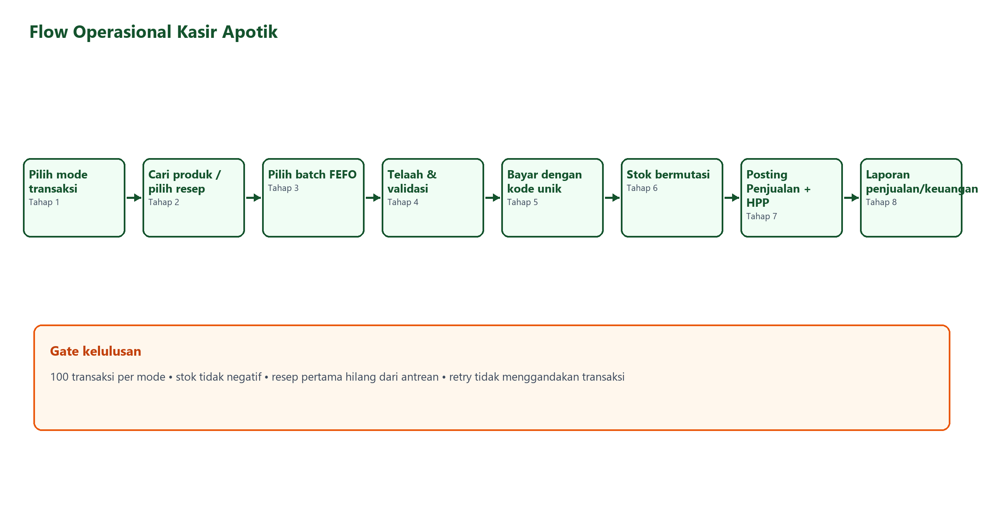
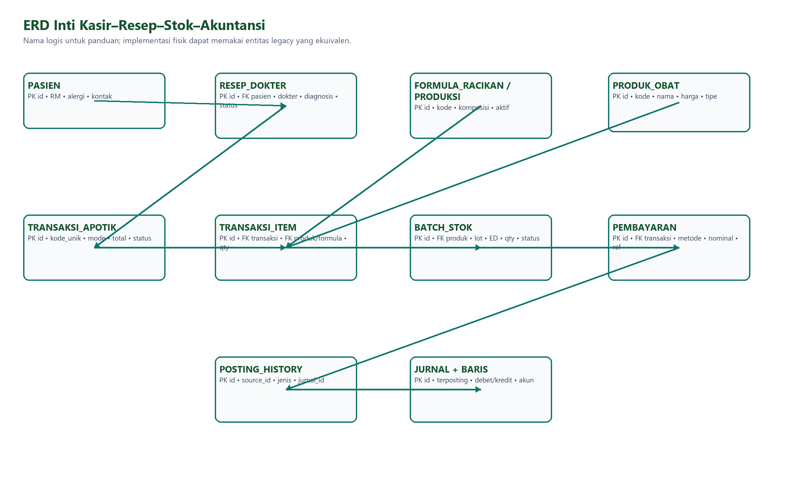
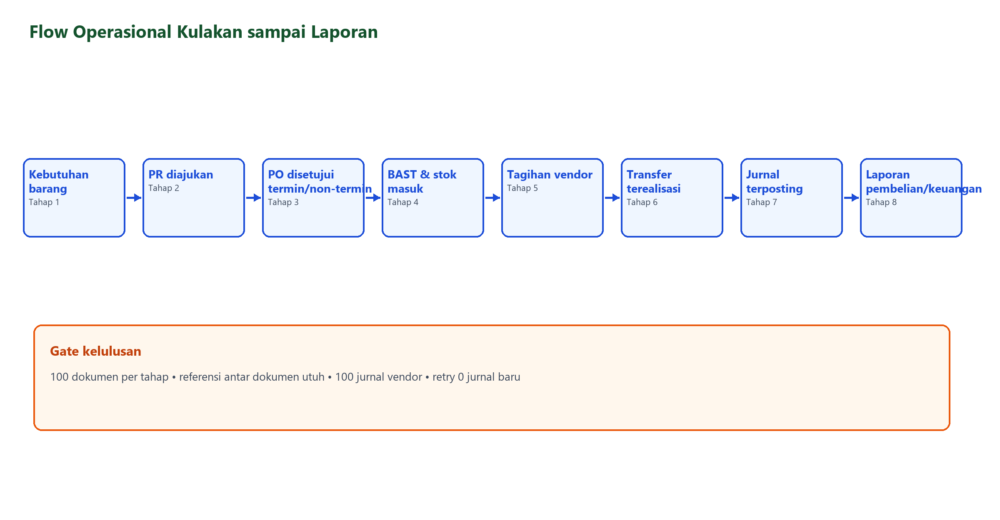
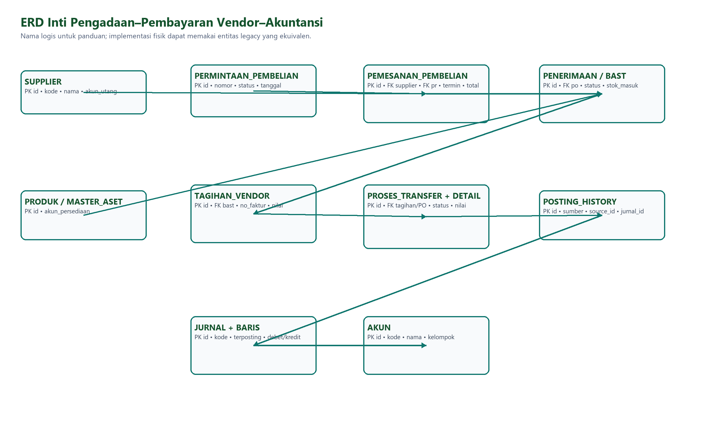

# Laporan UAT End-to-End Apotik

Tanggal pelaksanaan: 7 September 2026

Lingkungan: `https://demo.ecampus.id/ecampus/`

Rilis aplikasi: Apotik `1.35.1+189`

Backend tervalidasi: SVN `r87376`
Status akhir: **PASS**

## Ruang lingkup

UAT mencakup proses operasional Apotik dari penjualan, pengadaan/kulakan, pembayaran vendor, pembentukan dan posting jurnal, sampai laporan operasional dan akuntansi. Pengujian volume dijalankan melalui API live dengan data UAT bertanda khusus. Screenshot UI dipakai untuk memverifikasi navigasi, tampilan data, formulir, dan hasil laporan.

## Ringkasan hasil

| Area | Volume | Hasil |
|---|---:|---|
| OTC / Obat Bebas | 100 transaksi | PASS |
| Resep Dokter | 100 transaksi | PASS |
| Racikan | 100 transaksi | PASS |
| Produksi Farmasi | 100 proses produksi | PASS |
| Tebus Resep campuran | 100 transaksi | PASS |
| Permintaan Pembelian (PR) | 100 dokumen | PASS |
| Pemesanan Pembelian (PO) | 100 dokumen | PASS |
| Penerimaan Barang (BAST) | 100 dokumen | PASS |
| Terima Tagihan Vendor | 100 dokumen | PASS |
| Pembayaran Vendor | 100 item transfer | PASS |
| Jurnal Penjualan Apotik | 400 terposting | PASS |
| Jurnal HPP Apotik | 400 terposting | PASS |
| Jurnal BAST/persediaan | 100 terposting | PASS |
| Jurnal pembayaran vendor | 100 terposting | PASS |
| Jurnal Umum UAT | 100 terposting | PASS |

Total jurnal run-specific yang diverifikasi terposting adalah **1.100 jurnal**. Retry terhadap kelompok yang diuji tidak membentuk jurnal baru.

## Kasir Apotik

Run ID `FNL0907B` menghasilkan masing-masing 100 transaksi OTC, Resep Dokter, Racikan, Produksi Farmasi, dan Tebus Resep. Seluruh mode kasir terbuka. Pembayaran OTC berhasil dengan kode transaksi yang terinisialisasi. Pemilihan batch FEFO, konsumsi bahan produksi, pembentukan batch barang jadi, pengurangan stok, serta penebusan resep campuran berjalan konsisten.

Data pendukung live yang diverifikasi meliputi 10.000 obat jadi, 500 formula racikan operasional, 500 formula produksi, 1.000 resep klinis lengkap, dan 400 resep campuran siap ditebus. Uji idempotensi untuk OTC, racikan, produksi, dan tebus resep seluruhnya PASS.

Bukti terstruktur: [uat-kasir-summary.json](evidence/results/uat-kasir-summary.json) dan [posting-run-summary.json](evidence/results/posting-run-summary.json).

## Kulakan dan pembayaran vendor

Alur PR → PO → BAST → Terima Tagihan → Pembayaran Vendor dijalankan dengan prefix `UAT-APT-E2E-FINAL-20260907-PROC-A`. Setiap tahap memiliki 100 data terverifikasi. PO mencakup skema termin dan non-termin.

Penerimaan BAST membentuk 100 jurnal persediaan/fixed asset yang seluruhnya diposting. Pembayaran vendor menghasilkan proses transfer `UAT-APT-E2E-FINAL-20260907-PROC-A-TRANSFER-100`, berstatus `Terealisasi`, berisi 100 item, dan membentuk 100 jurnal. Sesudah deployment `r87376`, saldo akun pembayaran termin vendor mengarah ke Hutang Vendor secara benar; retry menghasilkan 0 jurnal tambahan.

Bukti terstruktur: [procurement-summary.json](evidence/results/procurement-summary.json), [procurement-posting-summary.json](evidence/results/procurement-posting-summary.json), dan [vendor-payment-summary.json](evidence/results/vendor-payment-summary.json).

## Akuntansi dan laporan

Seluruh jurnal yang dibentuk oleh batch UAT ini telah diposting dan diverifikasi. Pengujian juga membuat serta mem-posting 100 Jurnal Umum khusus UAT. Tidak ada pemetaan akun yang tertinggal dan retry posting tidak membentuk jurnal ganda.

| Laporan | Baris | Hasil |
|---|---:|---|
| Laba Rugi | 13 | PASS |
| Neraca | 39 | PASS |
| Arus Kas | 30 | PASS |
| Keseluruhan Jurnal | 15.330 | PASS |
| Buku Besar | 15.330 | PASS |
| Neraca Saldo | 19 | PASS |

Bukti terstruktur: [financial-report-summary.json](evidence/results/financial-report-summary.json).

## Bukti visual dan panduan pengguna

Manual final memuat screenshot setiap proses, langkah operator, hasil UAT, flow diagram, dan ERD:

- [Manual Word](Manual-UAT-E2E-Apotik-Pengadaan-Akuntansi-2026-09-07.docx)
- [Manual PDF](Manual-UAT-E2E-Apotik-Pengadaan-Akuntansi-2026-09-07.pdf)
- [Presentasi PowerPoint](Presentasi-UAT-E2E-Apotik-2026-09-07-final.pptx)
- [Release checklist](RELEASE-CHECKLIST.md)
- [Checksum SHA-256](CHECKSUMS-SHA256.txt)
- [Screenshot Kasir](evidence/screenshots-kasir/)
- [Screenshot Pengadaan](evidence/screenshots-pengadaan/)
- [Screenshot Akuntansi](evidence/screenshots-akuntansi/)

Dokumen Word berjumlah 116 halaman dengan 131 gambar. Seluruh halaman dirender dan diperiksa; tidak ditemukan halaman kosong atau clipping. Audit aksesibilitas akhir: 0 high, 0 medium, 0 low. Bukti audit: [docx-accessibility-audit.json](evidence/results/docx-accessibility-audit.json).

## Regresi kode

- `flutter test test`: **1.058/1.058 PASS**, termasuk widget, golden, responsivitas, skala teks, pembayaran, FEFO, resep, racikan, produksi, pengadaan, posting, dan laporan.
- `flutter analyze --no-fatal-infos`: selesai tanpa error atau warning; terdapat 51 informational lint historis yang tidak memblokir build.
- PDF final: 116 halaman Letter, dapat diekstrak teksnya, dan seluruh halaman berhasil dirender.

## Batas validasi

- Screenshot formulir PR, PO, BAST, dan produksi diambil sebelum tindakan simpan/proses agar dokumentasi layar tidak menambah data di luar batch UAT. Mutasi final volumenya dijalankan melalui API live dan direkonsiliasi lewat daftar serta laporan.
- Yang diposting adalah semua jurnal yang terbentuk dari batch UAT final. Draft historis global dari modul/periode lain tidak diposting massal.
- Closing periode tidak dijalankan karena merupakan tindakan irreversible terhadap seluruh jurnal dalam periode dan bukan prasyarat pembuktian alur Apotik ini.
- Informasi klinis dalam resep adalah data sample/UAT, bukan data pasien nyata.

## Kesimpulan

Alur Apotik dari kasir, resep, racikan, produksi, tebus resep, kulakan, pembayaran vendor, jurnal umum, posting, dan laporan telah lulus UAT end-to-end. Tidak diperlukan deployment backend tambahan untuk hasil ini.
