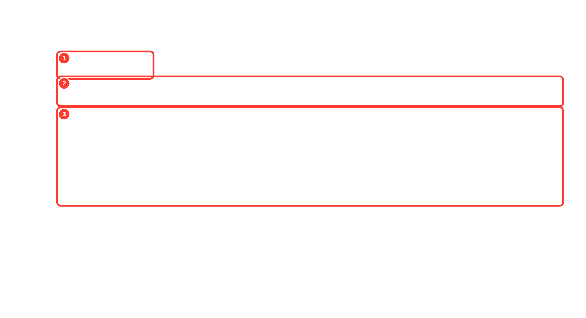
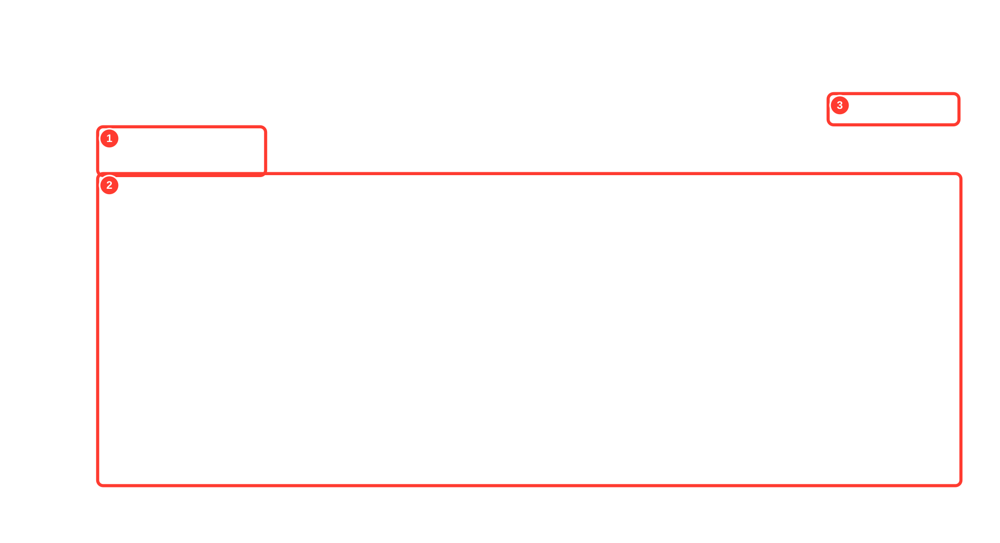
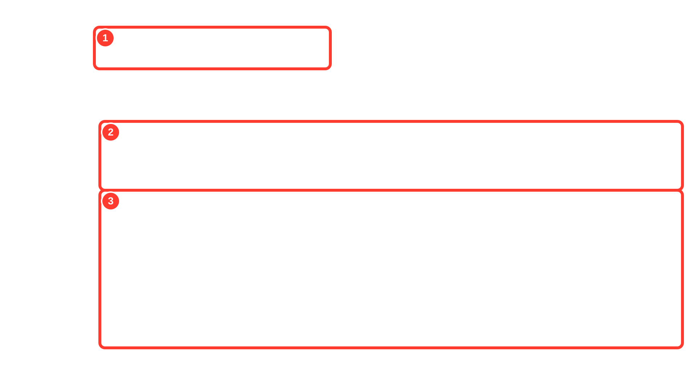
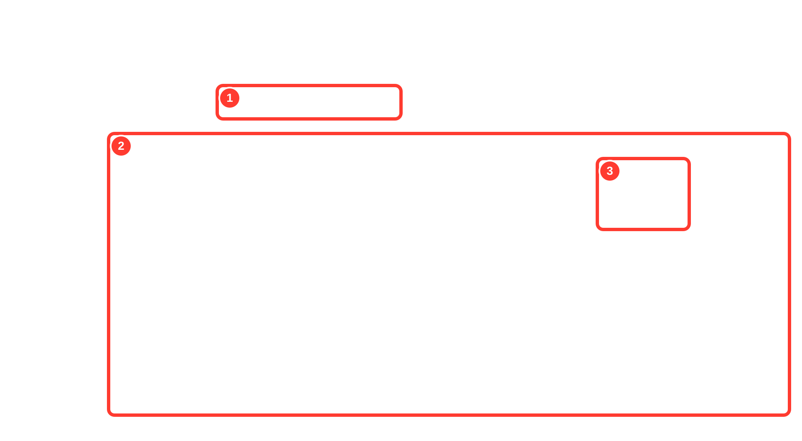

# Hasil UAT eBisnis POS v1.34.34 (build 197)

Tanggal UAT: 10 September 2026

Varian: **eBisnis saja** (`id.zishof.ebisnis`)

Lingkungan data UAT: `https://demo.ecampus.id/ecampus/Api_eBisnis`

Status: **LULUS pada lingkungan UAT**; autentikasi API produksi masih menjadi catatan pra-produksi.

## Ringkasan hasil

| Area | Skenario dan data nyata | Hasil |
|---|---|---|
| Penjualan POS | 5 transaksi tunai, ID 1296–1300, kode `UAT-EBISNIS-20260910-POS-D10-001` s.d. `005` | LULUS |
| Rekonsiliasi penjualan | 5 transaksi tampil di Riwayat Penjualan, omzet **Rp680.000** | LULUS |
| Posting Penjualan/HPP via API | 10 transaksi/Rp1.360.000 siap; HPP tersedia; tidak ada akun yang belum dipetakan | LULUS |
| Permintaan Pembelian (PR) | PR 280 dan 281 | LULUS |
| Pemesanan Pembelian (PO) | PO 265 nontermin dan PO 266 termin | LULUS |
| Penerimaan Barang (BAST) | BAST 263 dan 264 disetujui | LULUS |
| Terima Tagihan | 2 tagihan tercatat untuk kedua alur | LULUS |
| Bayar Vendor | Pembayaran 252 Rp750.000 dan 253 Rp930.000 berstatus `DISETUJUI` | LULUS |
| Kulakan | 3 faktur ID 567–569; 5 draft terdeteksi dan 5 siap | LULUS |
| Laporan | Laba Rugi, Neraca, Arus Kas, Jurnal Umum, Buku Besar, Neraca Saldo berisi data | **6/6 LULUS** |
| Unit/widget test | Seluruh pengujian aplikasi | **845/845 LULUS** |
| Isolasi varian/update | Profil produk, channel update aktif, branding login | **8/8 LULUS** |
| Analisis statis | Error 0, warning 0; 45 info lint non-blocking | LULUS |

Screenshot yang dipublikasikan berasal langsung dari render aplikasi Windows pada saat UAT. Tidak ada screenshot WhatsApp dan tidak ada layar data kosong yang dipakai sebagai bukti kelulusan.

## Bukti beranotasi

PNG asli tersedia di folder [`screenshots/raw`](screenshots/raw). Lapisan coretan disimpan terpisah sebagai SVG di [`screenshots/annotated`](screenshots/annotated), sehingga piksel screenshot asli tidak diubah.

### 1. Riwayat Penjualan POS

1. Ringkasan menunjukkan **5 transaksi** dan omzet **Rp680.000** pada 10-09-2026.
2. Rentang tanggal, filter lengkap, dan indikator pembaruan server membuktikan data dimuat dari server UAT.
3. Lima baris transaksi menampilkan kode UAT, waktu, kasir/mesin, metode Tunai, dan nilai masing-masing.

### 2. Kulakan

1. Ringkasan halaman menampilkan jumlah faktur dan nilai pembelian yang terisi.
2. Tabel berisi nomor faktur, tanggal, supplier, jumlah item, dan total—bukan keadaan kosong.
3. Tombol Entri Faktur dan Bulk Entry Faktur tersedia untuk alur input operasional.

### 3. Permintaan Pembelian (PR)

1. Modul dan tombol **Buat PR** tersedia pada varian eBisnis v1.34.34.
2. KPI PR berisi total dokumen, nilai pengajuan, disetujui, menunggu, ditolak, dan ditutup.
3. Ringkasan tahapan menghubungkan PR sampai PO, BAST, tagihan, dan pembayaran.

### 4. Pemesanan Pembelian (PO)

1. PO dapat dibuat dari PR maupun langsung; formulir nontermin dan termin juga dibuka pada UAT.
2. KPI menampilkan total PO, nilai pesanan, nilai dibayar, sisa kewajiban, dan status.
3. Tren serta komposisi status berisi data dokumen pengadaan.

### 5. Penerimaan Barang (BAST)

1. Modul BAST dan aksi penerimaan dari PO tersedia.
2. KPI menampilkan total/nilai BAST dan status persetujuan serta masuk stok.
3. Grafik periode berisi penerimaan nyata; alur UAT membuat BAST 263 dan 264.

### 6. Terima Tagihan Vendor

1. Halaman mendukung tagihan dari BAST dan tagihan tanpa BAST.
2. KPI menampilkan tagihan siap, sudah bertagihan, belum bertagihan, dan waktu tunggu.
3. Ringkasan vendor dan nilai tagihan berisi data; kedua BAST UAT berhasil menjadi tagihan.

### 7. Bayar Vendor

1. Tab **Pembayaran Vendor** aktif pada mata rantai Proses Transfer.
2. Daftar berisi pembayaran nyata, termasuk pembayaran baru tanggal 10-09-2026.
3. Nilai Rp930.000 dan Rp750.000 serta status `DISETUJUI` sesuai hasil API pembayaran 253 dan 252.

### 8–13. Laporan keuangan

| Laporan | Bukti |
|---|---|
| Laba Rugi | [Anotasi](screenshots/annotated/08-laba-rugi.svg) · [PNG asli atas](screenshots/raw/laporan/24-laba-rugi-full-atas.png) · [PNG asli bawah](screenshots/raw/laporan/24-laba-rugi-full-bawah.png) |
| Neraca | [Anotasi](screenshots/annotated/09-neraca.svg) · [PNG asli atas](screenshots/raw/laporan/25-neraca-full-atas.png) · [PNG asli bawah](screenshots/raw/laporan/25-neraca-full-bawah.png) |
| Arus Kas | [Anotasi](screenshots/annotated/10-arus-kas.svg) · [PNG asli atas](screenshots/raw/laporan/26-arus-kas-full-atas.png) · [PNG asli bawah](screenshots/raw/laporan/26-arus-kas-full-bawah.png) |
| Jurnal Umum | [Anotasi](screenshots/annotated/11-jurnal-umum.svg) · [PNG asli atas](screenshots/raw/laporan/27-jurnal-umum-full-atas.png) · [PNG asli bawah](screenshots/raw/laporan/27-jurnal-umum-full-bawah.png) |
| Buku Besar | [Anotasi](screenshots/annotated/12-buku-besar.svg) · [PNG asli atas](screenshots/raw/laporan/28-buku-besar-full-atas.png) · [PNG asli bawah](screenshots/raw/laporan/28-buku-besar-full-bawah.png) |
| Neraca Saldo | [Anotasi](screenshots/annotated/13-neraca-saldo.svg) · [PNG asli atas](screenshots/raw/laporan/29-neraca-saldo-full-atas.png) · [PNG asli bawah](screenshots/raw/laporan/29-neraca-saldo-full-bawah.png) |

Penjelasan anotasi laporan:

1. Rentang tanggal dan tombol **Tampilkan** menunjukkan filter yang diuji.
2. Tabel laporan berisi akun/baris dan nilai; tes otomatis menolak teks “Tidak ada data untuk filter yang dipilih”.
3. Tombol PDF dan Excel tersedia setelah data selesai dimuat.

## Build eBisnis v1.34.34

| Artefak | Identitas | SHA-256 |
|---|---|---|
| `eBisnis-Android-1.34.34.apk` | package `id.zishof.ebisnis`, versionCode 197 | `8514EF4BF93572E34CEE0F7E32592BA56748AA90BF033BBD506C778763EE4DDB` |
| `eBisnis-Setup-1.34.34.exe` | eBisnis Windows 1.34.34 | `576A942E5DBE0295EA69BDF7073B33BA91A1583B1CEC68F7A0675415E0F32DA4` |

Build ini diterbitkan sebagai **UAT/prerelease internal**: APK menggunakan Android Debug/UAT certificate dan installer Windows belum ditandatangani Authenticode. Karena itu, artefak belum boleh dianggap paket produksi bertanda tangan resmi.

## Isolasi varian

- Tag rilis eBisnis menggunakan pola `v1.34.34` dan aset mengandung kata `eBisnis`.
- Channel Nahl menggunakan prefiks `nahl-`; Al-Bahjah menggunakan `albahjah-`.
- Paket Android adalah `id.zishof.ebisnis`; installer hanya mengemas `ebisnis.exe`.
- Tidak ada APK/installer Nahl, Al-Bahjah, atau varian lain di rilis ini.

## Catatan produksi

Pada 10-09-2026, halaman browser `https://ebisnis.id/ebisnis/` dapat dibuka. Namun POST login ke `https://ebisnis.id/ebisnis/Api_eBisnis` masih menjawab `HTTP 302` dengan `Location: /ebisnis/`, sedangkan endpoint UAT menjawab `HTTP 200` dan token valid. Jadi hasil di atas membuktikan aplikasi dan alur bisnis pada lingkungan UAT; sebelum promosi ke produksi, autentikasi API produksi harus kembali menghasilkan JSON login sukses dan smoke test produksi perlu diulang.
