# UAT dan User Manual ABChicken POS Rev4

**Perbaikan utama:** setiap kebutuhan DKB memakai bukti layar yang dipetakan per fitur. Gambar pada halaman fitur tidak identik secara byte dan setiap gambar memiliki anotasi fungsi.

**Varian:** `abchicken`
**Versi:** `1.34.52+215` (tidak dinaikkan)
**Tanggal:** 29 September 2026

## Batas bukti

- Label **LAYAR LIVE** berarti layar dibuka dengan akun tenant ABChicken pada 29 September 2026 dan lolos pemeriksaan tidak menampilkan pesan layanan tidak dikenal.
- Label **REFERENSI UAT UI** berarti bukti berasal dari UAT aplikasi sebelumnya pada 9-10 September 2026. Bukti tersebut menunjukkan layar dan kontrol, bukan konfirmasi data tenant ABChicken terbaru.
- Layar yang sama hanya digunakan kembali bila beberapa kebutuhan memang berada pada tab atau dialog yang sama. Anotasi dan pembahasan tetap menunjuk kontrol yang berbeda.
- Bukti tampilan tidak menggantikan pengujian transaksi end-to-end atau persetujuan bisnis.

## Ringkasan validasi

- 58 kebutuhan tercatat.
- 58 gambar fitur dibuat.
- 0 duplikasi gambar identik berdasarkan SHA-256.
- Build dan integration test Windows untuk pengambilan layar: lulus.

## DKB-01 Kasir (order & biling, menu dengan foto produk, print struk untuk customer dan dapur)

- Departemen: Operational
- Posisi menu: Operasional > Kasir/POS
- Status bukti: REFERENSI UAT UI
- Bukti: `docs/uat-abchicken-20260929-rev4-bukti-sesuai/feature-evidence/DKB-01.png`
- Sumber layar: `docs/pos/uat-training-operasional-20260910/screenshots/01-kasir-pos-layar-penuh.png` (UAT UI 10-09-2026)
- Anotasi: 1 menu/konteks, 2 filter atau kontrol utama, 3 data/aksi yang diuji.
- Petunjuk: buka menu yang tercantum, pastikan tenant dan toko aktif sudah benar, gunakan kontrol yang ditandai, lalu periksa data atau status hasilnya.

## DKB-02 Nomor antrian di setiap struk, catatan pesanan

- Departemen: Operational
- Posisi menu: Operasional > Kasir/POS > Keranjang
- Status bukti: LAYAR LIVE
- Bukti: `docs/uat-abchicken-20260929-rev4-bukti-sesuai/feature-evidence/DKB-02.png`
- Sumber layar: `docs/uat-abchicken-20260929-rev3-per-fitur/evidence-live/11-pos_sale-50-record.png` (Live ABChicken 29-09-2026)
- Anotasi: 1 menu/konteks, 2 filter atau kontrol utama, 3 data/aksi yang diuji.
- Petunjuk: buka menu yang tercantum, pastikan tenant dan toko aktif sudah benar, gunakan kontrol yang ditandai, lalu periksa data atau status hasilnya.

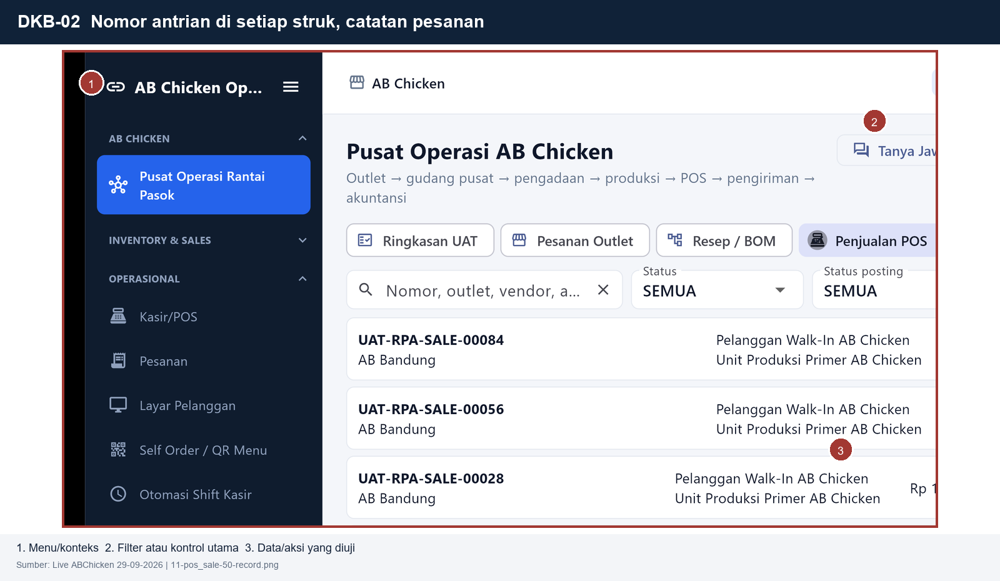

## DKB-03 Waste produk dan retur barang

- Departemen: Operational
- Posisi menu: Produksi > Waste & Susut Produksi
- Status bukti: LAYAR LIVE
- Bukti: `docs/uat-abchicken-20260929-rev4-bukti-sesuai/feature-evidence/DKB-03.png`
- Sumber layar: `docs/uat-abchicken-20260929-rev4-bukti-sesuai/evidence-live/42-waste-produksi.png` (Live ABChicken 29-09-2026)
- Anotasi: 1 menu/konteks, 2 filter atau kontrol utama, 3 data/aksi yang diuji.
- Petunjuk: buka menu yang tercantum, pastikan tenant dan toko aktif sudah benar, gunakan kontrol yang ditandai, lalu periksa data atau status hasilnya.

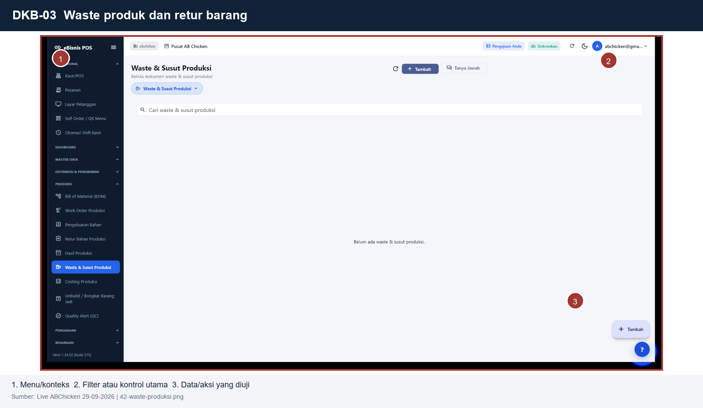

## DKB-04 Manager Meal (tester maximal 20 rb) dan crew meal atau diskon karyawan (potongan harga 10 %)

- Departemen: Operational
- Posisi menu: Operasional > Kasir/POS > Meal Pegawai
- Status bukti: REFERENSI UAT UI
- Bukti: `docs/uat-abchicken-20260929-rev4-bukti-sesuai/feature-evidence/DKB-04.png`
- Sumber layar: `docs/pos/uat-training-operasional-20260910/screenshots/01-kasir-pos-layar-penuh.png` (UAT UI 10-09-2026)
- Anotasi: 1 menu/konteks, 2 filter atau kontrol utama, 3 data/aksi yang diuji.
- Petunjuk: buka menu yang tercantum, pastikan tenant dan toko aktif sudah benar, gunakan kontrol yang ditandai, lalu periksa data atau status hasilnya.

## DKB-05 Laporan penjualan perjam dan per item serta menu khusus

- Departemen: Operational
- Posisi menu: Transaksi & Laporan > Penjualan
- Status bukti: REFERENSI UAT UI
- Bukti: `docs/uat-abchicken-20260929-rev4-bukti-sesuai/feature-evidence/DKB-05.png`
- Sumber layar: `docs/pos/uat-training-operasional-20260910/screenshots/15-penjualan-per-barang-atas.png` (UAT UI 10-09-2026)
- Anotasi: 1 menu/konteks, 2 filter atau kontrol utama, 3 data/aksi yang diuji.
- Petunjuk: buka menu yang tercantum, pastikan tenant dan toko aktif sudah benar, gunakan kontrol yang ditandai, lalu periksa data atau status hasilnya.

## DKB-06 Laporan mengenai laba rugi, cogs, dan sebagainya

- Departemen: Operational
- Posisi menu: Akuntansi > Laba Rugi
- Status bukti: LAYAR LIVE
- Bukti: `docs/uat-abchicken-20260929-rev4-bukti-sesuai/feature-evidence/DKB-06.png`
- Sumber layar: `docs/uat-abchicken-20260929-rev3-per-fitur/evidence-live/23-laba-rugi.png` (Live ABChicken 29-09-2026)
- Anotasi: 1 menu/konteks, 2 filter atau kontrol utama, 3 data/aksi yang diuji.
- Petunjuk: buka menu yang tercantum, pastikan tenant dan toko aktif sudah benar, gunakan kontrol yang ditandai, lalu periksa data atau status hasilnya.

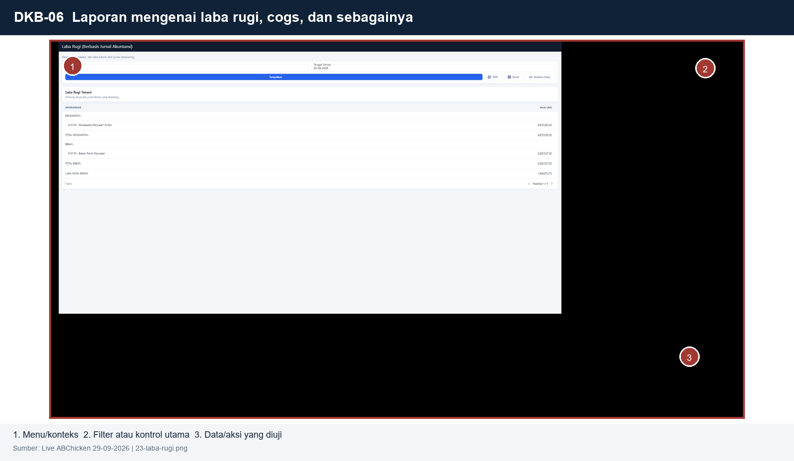

## DKB-07 Self order/customer pesan sendiri lewat scan

- Departemen: Operational
- Posisi menu: Operasional > Self Order / QR Menu
- Status bukti: LAYAR LIVE
- Bukti: `docs/uat-abchicken-20260929-rev4-bukti-sesuai/feature-evidence/DKB-07.png`
- Sumber layar: `docs/uat-abchicken-20260929-rev4-bukti-sesuai/evidence-live/36-self-order-qr.png` (Live ABChicken 29-09-2026)
- Anotasi: 1 menu/konteks, 2 filter atau kontrol utama, 3 data/aksi yang diuji.
- Petunjuk: buka menu yang tercantum, pastikan tenant dan toko aktif sudah benar, gunakan kontrol yang ditandai, lalu periksa data atau status hasilnya.

## DKB-08 Buka dan akhiri shift otomatis

- Departemen: Operational
- Posisi menu: Operasional > Pengaturan Shift Otomatis
- Status bukti: LAYAR LIVE
- Bukti: `docs/uat-abchicken-20260929-rev4-bukti-sesuai/feature-evidence/DKB-08.png`
- Sumber layar: `docs/uat-abchicken-20260929-rev4-bukti-sesuai/evidence-live/37-otomasi-shift-kasir.png` (Live ABChicken 29-09-2026)
- Anotasi: 1 menu/konteks, 2 filter atau kontrol utama, 3 data/aksi yang diuji.
- Petunjuk: buka menu yang tercantum, pastikan tenant dan toko aktif sudah benar, gunakan kontrol yang ditandai, lalu periksa data atau status hasilnya.

## DKB-09 Offline POS

- Departemen: Operational
- Posisi menu: Operasional > Kasir/POS
- Status bukti: REFERENSI UAT UI
- Bukti: `docs/uat-abchicken-20260929-rev4-bukti-sesuai/feature-evidence/DKB-09.png`
- Sumber layar: `docs/pos/uat-offline-20260909/screenshots/04-matriks-batas-offline.png` (UAT Offline 09-09-2026)
- Anotasi: 1 menu/konteks, 2 filter atau kontrol utama, 3 data/aksi yang diuji.
- Petunjuk: buka menu yang tercantum, pastikan tenant dan toko aktif sudah benar, gunakan kontrol yang ditandai, lalu periksa data atau status hasilnya.

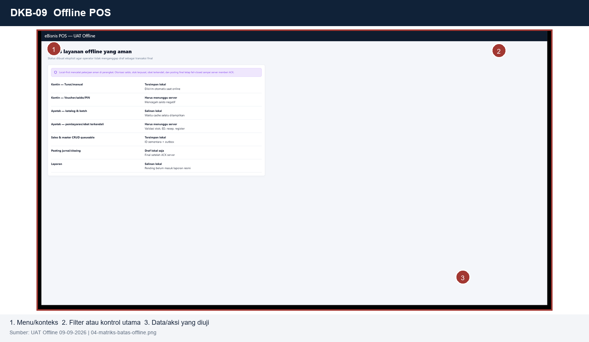

## DKB-10 Update HPP dengan fitur all outlet atau check list toko

- Departemen: Research & Development
- Posisi menu: Master Data > Grup Produk
- Status bukti: LAYAR LIVE
- Bukti: `docs/uat-abchicken-20260929-rev4-bukti-sesuai/feature-evidence/DKB-10.png`
- Sumber layar: `docs/uat-abchicken-20260929-rev4-bukti-sesuai/evidence-live/39-master-harga.png` (Live ABChicken 29-09-2026)
- Anotasi: 1 menu/konteks, 2 filter atau kontrol utama, 3 data/aksi yang diuji.
- Petunjuk: buka menu yang tercantum, pastikan tenant dan toko aktif sudah benar, gunakan kontrol yang ditandai, lalu periksa data atau status hasilnya.

## DKB-11 Penghapusan resep dan menu sekaligus

- Departemen: Research & Development
- Posisi menu: Master Data > Produk > Resep
- Status bukti: LAYAR LIVE
- Bukti: `docs/uat-abchicken-20260929-rev4-bukti-sesuai/feature-evidence/DKB-11.png`
- Sumber layar: `docs/uat-abchicken-20260929-rev4-bukti-sesuai/evidence-live/38-produk-aksi-massal.png` (Live ABChicken 29-09-2026)
- Anotasi: 1 menu/konteks, 2 filter atau kontrol utama, 3 data/aksi yang diuji.
- Petunjuk: buka menu yang tercantum, pastikan tenant dan toko aktif sudah benar, gunakan kontrol yang ditandai, lalu periksa data atau status hasilnya.

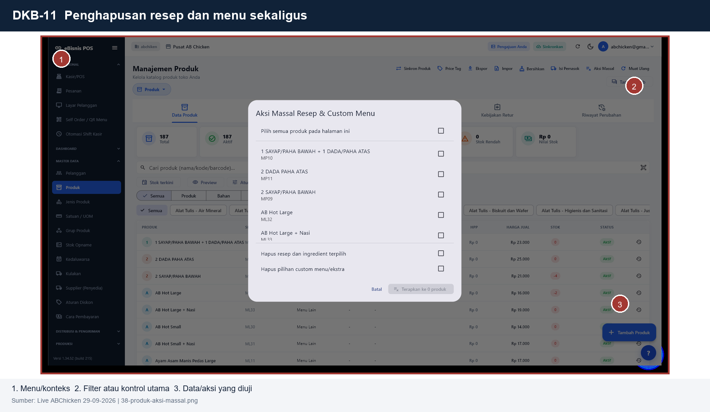

## DKB-12 Penghapusan ingredient dengan fitur check list

- Departemen: Research & Development
- Posisi menu: Master Data > Produk > Resep
- Status bukti: LAYAR LIVE
- Bukti: `docs/uat-abchicken-20260929-rev4-bukti-sesuai/feature-evidence/DKB-12.png`
- Sumber layar: `docs/uat-abchicken-20260929-rev4-bukti-sesuai/evidence-live/38-produk-hapus-resep-ingredient.png` (Live ABChicken 29-09-2026)
- Anotasi: 1 menu/konteks, 2 filter atau kontrol utama, 3 data/aksi yang diuji.
- Petunjuk: buka menu yang tercantum, pastikan tenant dan toko aktif sudah benar, gunakan kontrol yang ditandai, lalu periksa data atau status hasilnya.

## DKB-13 Custom menu dengan fitur check list

- Departemen: Research & Development
- Posisi menu: Master Data > Produk > Custom Menu
- Status bukti: LAYAR LIVE
- Bukti: `docs/uat-abchicken-20260929-rev4-bukti-sesuai/feature-evidence/DKB-13.png`
- Sumber layar: `docs/uat-abchicken-20260929-rev4-bukti-sesuai/evidence-live/38-produk-hapus-custom-menu.png` (Live ABChicken 29-09-2026)
- Anotasi: 1 menu/konteks, 2 filter atau kontrol utama, 3 data/aksi yang diuji.
- Petunjuk: buka menu yang tercantum, pastikan tenant dan toko aktif sudah benar, gunakan kontrol yang ditandai, lalu periksa data atau status hasilnya.

## DKB-14 Fitur untuk melihat produk yang paling banyak dan paling sedikit terjual

- Departemen: Research & Development
- Posisi menu: Dashboard > Produk
- Status bukti: LAYAR LIVE
- Bukti: `docs/uat-abchicken-20260929-rev4-bukti-sesuai/feature-evidence/DKB-14.png`
- Sumber layar: `docs/uat-abchicken-20260929-rev4-bukti-sesuai/evidence-live/40-analisis-penjualan.png` (Live ABChicken 29-09-2026)
- Anotasi: 1 menu/konteks, 2 filter atau kontrol utama, 3 data/aksi yang diuji.
- Petunjuk: buka menu yang tercantum, pastikan tenant dan toko aktif sudah benar, gunakan kontrol yang ditandai, lalu periksa data atau status hasilnya.

## DKB-15 Laporan penjualan produk

- Departemen: Research & Development
- Posisi menu: Transaksi & Laporan > Penjualan Produk
- Status bukti: REFERENSI UAT UI
- Bukti: `docs/uat-abchicken-20260929-rev4-bukti-sesuai/feature-evidence/DKB-15.png`
- Sumber layar: `docs/pos/uat-training-operasional-20260910/screenshots/15-penjualan-per-barang-atas.png` (UAT UI 10-09-2026)
- Anotasi: 1 menu/konteks, 2 filter atau kontrol utama, 3 data/aksi yang diuji.
- Petunjuk: buka menu yang tercantum, pastikan tenant dan toko aktif sudah benar, gunakan kontrol yang ditandai, lalu periksa data atau status hasilnya.

## DKB-16 Laporan penjualan sales type

- Departemen: Research & Development
- Posisi menu: Transaksi & Laporan > Penjualan > Sales Type
- Status bukti: LAYAR LIVE
- Bukti: `docs/uat-abchicken-20260929-rev4-bukti-sesuai/feature-evidence/DKB-16.png`
- Sumber layar: `docs/uat-abchicken-20260929-rev4-bukti-sesuai/evidence-live/40-analisis-penjualan.png` (Live ABChicken 29-09-2026)
- Anotasi: 1 menu/konteks, 2 filter atau kontrol utama, 3 data/aksi yang diuji.
- Petunjuk: buka menu yang tercantum, pastikan tenant dan toko aktif sudah benar, gunakan kontrol yang ditandai, lalu periksa data atau status hasilnya.

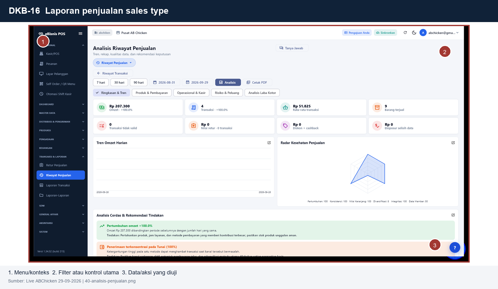

## DKB-17 Semua menu dibedakan harga category termasuk online food

- Departemen: Research & Development
- Posisi menu: Master Data > Produk > Harga per Kanal
- Status bukti: LAYAR LIVE
- Bukti: `docs/uat-abchicken-20260929-rev4-bukti-sesuai/feature-evidence/DKB-17.png`
- Sumber layar: `docs/uat-abchicken-20260929-rev4-bukti-sesuai/evidence-live/39-harga-per-kanal.png` (Live ABChicken 29-09-2026)
- Anotasi: 1 menu/konteks, 2 filter atau kontrol utama, 3 data/aksi yang diuji.
- Petunjuk: buka menu yang tercantum, pastikan tenant dan toko aktif sudah benar, gunakan kontrol yang ditandai, lalu periksa data atau status hasilnya.

## DKB-18 Ringkasan Penjualan (Gross Sales, Discount, Refunds, Net Sales)

- Departemen: Audit & Surveillance
- Posisi menu: Transaksi & Laporan > Ringkasan Penjualan
- Status bukti: REFERENSI UAT UI
- Bukti: `docs/uat-abchicken-20260929-rev4-bukti-sesuai/feature-evidence/DKB-18.png`
- Sumber layar: `docs/pos/uat-training-operasional-20260910/screenshots/17-omzet-transaksi-atas.png` (UAT UI 10-09-2026)
- Anotasi: 1 menu/konteks, 2 filter atau kontrol utama, 3 data/aksi yang diuji.
- Petunjuk: buka menu yang tercantum, pastikan tenant dan toko aktif sudah benar, gunakan kontrol yang ditandai, lalu periksa data atau status hasilnya.

## DKB-19 Gross Profit

- Departemen: Audit & Surveillance
- Posisi menu: Transaksi & Laporan > Laba Kotor
- Status bukti: REFERENSI UAT UI
- Bukti: `docs/uat-abchicken-20260929-rev4-bukti-sesuai/feature-evidence/DKB-19.png`
- Sumber layar: `docs/pos/uat-training-operasional-20260910/screenshots/25-laba-kotor-harian-atas.png` (UAT UI 10-09-2026)
- Anotasi: 1 menu/konteks, 2 filter atau kontrol utama, 3 data/aksi yang diuji.
- Petunjuk: buka menu yang tercantum, pastikan tenant dan toko aktif sudah benar, gunakan kontrol yang ditandai, lalu periksa data atau status hasilnya.

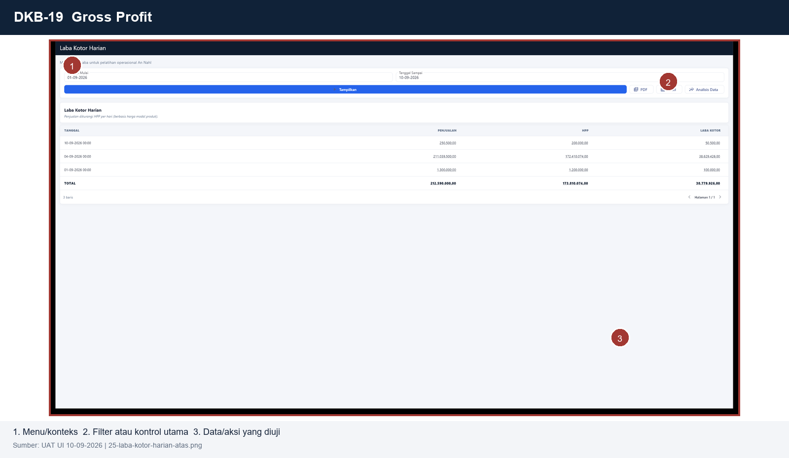

## DKB-20 Rincian Metode Pembayaran

- Departemen: Audit & Surveillance
- Posisi menu: Transaksi & Laporan > Metode Pembayaran
- Status bukti: LAYAR LIVE
- Bukti: `docs/uat-abchicken-20260929-rev4-bukti-sesuai/feature-evidence/DKB-20.png`
- Sumber layar: `docs/uat-abchicken-20260929-rev4-bukti-sesuai/evidence-live/41-laporan-report-payment.png` (Live ABChicken 29-09-2026)
- Anotasi: 1 menu/konteks, 2 filter atau kontrol utama, 3 data/aksi yang diuji.
- Petunjuk: buka menu yang tercantum, pastikan tenant dan toko aktif sudah benar, gunakan kontrol yang ditandai, lalu periksa data atau status hasilnya.

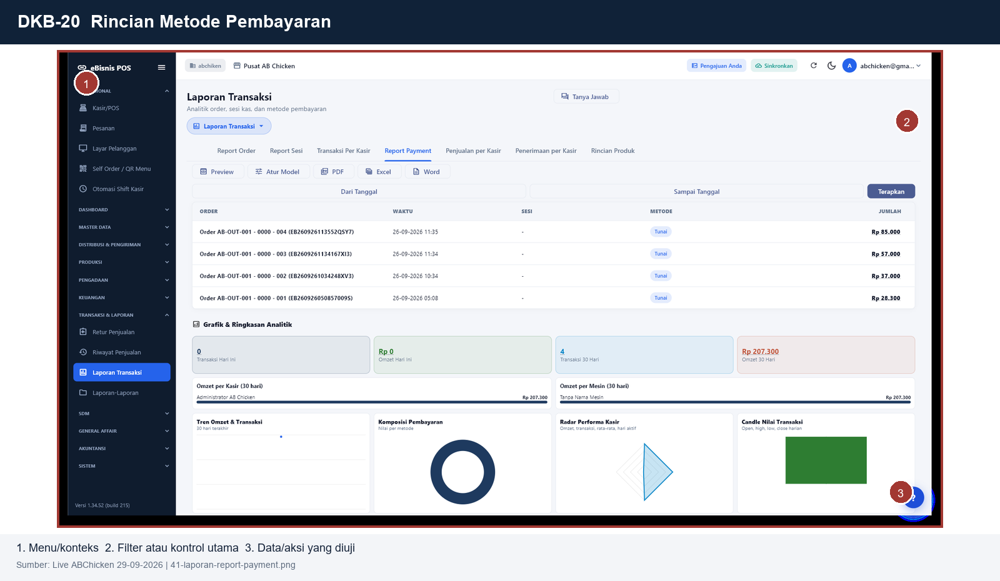

## DKB-21 Rincian Produk Terjual (per toko, per hari)

- Departemen: Audit & Surveillance
- Posisi menu: Transaksi & Laporan > Produk Terjual
- Status bukti: LAYAR LIVE
- Bukti: `docs/uat-abchicken-20260929-rev4-bukti-sesuai/feature-evidence/DKB-21.png`
- Sumber layar: `docs/uat-abchicken-20260929-rev4-bukti-sesuai/evidence-live/41-laporan-rincian-produk.png` (Live ABChicken 29-09-2026)
- Anotasi: 1 menu/konteks, 2 filter atau kontrol utama, 3 data/aksi yang diuji.
- Petunjuk: buka menu yang tercantum, pastikan tenant dan toko aktif sudah benar, gunakan kontrol yang ditandai, lalu periksa data atau status hasilnya.

## DKB-22 Rincian Item Refund

- Departemen: Audit & Surveillance
- Posisi menu: Transaksi & Laporan > Retur Penjualan
- Status bukti: LAYAR LIVE
- Bukti: `docs/uat-abchicken-20260929-rev4-bukti-sesuai/feature-evidence/DKB-22.png`
- Sumber layar: `docs/uat-abchicken-20260929-rev4-bukti-sesuai/evidence-live/46-retur-penjualan.png` (Live ABChicken 29-09-2026)
- Anotasi: 1 menu/konteks, 2 filter atau kontrol utama, 3 data/aksi yang diuji.
- Petunjuk: buka menu yang tercantum, pastikan tenant dan toko aktif sudah benar, gunakan kontrol yang ditandai, lalu periksa data atau status hasilnya.

## DKB-23 Laporan Transaksi per hari/bulan/tahun

- Departemen: Audit & Surveillance
- Posisi menu: Transaksi & Laporan > Transaksi
- Status bukti: LAYAR LIVE
- Bukti: `docs/uat-abchicken-20260929-rev4-bukti-sesuai/feature-evidence/DKB-23.png`
- Sumber layar: `docs/uat-abchicken-20260929-rev4-bukti-sesuai/evidence-live/41-laporan-report-order.png` (Live ABChicken 29-09-2026)
- Anotasi: 1 menu/konteks, 2 filter atau kontrol utama, 3 data/aksi yang diuji.
- Petunjuk: buka menu yang tercantum, pastikan tenant dan toko aktif sudah benar, gunakan kontrol yang ditandai, lalu periksa data atau status hasilnya.

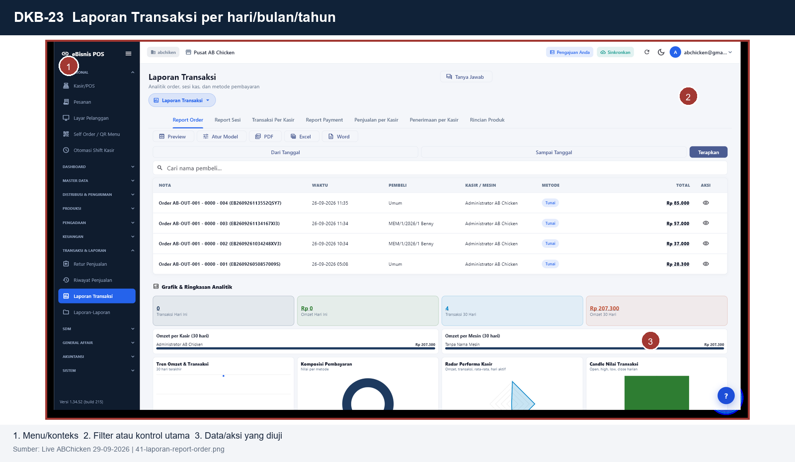

## DKB-24 Laporan Shift (pemasukan dan pengeluaran)

- Departemen: Audit & Surveillance
- Posisi menu: Transaksi & Laporan > Rekonsiliasi Sesi
- Status bukti: LAYAR LIVE
- Bukti: `docs/uat-abchicken-20260929-rev4-bukti-sesuai/feature-evidence/DKB-24.png`
- Sumber layar: `docs/uat-abchicken-20260929-rev4-bukti-sesuai/evidence-live/41-laporan-report-sesi.png` (Live ABChicken 29-09-2026)
- Anotasi: 1 menu/konteks, 2 filter atau kontrol utama, 3 data/aksi yang diuji.
- Petunjuk: buka menu yang tercantum, pastikan tenant dan toko aktif sudah benar, gunakan kontrol yang ditandai, lalu periksa data atau status hasilnya.

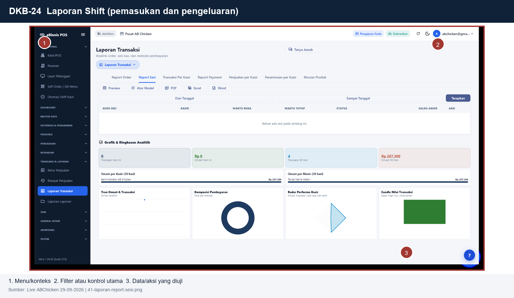

## DKB-25 Laporan Inventory/Stok (saldo awal, purchase order, pemakaian/usage, transfer stok, adjustment stok, waste, saldo akhir)

- Departemen: Audit & Surveillance
- Posisi menu: Inventory & Sales > Riwayat Stok
- Status bukti: LAYAR LIVE
- Bukti: `docs/uat-abchicken-20260929-rev4-bukti-sesuai/feature-evidence/DKB-25.png`
- Sumber layar: `docs/uat-abchicken-20260929-rev4-bukti-sesuai/evidence-live/41-laporan-rincian-produk.png` (Live ABChicken 29-09-2026)
- Anotasi: 1 menu/konteks, 2 filter atau kontrol utama, 3 data/aksi yang diuji.
- Petunjuk: buka menu yang tercantum, pastikan tenant dan toko aktif sudah benar, gunakan kontrol yang ditandai, lalu periksa data atau status hasilnya.

## DKB-26 Ringkasan Selisih Stok

- Departemen: Audit & Surveillance
- Posisi menu: Inventory & Sales > Rekonsiliasi Stok
- Status bukti: LAYAR LIVE
- Bukti: `docs/uat-abchicken-20260929-rev4-bukti-sesuai/feature-evidence/DKB-26.png`
- Sumber layar: `docs/uat-abchicken-20260929-rev4-bukti-sesuai/evidence-live/48-rekonsiliasi-stok.png` (Live ABChicken 29-09-2026)
- Anotasi: 1 menu/konteks, 2 filter atau kontrol utama, 3 data/aksi yang diuji.
- Petunjuk: buka menu yang tercantum, pastikan tenant dan toko aktif sudah benar, gunakan kontrol yang ditandai, lalu periksa data atau status hasilnya.

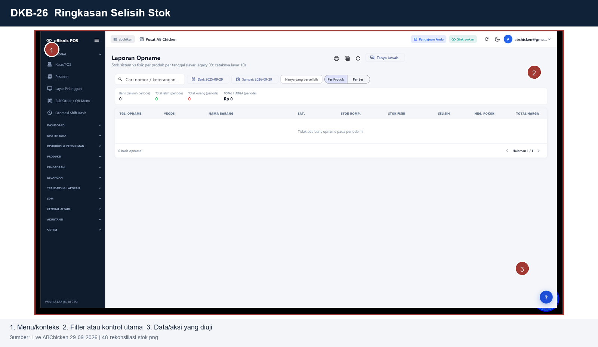

## DKB-27 Ringkasan waste produk

- Departemen: Audit & Surveillance
- Posisi menu: Produksi > Waste & Susut Produksi
- Status bukti: LAYAR LIVE
- Bukti: `docs/uat-abchicken-20260929-rev4-bukti-sesuai/feature-evidence/DKB-27.png`
- Sumber layar: `docs/uat-abchicken-20260929-rev4-bukti-sesuai/evidence-live/42-waste-produksi.png` (Live ABChicken 29-09-2026)
- Anotasi: 1 menu/konteks, 2 filter atau kontrol utama, 3 data/aksi yang diuji.
- Petunjuk: buka menu yang tercantum, pastikan tenant dan toko aktif sudah benar, gunakan kontrol yang ditandai, lalu periksa data atau status hasilnya.

## DKB-28 Pengajuan cuti online

- Departemen: HRD
- Posisi menu: SDM / HRD > Cuti & Izin
- Status bukti: LAYAR LIVE
- Bukti: `docs/uat-abchicken-20260929-rev4-bukti-sesuai/feature-evidence/DKB-28.png`
- Sumber layar: `docs/uat-abchicken-20260929-rev4-bukti-sesuai/evidence-live/34-hrd-cuti-izin.png` (Live ABChicken 29-09-2026)
- Anotasi: 1 menu/konteks, 2 filter atau kontrol utama, 3 data/aksi yang diuji.
- Petunjuk: buka menu yang tercantum, pastikan tenant dan toko aktif sudah benar, gunakan kontrol yang ditandai, lalu periksa data atau status hasilnya.

## DKB-29 Rekap kehadiran bisa dengan beberapa metode: foto/fingerprint/qrcode

- Departemen: HRD
- Posisi menu: SDM / HRD > Kehadiran
- Status bukti: LAYAR LIVE
- Bukti: `docs/uat-abchicken-20260929-rev4-bukti-sesuai/feature-evidence/DKB-29.png`
- Sumber layar: `docs/uat-abchicken-20260929-rev4-bukti-sesuai/evidence-live/34-hrd-kehadiran.png` (Live ABChicken 29-09-2026)
- Anotasi: 1 menu/konteks, 2 filter atau kontrol utama, 3 data/aksi yang diuji.
- Petunjuk: buka menu yang tercantum, pastikan tenant dan toko aktif sudah benar, gunakan kontrol yang ditandai, lalu periksa data atau status hasilnya.

## DKB-30 Pengajuan Sakit dan Izin secara online, lalu ngelink approval dari atasan dan HRD

- Departemen: HRD
- Posisi menu: SDM / HRD > Cuti & Izin
- Status bukti: LAYAR LIVE
- Bukti: `docs/uat-abchicken-20260929-rev4-bukti-sesuai/feature-evidence/DKB-30.png`
- Sumber layar: `docs/uat-abchicken-20260929-rev4-bukti-sesuai/evidence-live/34-hrd-cuti-izin.png` (Live ABChicken 29-09-2026)
- Anotasi: 1 menu/konteks, 2 filter atau kontrol utama, 3 data/aksi yang diuji.
- Petunjuk: buka menu yang tercantum, pastikan tenant dan toko aktif sudah benar, gunakan kontrol yang ditandai, lalu periksa data atau status hasilnya.

## DKB-31 Terdapat grafik kedisiplinan (Paling sering izin, Paling sering datang tepat waktu)

- Departemen: HRD
- Posisi menu: SDM / HRD > Kedisiplinan
- Status bukti: LAYAR LIVE
- Bukti: `docs/uat-abchicken-20260929-rev4-bukti-sesuai/feature-evidence/DKB-31.png`
- Sumber layar: `docs/uat-abchicken-20260929-rev4-bukti-sesuai/evidence-live/34-hrd-kedisiplinan.png` (Live ABChicken 29-09-2026)
- Anotasi: 1 menu/konteks, 2 filter atau kontrol utama, 3 data/aksi yang diuji.
- Petunjuk: buka menu yang tercantum, pastikan tenant dan toko aktif sudah benar, gunakan kontrol yang ditandai, lalu periksa data atau status hasilnya.

## DKB-32 Bisa tarik data riwayat kehadiran

- Departemen: HRD
- Posisi menu: SDM / HRD > Kehadiran
- Status bukti: LAYAR LIVE
- Bukti: `docs/uat-abchicken-20260929-rev4-bukti-sesuai/feature-evidence/DKB-32.png`
- Sumber layar: `docs/uat-abchicken-20260929-rev4-bukti-sesuai/evidence-live/34-hrd-riwayat.png` (Live ABChicken 29-09-2026)
- Anotasi: 1 menu/konteks, 2 filter atau kontrol utama, 3 data/aksi yang diuji.
- Petunjuk: buka menu yang tercantum, pastikan tenant dan toko aktif sudah benar, gunakan kontrol yang ditandai, lalu periksa data atau status hasilnya.

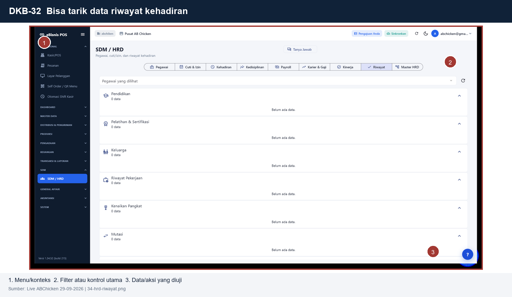

## DKB-33 Untuk outlet absen di Aplikasi -> setiap karyawan dibuatkan akun dan WAJIB ABSEN di aplikasi tsb

- Departemen: HRD
- Posisi menu: SDM / HRD > Pegawai
- Status bukti: LAYAR LIVE
- Bukti: `docs/uat-abchicken-20260929-rev4-bukti-sesuai/feature-evidence/DKB-33.png`
- Sumber layar: `docs/uat-abchicken-20260929-rev4-bukti-sesuai/evidence-live/34-sdm-hrd.png` (Live ABChicken 29-09-2026)
- Anotasi: 1 menu/konteks, 2 filter atau kontrol utama, 3 data/aksi yang diuji.
- Petunjuk: buka menu yang tercantum, pastikan tenant dan toko aktif sudah benar, gunakan kontrol yang ditandai, lalu periksa data atau status hasilnya.

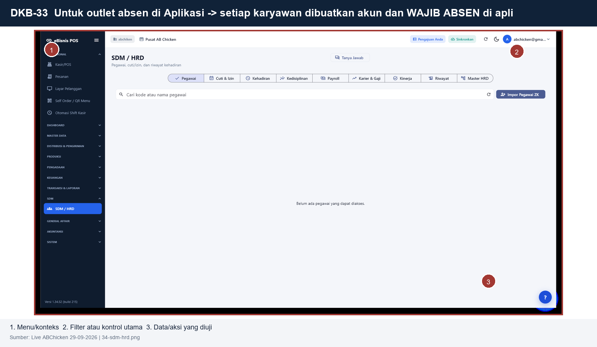

## DKB-34 7 Pengajian dan lembur berdasarkan surat perintah/persetujuan atasan-> jika tidak ada, dianggap tidak lembur (tidak untuk pencairan lembur)

- Departemen: HRD
- Posisi menu: SDM / HRD > Payroll
- Status bukti: LAYAR LIVE
- Bukti: `docs/uat-abchicken-20260929-rev4-bukti-sesuai/feature-evidence/DKB-34.png`
- Sumber layar: `docs/uat-abchicken-20260929-rev4-bukti-sesuai/evidence-live/34-hrd-payroll.png` (Live ABChicken 29-09-2026)
- Anotasi: 1 menu/konteks, 2 filter atau kontrol utama, 3 data/aksi yang diuji.
- Petunjuk: buka menu yang tercantum, pastikan tenant dan toko aktif sudah benar, gunakan kontrol yang ditandai, lalu periksa data atau status hasilnya.

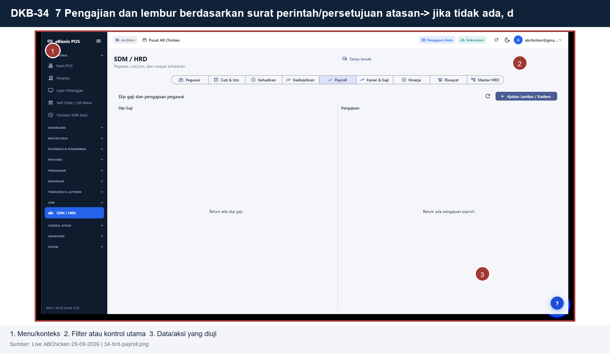

## DKB-35 Jenjang kenaikan gaji disesuaikan berdasarkan masa kerja atau persentase

- Departemen: HRD
- Posisi menu: SDM / HRD > Payroll > Jenjang Gaji
- Status bukti: LAYAR LIVE
- Bukti: `docs/uat-abchicken-20260929-rev4-bukti-sesuai/feature-evidence/DKB-35.png`
- Sumber layar: `docs/uat-abchicken-20260929-rev4-bukti-sesuai/evidence-live/34-hrd-karier-gaji.png` (Live ABChicken 29-09-2026)
- Anotasi: 1 menu/konteks, 2 filter atau kontrol utama, 3 data/aksi yang diuji.
- Petunjuk: buka menu yang tercantum, pastikan tenant dan toko aktif sudah benar, gunakan kontrol yang ditandai, lalu periksa data atau status hasilnya.

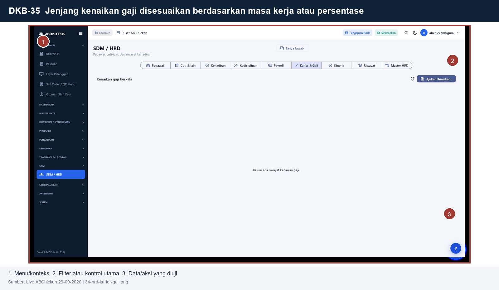

## DKB-36 Bisa integrasi data kasbon dan segala bentuk potongan ke dalam slip gaji tanpa harus menginput manual

- Departemen: HRD
- Posisi menu: SDM / HRD > Payroll
- Status bukti: LAYAR LIVE
- Bukti: `docs/uat-abchicken-20260929-rev4-bukti-sesuai/feature-evidence/DKB-36.png`
- Sumber layar: `docs/uat-abchicken-20260929-rev4-bukti-sesuai/evidence-live/34-hrd-payroll.png` (Live ABChicken 29-09-2026)
- Anotasi: 1 menu/konteks, 2 filter atau kontrol utama, 3 data/aksi yang diuji.
- Petunjuk: buka menu yang tercantum, pastikan tenant dan toko aktif sudah benar, gunakan kontrol yang ditandai, lalu periksa data atau status hasilnya.

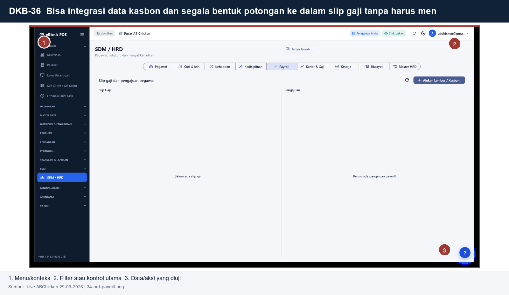

## DKB-37 Sistem slip gaji mengakses mandiri di akun pribadi karyawan

- Departemen: HRD
- Posisi menu: SDM / HRD > Payroll > Slip Saya
- Status bukti: LAYAR LIVE
- Bukti: `docs/uat-abchicken-20260929-rev4-bukti-sesuai/feature-evidence/DKB-37.png`
- Sumber layar: `docs/uat-abchicken-20260929-rev4-bukti-sesuai/evidence-live/34-hrd-payroll.png` (Live ABChicken 29-09-2026)
- Anotasi: 1 menu/konteks, 2 filter atau kontrol utama, 3 data/aksi yang diuji.
- Petunjuk: buka menu yang tercantum, pastikan tenant dan toko aktif sudah benar, gunakan kontrol yang ditandai, lalu periksa data atau status hasilnya.

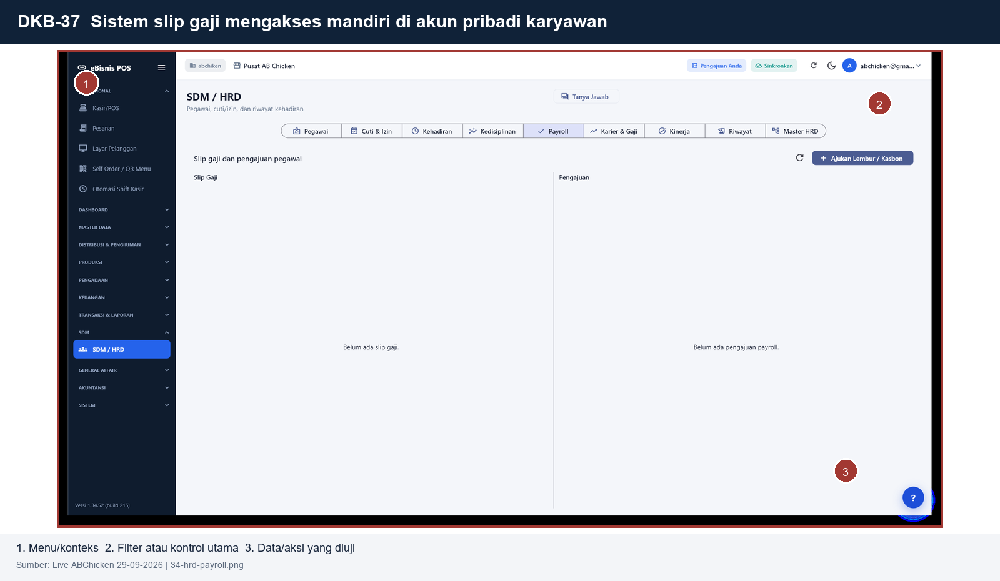

## DKB-38 Setiap karyawan mendapatkan ID User sehingga presensi bisa ter-record

- Departemen: HRD
- Posisi menu: SDM / HRD > Pegawai
- Status bukti: LAYAR LIVE
- Bukti: `docs/uat-abchicken-20260929-rev4-bukti-sesuai/feature-evidence/DKB-38.png`
- Sumber layar: `docs/uat-abchicken-20260929-rev4-bukti-sesuai/evidence-live/34-sdm-hrd.png` (Live ABChicken 29-09-2026)
- Anotasi: 1 menu/konteks, 2 filter atau kontrol utama, 3 data/aksi yang diuji.
- Petunjuk: buka menu yang tercantum, pastikan tenant dan toko aktif sudah benar, gunakan kontrol yang ditandai, lalu periksa data atau status hasilnya.

## DKB-39 12 Setiap tim lapangan yang visit ke outlet untuk pendampingan akan mendapatkan notes minusan secara otomatis setelah mendapatkan verifikasi audit

- Departemen: HRD
- Posisi menu: SDM / HRD > Aturan Potongan
- Status bukti: LAYAR LIVE
- Bukti: `docs/uat-abchicken-20260929-rev4-bukti-sesuai/feature-evidence/DKB-39.png`
- Sumber layar: `docs/uat-abchicken-20260929-rev4-bukti-sesuai/evidence-live/34-hrd-master-hrd.png` (Live ABChicken 29-09-2026)
- Anotasi: 1 menu/konteks, 2 filter atau kontrol utama, 3 data/aksi yang diuji.
- Petunjuk: buka menu yang tercantum, pastikan tenant dan toko aktif sudah benar, gunakan kontrol yang ditandai, lalu periksa data atau status hasilnya.

## DKB-40 Karyawan yang tercatat resign dadakan kena potong gaji 50%

- Departemen: HRD
- Posisi menu: SDM / HRD > Aturan Potongan
- Status bukti: LAYAR LIVE
- Bukti: `docs/uat-abchicken-20260929-rev4-bukti-sesuai/feature-evidence/DKB-40.png`
- Sumber layar: `docs/uat-abchicken-20260929-rev4-bukti-sesuai/evidence-live/34-hrd-master-hrd.png` (Live ABChicken 29-09-2026)
- Anotasi: 1 menu/konteks, 2 filter atau kontrol utama, 3 data/aksi yang diuji.
- Petunjuk: buka menu yang tercantum, pastikan tenant dan toko aktif sudah benar, gunakan kontrol yang ditandai, lalu periksa data atau status hasilnya.

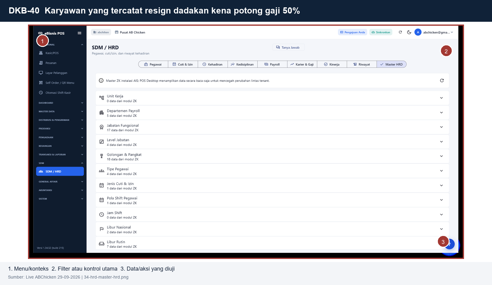

## DKB-41 Karyawan masa kerja di bawah 10 hari tidak kena minusan

- Departemen: HRD
- Posisi menu: SDM / HRD > Aturan Potongan
- Status bukti: LAYAR LIVE
- Bukti: `docs/uat-abchicken-20260929-rev4-bukti-sesuai/feature-evidence/DKB-41.png`
- Sumber layar: `docs/uat-abchicken-20260929-rev4-bukti-sesuai/evidence-live/34-hrd-master-hrd.png` (Live ABChicken 29-09-2026)
- Anotasi: 1 menu/konteks, 2 filter atau kontrol utama, 3 data/aksi yang diuji.
- Petunjuk: buka menu yang tercantum, pastikan tenant dan toko aktif sudah benar, gunakan kontrol yang ditandai, lalu periksa data atau status hasilnya.

## DKB-42 Purchase Request (dari divisi gudang, packing, bd, rpa)

- Departemen: Purchase
- Posisi menu: Pengadaan > PR
- Status bukti: LAYAR LIVE
- Bukti: `docs/uat-abchicken-20260929-rev4-bukti-sesuai/feature-evidence/DKB-42.png`
- Sumber layar: `docs/uat-abchicken-20260929-rev3-per-fitur/evidence-live/03-procurement_pr-50-record.png` (Live ABChicken 29-09-2026)
- Anotasi: 1 menu/konteks, 2 filter atau kontrol utama, 3 data/aksi yang diuji.
- Petunjuk: buka menu yang tercantum, pastikan tenant dan toko aktif sudah benar, gunakan kontrol yang ditandai, lalu periksa data atau status hasilnya.

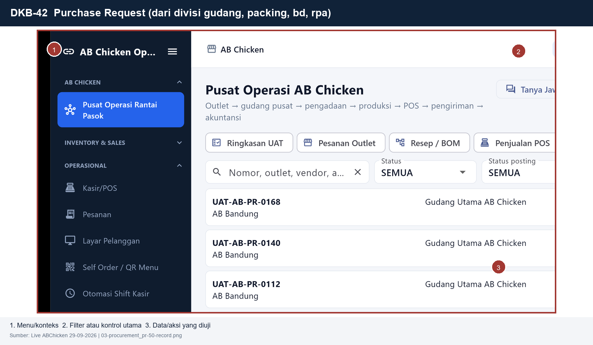

## DKB-43 Laporan Purchase Request

- Departemen: Purchase
- Posisi menu: Pengadaan > Laporan PR
- Status bukti: REFERENSI UAT UI
- Bukti: `docs/uat-abchicken-20260929-rev4-bukti-sesuai/feature-evidence/DKB-43.png`
- Sumber layar: `docs/pos/uat-training-operasional-20260910/screenshots/04-pr-daftar-100-dokumen.png` (UAT UI 10-09-2026)
- Anotasi: 1 menu/konteks, 2 filter atau kontrol utama, 3 data/aksi yang diuji.
- Petunjuk: buka menu yang tercantum, pastikan tenant dan toko aktif sudah benar, gunakan kontrol yang ditandai, lalu periksa data atau status hasilnya.

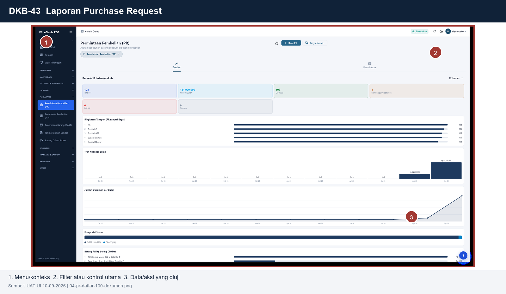

## DKB-44 List Data Supplier

- Departemen: Purchase
- Posisi menu: Master Data > Pemasok
- Status bukti: LAYAR LIVE
- Bukti: `docs/uat-abchicken-20260929-rev4-bukti-sesuai/feature-evidence/DKB-44.png`
- Sumber layar: `docs/uat-abchicken-20260929-rev4-bukti-sesuai/evidence-live/45-master-supplier.png` (Live ABChicken 29-09-2026)
- Anotasi: 1 menu/konteks, 2 filter atau kontrol utama, 3 data/aksi yang diuji.
- Petunjuk: buka menu yang tercantum, pastikan tenant dan toko aktif sudah benar, gunakan kontrol yang ditandai, lalu periksa data atau status hasilnya.

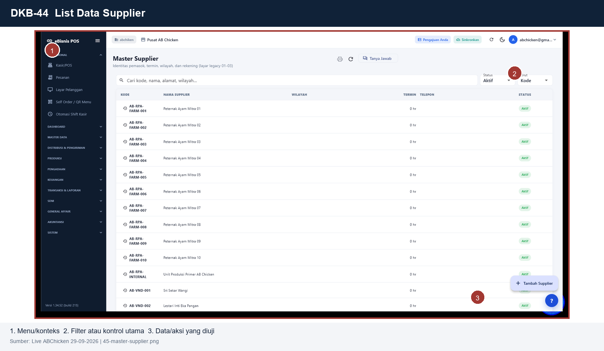

## DKB-45 Daftar Pembelian

- Departemen: Purchase
- Posisi menu: Inventory & Sales > Kulakan
- Status bukti: LAYAR LIVE
- Bukti: `docs/uat-abchicken-20260929-rev4-bukti-sesuai/feature-evidence/DKB-45.png`
- Sumber layar: `docs/uat-abchicken-20260929-rev4-bukti-sesuai/evidence-live/43-kulakan.png` (Live ABChicken 29-09-2026)
- Anotasi: 1 menu/konteks, 2 filter atau kontrol utama, 3 data/aksi yang diuji.
- Petunjuk: buka menu yang tercantum, pastikan tenant dan toko aktif sudah benar, gunakan kontrol yang ditandai, lalu periksa data atau status hasilnya.

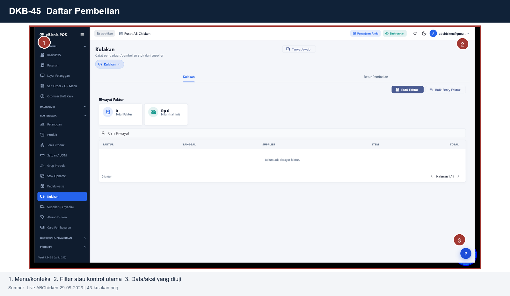

## DKB-46 Laporan Pembelian (Persupplier, Perjenis, Peritem)

- Departemen: Purchase
- Posisi menu: Inventory & Sales > Hutang Supplier
- Status bukti: LAYAR LIVE
- Bukti: `docs/uat-abchicken-20260929-rev4-bukti-sesuai/feature-evidence/DKB-46.png`
- Sumber layar: `docs/uat-abchicken-20260929-rev4-bukti-sesuai/evidence-live/44-hutang-laporan-pembelian.png` (Live ABChicken 29-09-2026)
- Anotasi: 1 menu/konteks, 2 filter atau kontrol utama, 3 data/aksi yang diuji.
- Petunjuk: buka menu yang tercantum, pastikan tenant dan toko aktif sudah benar, gunakan kontrol yang ditandai, lalu periksa data atau status hasilnya.

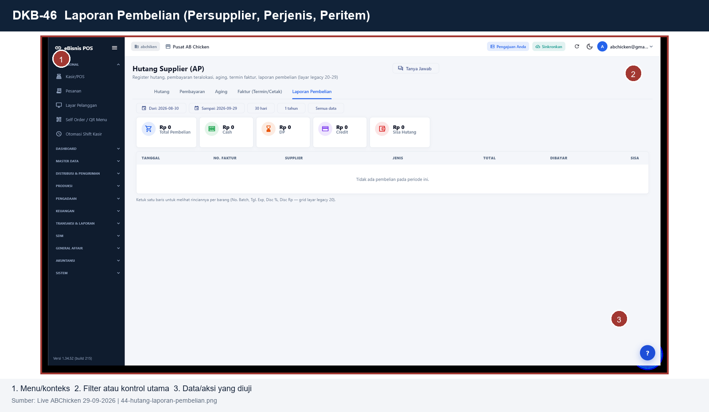

## DKB-47 Reminder Pembayaran Tempo

- Departemen: Purchase
- Posisi menu: Inventory & Sales > Hutang Supplier
- Status bukti: LAYAR LIVE
- Bukti: `docs/uat-abchicken-20260929-rev4-bukti-sesuai/feature-evidence/DKB-47.png`
- Sumber layar: `docs/uat-abchicken-20260929-rev4-bukti-sesuai/evidence-live/44-hutang-aging.png` (Live ABChicken 29-09-2026)
- Anotasi: 1 menu/konteks, 2 filter atau kontrol utama, 3 data/aksi yang diuji.
- Petunjuk: buka menu yang tercantum, pastikan tenant dan toko aktif sudah benar, gunakan kontrol yang ditandai, lalu periksa data atau status hasilnya.

## DKB-48 Data Retur Supplier

- Departemen: Purchase
- Posisi menu: Inventory & Sales > Retur Pembelian
- Status bukti: LAYAR LIVE
- Bukti: `docs/uat-abchicken-20260929-rev4-bukti-sesuai/feature-evidence/DKB-48.png`
- Sumber layar: `docs/uat-abchicken-20260929-rev4-bukti-sesuai/evidence-live/43-retur-pembelian.png` (Live ABChicken 29-09-2026)
- Anotasi: 1 menu/konteks, 2 filter atau kontrol utama, 3 data/aksi yang diuji.
- Petunjuk: buka menu yang tercantum, pastikan tenant dan toko aktif sudah benar, gunakan kontrol yang ditandai, lalu periksa data atau status hasilnya.

## DKB-49 PO di buat oleh SPV, Business Development, RPA dan divisi lain yang akan order barang langsung link tanpa gudang input manual

- Departemen: Supply Chain
- Posisi menu: Pengadaan > PO
- Status bukti: LAYAR LIVE
- Bukti: `docs/uat-abchicken-20260929-rev4-bukti-sesuai/feature-evidence/DKB-49.png`
- Sumber layar: `docs/uat-abchicken-20260929-rev3-per-fitur/evidence-live/04-procurement_po-50-record.png` (Live ABChicken 29-09-2026)
- Anotasi: 1 menu/konteks, 2 filter atau kontrol utama, 3 data/aksi yang diuji.
- Petunjuk: buka menu yang tercantum, pastikan tenant dan toko aktif sudah benar, gunakan kontrol yang ditandai, lalu periksa data atau status hasilnya.

## DKB-50 Gudang (manager/adm) bisa edit PO untuk pengurangan barang

- Departemen: Supply Chain
- Posisi menu: Pengadaan > PO
- Status bukti: REFERENSI UAT UI
- Bukti: `docs/uat-abchicken-20260929-rev4-bukti-sesuai/feature-evidence/DKB-50.png`
- Sumber layar: `docs/pos/uat-training-operasional-20260910/screenshots/07-po-formulir-nontermin.png` (UAT UI 10-09-2026)
- Anotasi: 1 menu/konteks, 2 filter atau kontrol utama, 3 data/aksi yang diuji.
- Petunjuk: buka menu yang tercantum, pastikan tenant dan toko aktif sudah benar, gunakan kontrol yang ditandai, lalu periksa data atau status hasilnya.

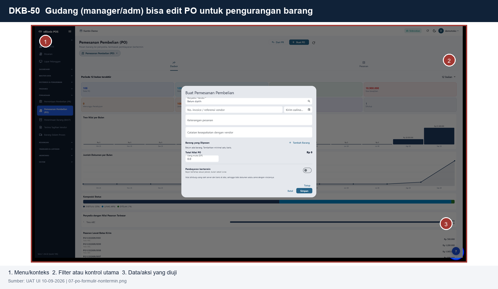

## DKB-51 PO bisa di print dalam bentuk surat jalan (ada kolom ceklist untuk gudang, checker, dan outlet) ada kolom TTD juga untuk gudang delivery dan outlet

- Departemen: Supply Chain
- Posisi menu: Distribusi & Pengiriman > Surat Jalan
- Status bukti: LAYAR LIVE
- Bukti: `docs/uat-abchicken-20260929-rev4-bukti-sesuai/feature-evidence/DKB-51.png`
- Sumber layar: `docs/uat-abchicken-20260929-rev4-bukti-sesuai/evidence-live/47-pengiriman.png` (Live ABChicken 29-09-2026)
- Anotasi: 1 menu/konteks, 2 filter atau kontrol utama, 3 data/aksi yang diuji.
- Petunjuk: buka menu yang tercantum, pastikan tenant dan toko aktif sudah benar, gunakan kontrol yang ditandai, lalu periksa data atau status hasilnya.

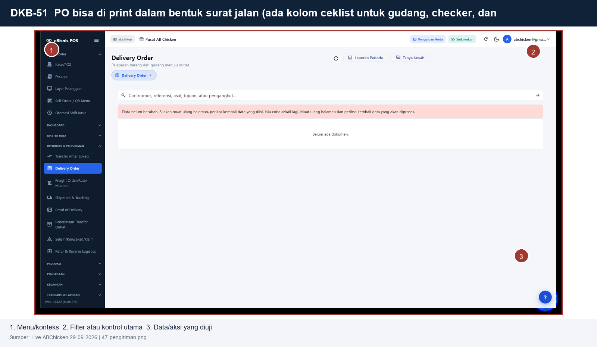

## DKB-52 Bisa menampilkan data pemakaian dan sisa stok outlet pada saat PO ke gudang

- Departemen: Supply Chain
- Posisi menu: Pengadaan > PO > Riwayat Stok Outlet
- Status bukti: LAYAR LIVE
- Bukti: `docs/uat-abchicken-20260929-rev4-bukti-sesuai/feature-evidence/DKB-52.png`
- Sumber layar: `docs/uat-abchicken-20260929-rev4-bukti-sesuai/evidence-live/48-rekonsiliasi-stok.png` (Live ABChicken 29-09-2026)
- Anotasi: 1 menu/konteks, 2 filter atau kontrol utama, 3 data/aksi yang diuji.
- Petunjuk: buka menu yang tercantum, pastikan tenant dan toko aktif sudah benar, gunakan kontrol yang ditandai, lalu periksa data atau status hasilnya.

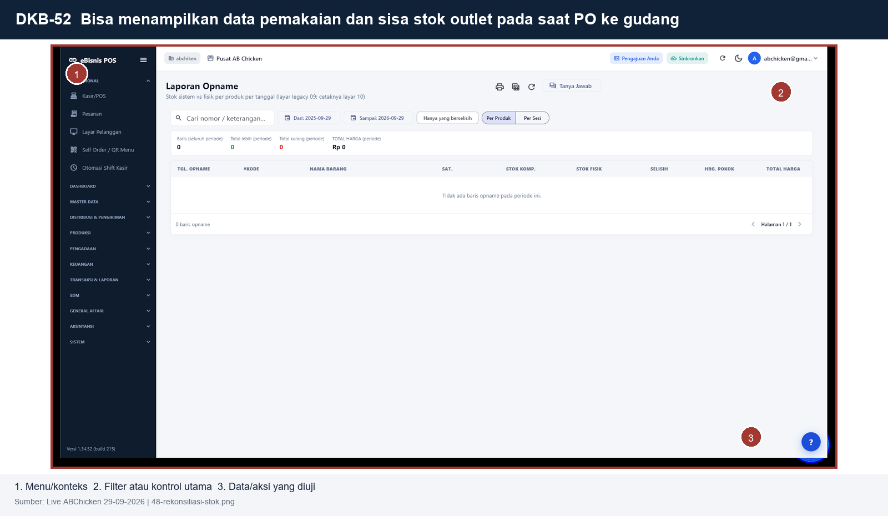

## DKB-53 Bisa tarik data laporan pengiriman barang harian, mingguan, bulanan. Baik per item/outlet

- Departemen: Supply Chain
- Posisi menu: Distribusi & Pengiriman > Laporan
- Status bukti: LAYAR LIVE
- Bukti: `docs/uat-abchicken-20260929-rev4-bukti-sesuai/feature-evidence/DKB-53.png`
- Sumber layar: `docs/uat-abchicken-20260929-rev3-per-fitur/evidence-live/09-shipment-50-record.png` (Live ABChicken 29-09-2026)
- Anotasi: 1 menu/konteks, 2 filter atau kontrol utama, 3 data/aksi yang diuji.
- Petunjuk: buka menu yang tercantum, pastikan tenant dan toko aktif sudah benar, gunakan kontrol yang ditandai, lalu periksa data atau status hasilnya.

## DKB-54 Data return dari outlet

- Departemen: Supply Chain
- Posisi menu: Distribusi & Pengiriman > Retur Outlet
- Status bukti: LAYAR LIVE
- Bukti: `docs/uat-abchicken-20260929-rev4-bukti-sesuai/feature-evidence/DKB-54.png`
- Sumber layar: `docs/uat-abchicken-20260929-rev3-per-fitur/evidence-live/10-claim-50-record.png` (Live ABChicken 29-09-2026)
- Anotasi: 1 menu/konteks, 2 filter atau kontrol utama, 3 data/aksi yang diuji.
- Petunjuk: buka menu yang tercantum, pastikan tenant dan toko aktif sudah benar, gunakan kontrol yang ditandai, lalu periksa data atau status hasilnya.

## DKB-55 Pengajuan inventaris toko lewat aplikasi POS, approval ke bagian General Affair dan di acc oleh Keuangan

- Departemen: General Affair
- Posisi menu: Inventaris GA > Pengajuan
- Status bukti: LAYAR LIVE
- Bukti: `docs/uat-abchicken-20260929-rev4-bukti-sesuai/feature-evidence/DKB-55.png`
- Sumber layar: `docs/uat-abchicken-20260929-rev4-bukti-sesuai/evidence-live/35-ga-pengajuan.png` (Live ABChicken 29-09-2026)
- Anotasi: 1 menu/konteks, 2 filter atau kontrol utama, 3 data/aksi yang diuji.
- Petunjuk: buka menu yang tercantum, pastikan tenant dan toko aktif sudah benar, gunakan kontrol yang ditandai, lalu periksa data atau status hasilnya.

## DKB-56 List inventaris per toko

- Departemen: General Affair
- Posisi menu: Inventaris GA > Daftar Aset
- Status bukti: LAYAR LIVE
- Bukti: `docs/uat-abchicken-20260929-rev4-bukti-sesuai/feature-evidence/DKB-56.png`
- Sumber layar: `docs/uat-abchicken-20260929-rev4-bukti-sesuai/evidence-live/35-inventaris-general-affair.png` (Live ABChicken 29-09-2026)
- Anotasi: 1 menu/konteks, 2 filter atau kontrol utama, 3 data/aksi yang diuji.
- Petunjuk: buka menu yang tercantum, pastikan tenant dan toko aktif sudah benar, gunakan kontrol yang ditandai, lalu periksa data atau status hasilnya.

## DKB-57 Pengajuan retur inventaris

- Departemen: General Affair
- Posisi menu: Inventaris GA > Retur
- Status bukti: LAYAR LIVE
- Bukti: `docs/uat-abchicken-20260929-rev4-bukti-sesuai/feature-evidence/DKB-57.png`
- Sumber layar: `docs/uat-abchicken-20260929-rev4-bukti-sesuai/evidence-live/35-ga-form-retur.png` (Live ABChicken 29-09-2026)
- Anotasi: 1 menu/konteks, 2 filter atau kontrol utama, 3 data/aksi yang diuji.
- Petunjuk: buka menu yang tercantum, pastikan tenant dan toko aktif sudah benar, gunakan kontrol yang ditandai, lalu periksa data atau status hasilnya.

## DKB-58 Pengajuan perpindahan invetaris dari satu outlet ke outlet lainnya

- Departemen: General Affair
- Posisi menu: Inventaris GA > Perpindahan
- Status bukti: LAYAR LIVE
- Bukti: `docs/uat-abchicken-20260929-rev4-bukti-sesuai/feature-evidence/DKB-58.png`
- Sumber layar: `docs/uat-abchicken-20260929-rev4-bukti-sesuai/evidence-live/35-ga-form-perpindahan.png` (Live ABChicken 29-09-2026)
- Anotasi: 1 menu/konteks, 2 filter atau kontrol utama, 3 data/aksi yang diuji.
- Petunjuk: buka menu yang tercantum, pastikan tenant dan toko aktif sudah benar, gunakan kontrol yang ditandai, lalu periksa data atau status hasilnya.

