# UAT dan User Manual ABChicken POS Rev5

Tanggal pemeriksaan: 29 September 2026 (WIB)

## Kesimpulan

Seluruh 58 fitur pada Fitur DKB SmartPOS.xlsx mempunyai satu halaman tersendiri. Setiap halaman menggabungkan posisi layar fitur dengan bukti data live dari proses utama ABChicken. Gerbang data live memverifikasi 60-270 record pada setiap proses utama; tidak ada proses utama yang berada di bawah 50 record.

Bukti layar fitur menunjukkan letak menu dan kontrol. Bukti data pendukung menunjukkan kesiapan volume data pada tenant yang sama. Kombinasi ini tidak boleh ditafsirkan sebagai keberhasilan transaksi untuk fitur yang tidak dieksekusi sampai tahap simpan/posting.

## Cakupan sumber Excel

- **Fitur DKB SmartPOS.xlsx**: 1 sheet, 60 baris tidak kosong.
- **DATA MASTER.xlsx**: 7 sheet, 815 baris tidak kosong.
- **MASTER MENU 2026.xlsx**: 3 sheet, 446 baris tidak kosong.
- **Laporan Harian DR Cibanteng Agustus 2026.xlsx**: 31 sheet, 4160 baris tidak kosong.

## Gerbang data live minimal 50

- Ringkasan Data Settle: **19** record, status gagal 0.
- Pesanan Outlet: **170** record, status gagal 0.
- Resep dan BOM: **60** record, status gagal 0.
- Permintaan Pembelian: **170** record, status gagal 0.
- Pesanan Pembelian: **170** record, status gagal 0.
- BAST Gudang Pusat: **170** record, status gagal 0.
- Terima Tagihan Vendor: **170** record, status gagal 0.
- Pembayaran Vendor: **170** record, status gagal 0.
- Produksi dan Packing: **170** record, status gagal 0.
- Delivery Order dan Pengiriman: **270** record, status gagal 0.
- Backorder Retur dan Klaim: **120** record, status gagal 0.
- Penjualan POS: **220** record, status gagal 0.
- Sumber Akun Posting: **3** record, status gagal 0.

## DKB-01 Kasir (order & biling, menu dengan foto produk, print struk untuk customer dan dapur)

- Departemen: Operational
- Posisi menu: Operasional > Kasir/POS
- Status bukti: LAYAR FITUR + DATA UJI LIVE 50+
- Data pendukung: Penjualan POS (220 record)
- Petunjuk: buka menu sesuai posisi, gunakan filter/kontrol yang ditandai, lalu periksa data dan tindakan pada area daftar.

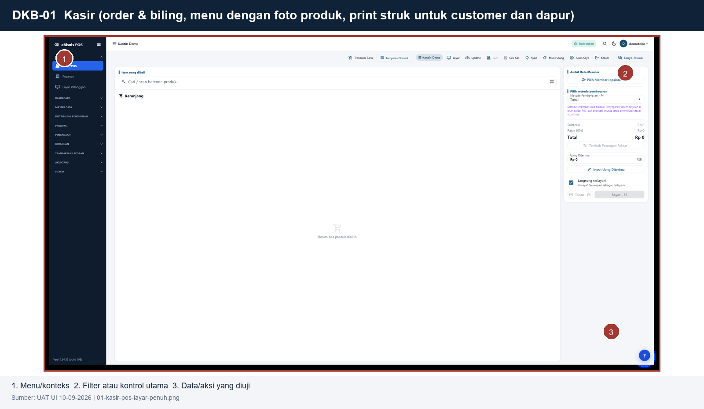

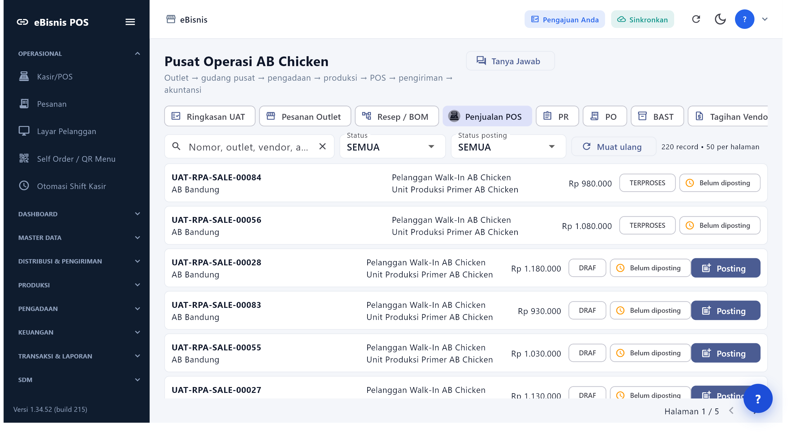

## DKB-02 Nomor antrian di setiap struk, catatan pesanan

- Departemen: Operational
- Posisi menu: Operasional > Kasir/POS > Keranjang
- Status bukti: LAYAR FITUR + DATA UJI LIVE 50+
- Data pendukung: Pesanan Outlet (170 record)
- Petunjuk: buka menu sesuai posisi, gunakan filter/kontrol yang ditandai, lalu periksa data dan tindakan pada area daftar.

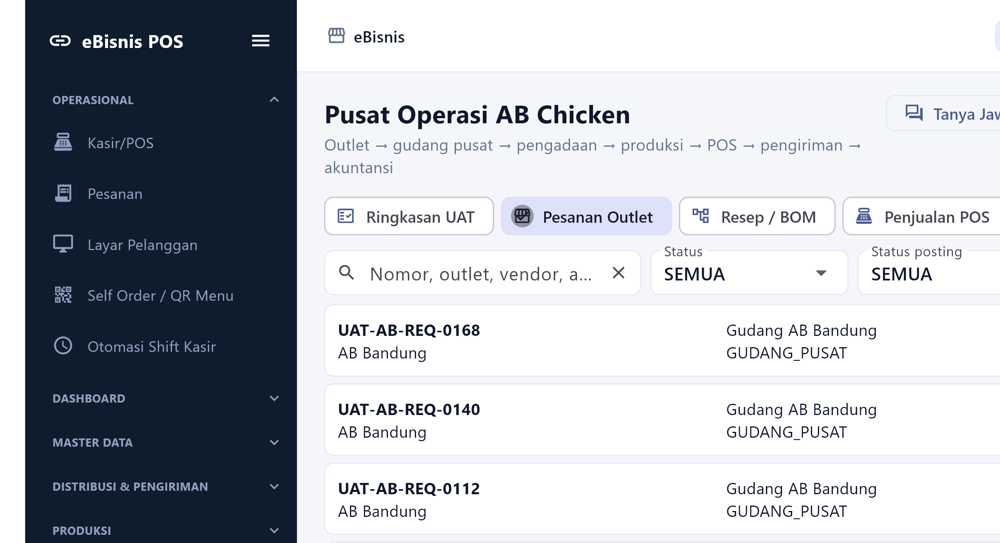

## DKB-03 Waste produk dan retur barang

- Departemen: Operational
- Posisi menu: Produksi > Waste & Susut Produksi
- Status bukti: LAYAR FITUR + DATA UJI LIVE 50+
- Data pendukung: Backorder Retur dan Klaim (120 record)
- Petunjuk: buka menu sesuai posisi, gunakan filter/kontrol yang ditandai, lalu periksa data dan tindakan pada area daftar.

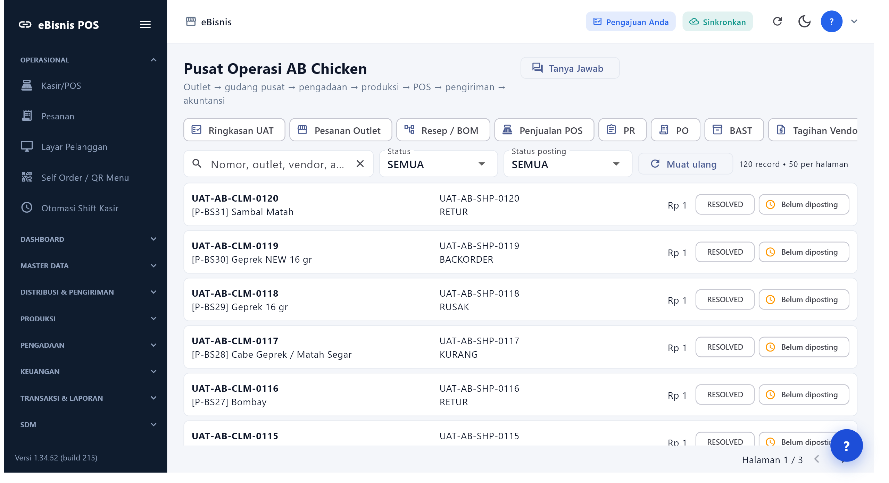

## DKB-04 Manager Meal (tester maximal 20 rb) dan crew meal atau diskon karyawan (potongan harga 10 %)

- Departemen: Operational
- Posisi menu: Operasional > Kasir/POS > Meal Pegawai
- Status bukti: LAYAR FITUR + DATA UJI LIVE 50+
- Data pendukung: Penjualan POS (220 record)
- Petunjuk: buka menu sesuai posisi, gunakan filter/kontrol yang ditandai, lalu periksa data dan tindakan pada area daftar.

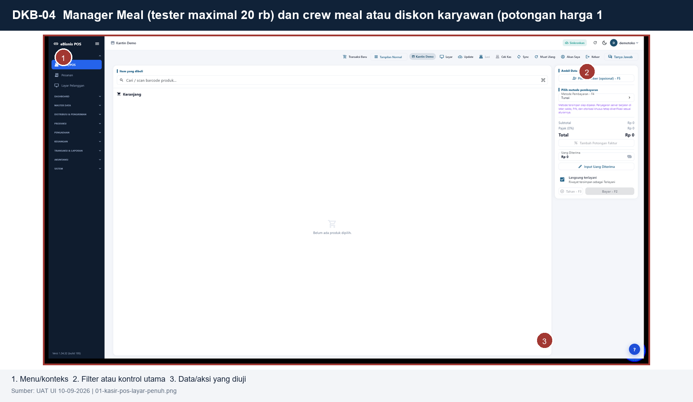

## DKB-05 Laporan penjualan perjam dan per item serta menu khusus

- Departemen: Operational
- Posisi menu: Transaksi & Laporan > Penjualan
- Status bukti: LAYAR FITUR + DATA UJI LIVE 50+
- Data pendukung: Pesanan Outlet (170 record)
- Petunjuk: buka menu sesuai posisi, gunakan filter/kontrol yang ditandai, lalu periksa data dan tindakan pada area daftar.

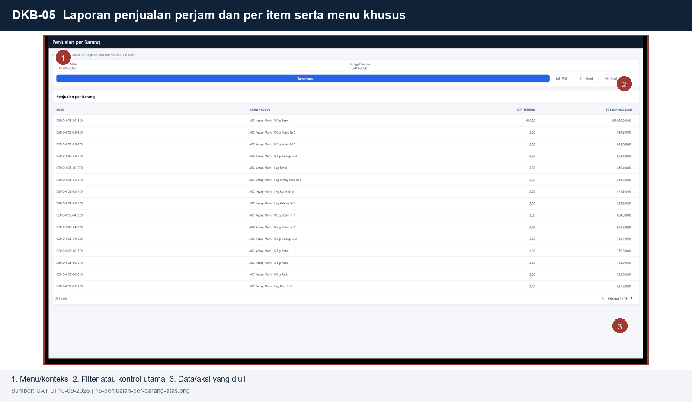

## DKB-06 Laporan mengenai laba rugi, cogs, dan sebagainya

- Departemen: Operational
- Posisi menu: Akuntansi > Laba Rugi
- Status bukti: LAYAR FITUR + DATA UJI LIVE 50+
- Data pendukung: Backorder Retur dan Klaim (120 record)
- Petunjuk: buka menu sesuai posisi, gunakan filter/kontrol yang ditandai, lalu periksa data dan tindakan pada area daftar.

## DKB-07 Self order/customer pesan sendiri lewat scan

- Departemen: Operational
- Posisi menu: Operasional > Self Order / QR Menu
- Status bukti: LAYAR FITUR + DATA UJI LIVE 50+
- Data pendukung: Penjualan POS (220 record)
- Petunjuk: buka menu sesuai posisi, gunakan filter/kontrol yang ditandai, lalu periksa data dan tindakan pada area daftar.

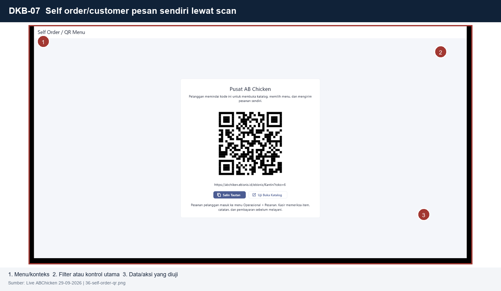

## DKB-08 Buka dan akhiri shift otomatis

- Departemen: Operational
- Posisi menu: Operasional > Pengaturan Shift Otomatis
- Status bukti: LAYAR FITUR + DATA UJI LIVE 50+
- Data pendukung: Pesanan Outlet (170 record)
- Petunjuk: buka menu sesuai posisi, gunakan filter/kontrol yang ditandai, lalu periksa data dan tindakan pada area daftar.

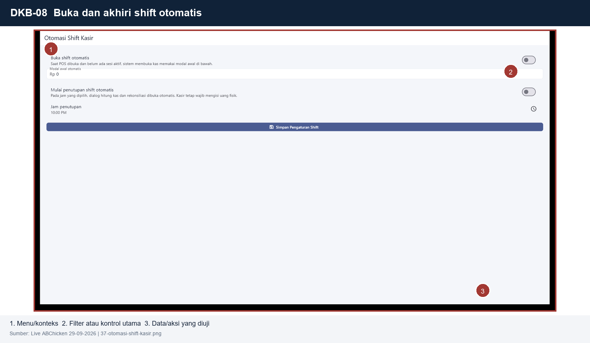

## DKB-09 Offline POS

- Departemen: Operational
- Posisi menu: Operasional > Kasir/POS
- Status bukti: LAYAR FITUR + DATA UJI LIVE 50+
- Data pendukung: Backorder Retur dan Klaim (120 record)
- Petunjuk: buka menu sesuai posisi, gunakan filter/kontrol yang ditandai, lalu periksa data dan tindakan pada area daftar.

## DKB-10 Update HPP dengan fitur all outlet atau check list toko

- Departemen: Research & Development
- Posisi menu: Master Data > Grup Produk
- Status bukti: LAYAR FITUR + DATA UJI LIVE 50+
- Data pendukung: Resep dan BOM (60 record)
- Petunjuk: buka menu sesuai posisi, gunakan filter/kontrol yang ditandai, lalu periksa data dan tindakan pada area daftar.

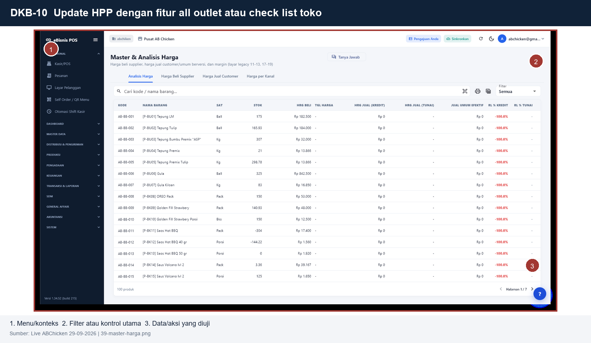

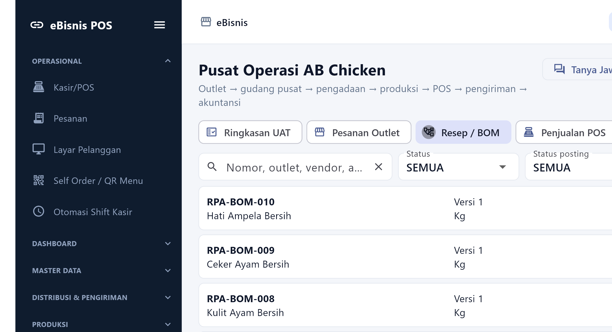

## DKB-11 Penghapusan resep dan menu sekaligus

- Departemen: Research & Development
- Posisi menu: Master Data > Produk > Resep
- Status bukti: LAYAR FITUR + DATA UJI LIVE 50+
- Data pendukung: Produksi dan Packing (170 record)
- Petunjuk: buka menu sesuai posisi, gunakan filter/kontrol yang ditandai, lalu periksa data dan tindakan pada area daftar.

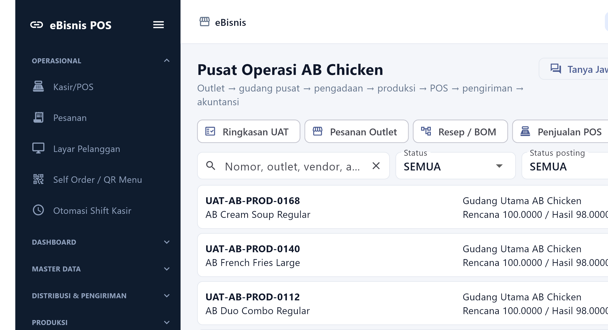

## DKB-12 Penghapusan ingredient dengan fitur check list

- Departemen: Research & Development
- Posisi menu: Master Data > Produk > Resep
- Status bukti: LAYAR FITUR + DATA UJI LIVE 50+
- Data pendukung: Penjualan POS (220 record)
- Petunjuk: buka menu sesuai posisi, gunakan filter/kontrol yang ditandai, lalu periksa data dan tindakan pada area daftar.

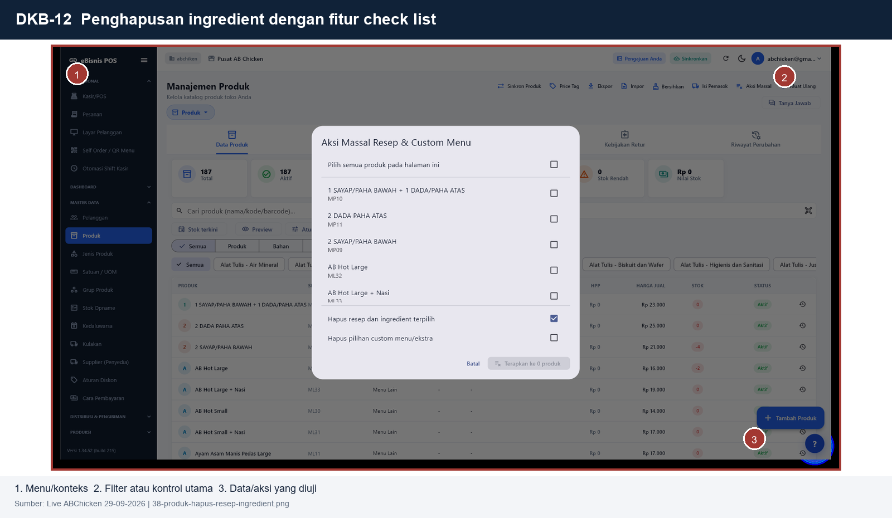

## DKB-13 Custom menu dengan fitur check list

- Departemen: Research & Development
- Posisi menu: Master Data > Produk > Custom Menu
- Status bukti: LAYAR FITUR + DATA UJI LIVE 50+
- Data pendukung: Resep dan BOM (60 record)
- Petunjuk: buka menu sesuai posisi, gunakan filter/kontrol yang ditandai, lalu periksa data dan tindakan pada area daftar.

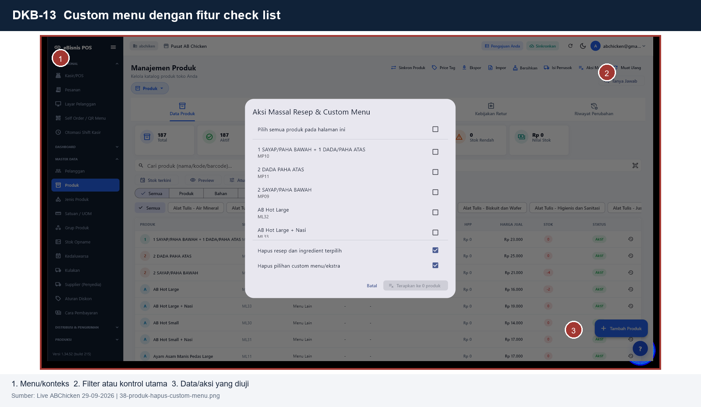

## DKB-14 Fitur untuk melihat produk yang paling banyak dan paling sedikit terjual

- Departemen: Research & Development
- Posisi menu: Dashboard > Produk
- Status bukti: LAYAR FITUR + DATA UJI LIVE 50+
- Data pendukung: Produksi dan Packing (170 record)
- Petunjuk: buka menu sesuai posisi, gunakan filter/kontrol yang ditandai, lalu periksa data dan tindakan pada area daftar.

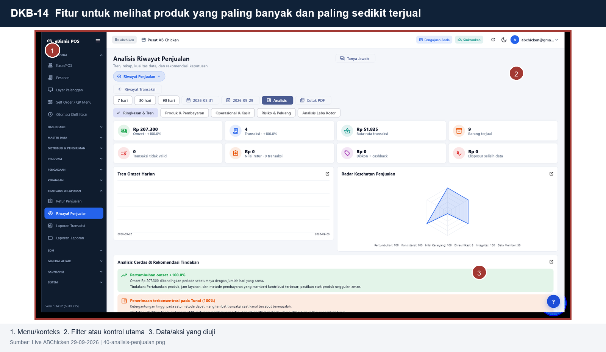

## DKB-15 Laporan penjualan produk

- Departemen: Research & Development
- Posisi menu: Transaksi & Laporan > Penjualan Produk
- Status bukti: LAYAR FITUR + DATA UJI LIVE 50+
- Data pendukung: Penjualan POS (220 record)
- Petunjuk: buka menu sesuai posisi, gunakan filter/kontrol yang ditandai, lalu periksa data dan tindakan pada area daftar.

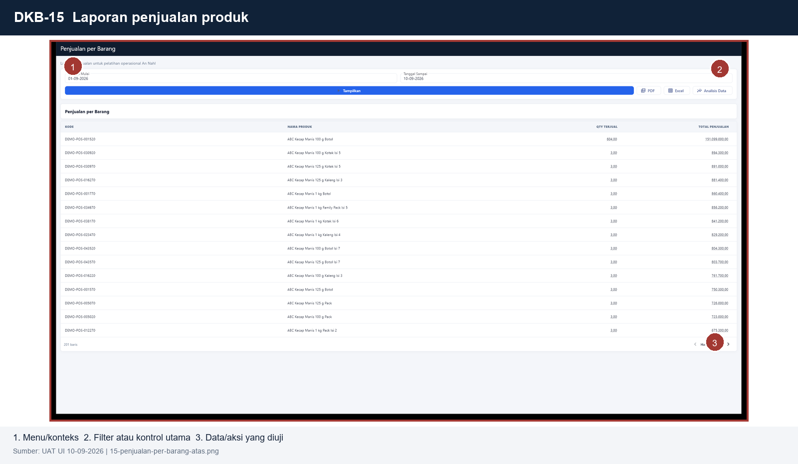

## DKB-16 Laporan penjualan sales type

- Departemen: Research & Development
- Posisi menu: Transaksi & Laporan > Penjualan > Sales Type
- Status bukti: LAYAR FITUR + DATA UJI LIVE 50+
- Data pendukung: Resep dan BOM (60 record)
- Petunjuk: buka menu sesuai posisi, gunakan filter/kontrol yang ditandai, lalu periksa data dan tindakan pada area daftar.

## DKB-17 Semua menu dibedakan harga category termasuk online food

- Departemen: Research & Development
- Posisi menu: Master Data > Produk > Harga per Kanal
- Status bukti: LAYAR FITUR + DATA UJI LIVE 50+
- Data pendukung: Produksi dan Packing (170 record)
- Petunjuk: buka menu sesuai posisi, gunakan filter/kontrol yang ditandai, lalu periksa data dan tindakan pada area daftar.

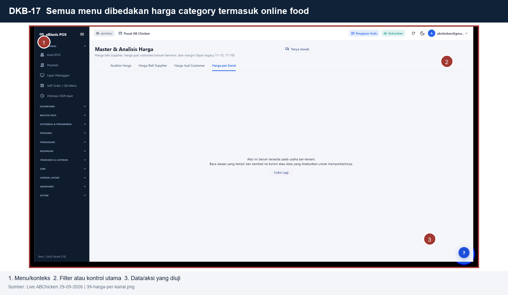

## DKB-18 Ringkasan Penjualan (Gross Sales, Discount, Refunds, Net Sales)

- Departemen: Audit & Surveillance
- Posisi menu: Transaksi & Laporan > Ringkasan Penjualan
- Status bukti: LAYAR FITUR + DATA UJI LIVE 50+
- Data pendukung: Pesanan Outlet (170 record)
- Petunjuk: buka menu sesuai posisi, gunakan filter/kontrol yang ditandai, lalu periksa data dan tindakan pada area daftar.

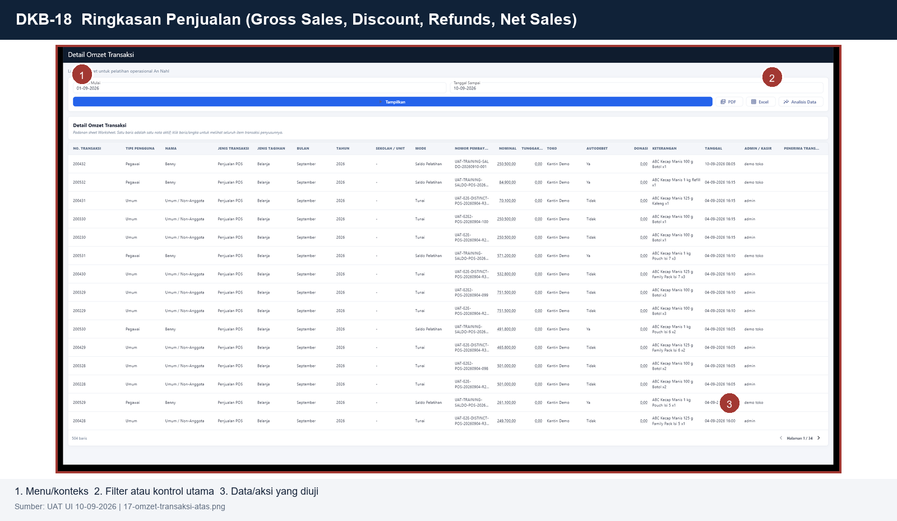

## DKB-19 Gross Profit

- Departemen: Audit & Surveillance
- Posisi menu: Transaksi & Laporan > Laba Kotor
- Status bukti: LAYAR FITUR + DATA UJI LIVE 50+
- Data pendukung: Penjualan POS (220 record)
- Petunjuk: buka menu sesuai posisi, gunakan filter/kontrol yang ditandai, lalu periksa data dan tindakan pada area daftar.

## DKB-20 Rincian Metode Pembayaran

- Departemen: Audit & Surveillance
- Posisi menu: Transaksi & Laporan > Metode Pembayaran
- Status bukti: LAYAR FITUR + DATA UJI LIVE 50+
- Data pendukung: Backorder Retur dan Klaim (120 record)
- Petunjuk: buka menu sesuai posisi, gunakan filter/kontrol yang ditandai, lalu periksa data dan tindakan pada area daftar.

## DKB-21 Rincian Produk Terjual (per toko, per hari)

- Departemen: Audit & Surveillance
- Posisi menu: Transaksi & Laporan > Produk Terjual
- Status bukti: LAYAR FITUR + DATA UJI LIVE 50+
- Data pendukung: Pesanan Outlet (170 record)
- Petunjuk: buka menu sesuai posisi, gunakan filter/kontrol yang ditandai, lalu periksa data dan tindakan pada area daftar.

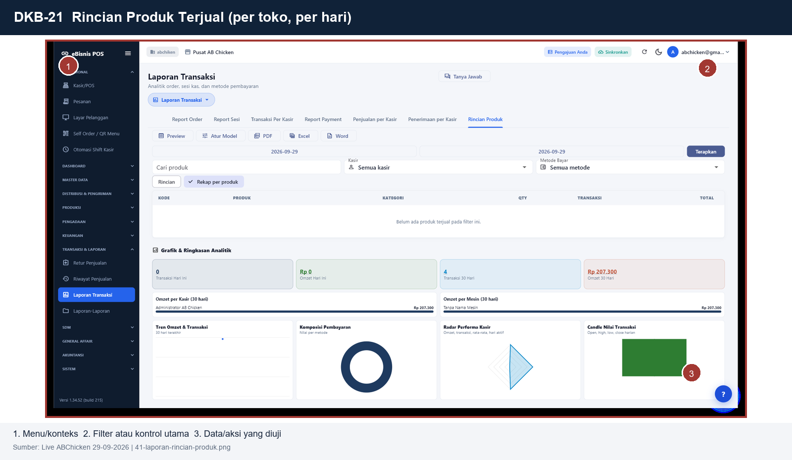

## DKB-22 Rincian Item Refund

- Departemen: Audit & Surveillance
- Posisi menu: Transaksi & Laporan > Retur Penjualan
- Status bukti: LAYAR FITUR + DATA UJI LIVE 50+
- Data pendukung: Penjualan POS (220 record)
- Petunjuk: buka menu sesuai posisi, gunakan filter/kontrol yang ditandai, lalu periksa data dan tindakan pada area daftar.

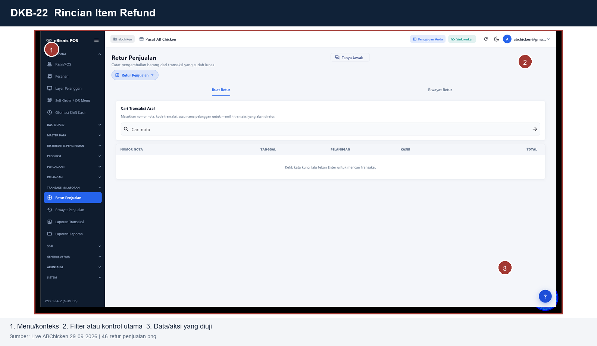

## DKB-23 Laporan Transaksi per hari/bulan/tahun

- Departemen: Audit & Surveillance
- Posisi menu: Transaksi & Laporan > Transaksi
- Status bukti: LAYAR FITUR + DATA UJI LIVE 50+
- Data pendukung: Backorder Retur dan Klaim (120 record)
- Petunjuk: buka menu sesuai posisi, gunakan filter/kontrol yang ditandai, lalu periksa data dan tindakan pada area daftar.

## DKB-24 Laporan Shift (pemasukan dan pengeluaran)

- Departemen: Audit & Surveillance
- Posisi menu: Transaksi & Laporan > Rekonsiliasi Sesi
- Status bukti: LAYAR FITUR + DATA UJI LIVE 50+
- Data pendukung: Pesanan Outlet (170 record)
- Petunjuk: buka menu sesuai posisi, gunakan filter/kontrol yang ditandai, lalu periksa data dan tindakan pada area daftar.

## DKB-25 Laporan Inventory/Stok (saldo awal, purchase order, pemakaian/usage, transfer stok, adjustment stok, waste, saldo akhir)

- Departemen: Audit & Surveillance
- Posisi menu: Inventory & Sales > Riwayat Stok
- Status bukti: LAYAR FITUR + DATA UJI LIVE 50+
- Data pendukung: Penjualan POS (220 record)
- Petunjuk: buka menu sesuai posisi, gunakan filter/kontrol yang ditandai, lalu periksa data dan tindakan pada area daftar.

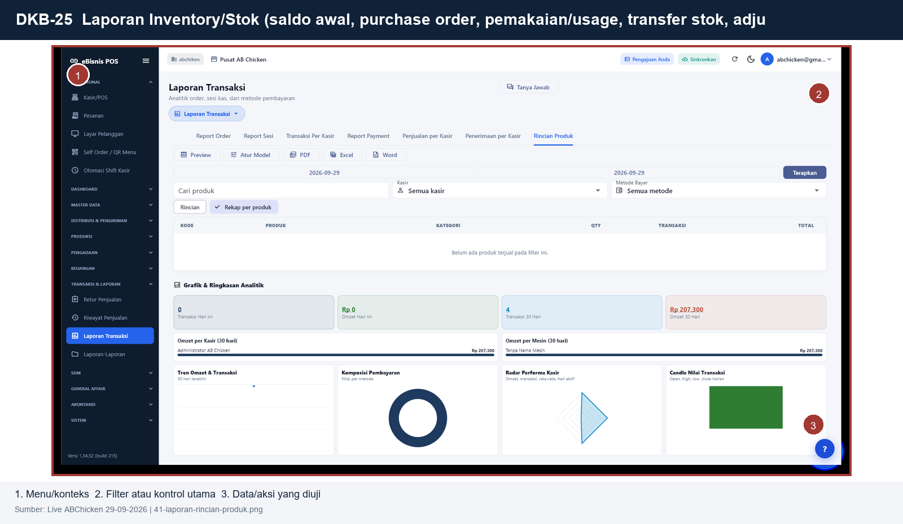

## DKB-26 Ringkasan Selisih Stok

- Departemen: Audit & Surveillance
- Posisi menu: Inventory & Sales > Rekonsiliasi Stok
- Status bukti: LAYAR FITUR + DATA UJI LIVE 50+
- Data pendukung: Backorder Retur dan Klaim (120 record)
- Petunjuk: buka menu sesuai posisi, gunakan filter/kontrol yang ditandai, lalu periksa data dan tindakan pada area daftar.

## DKB-27 Ringkasan waste produk

- Departemen: Audit & Surveillance
- Posisi menu: Produksi > Waste & Susut Produksi
- Status bukti: LAYAR FITUR + DATA UJI LIVE 50+
- Data pendukung: Pesanan Outlet (170 record)
- Petunjuk: buka menu sesuai posisi, gunakan filter/kontrol yang ditandai, lalu periksa data dan tindakan pada area daftar.

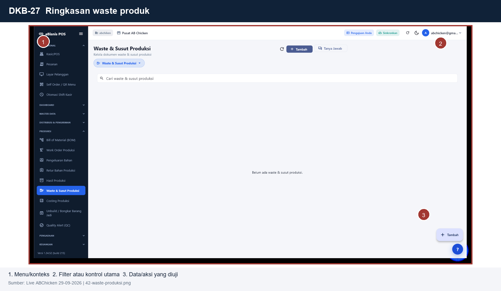

## DKB-28 Pengajuan cuti online

- Departemen: HRD
- Posisi menu: SDM / HRD > Cuti & Izin
- Status bukti: LAYAR FITUR + DATA UJI LIVE 50+
- Data pendukung: Penjualan POS (220 record)
- Petunjuk: buka menu sesuai posisi, gunakan filter/kontrol yang ditandai, lalu periksa data dan tindakan pada area daftar.

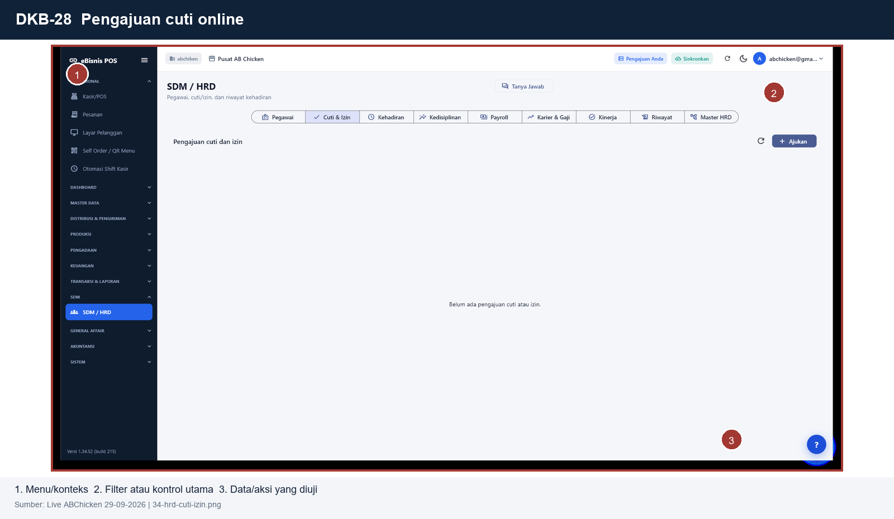

## DKB-29 Rekap kehadiran bisa dengan beberapa metode: foto/fingerprint/qrcode

- Departemen: HRD
- Posisi menu: SDM / HRD > Kehadiran
- Status bukti: LAYAR FITUR + DATA UJI LIVE 50+
- Data pendukung: Pesanan Outlet (170 record)
- Petunjuk: buka menu sesuai posisi, gunakan filter/kontrol yang ditandai, lalu periksa data dan tindakan pada area daftar.

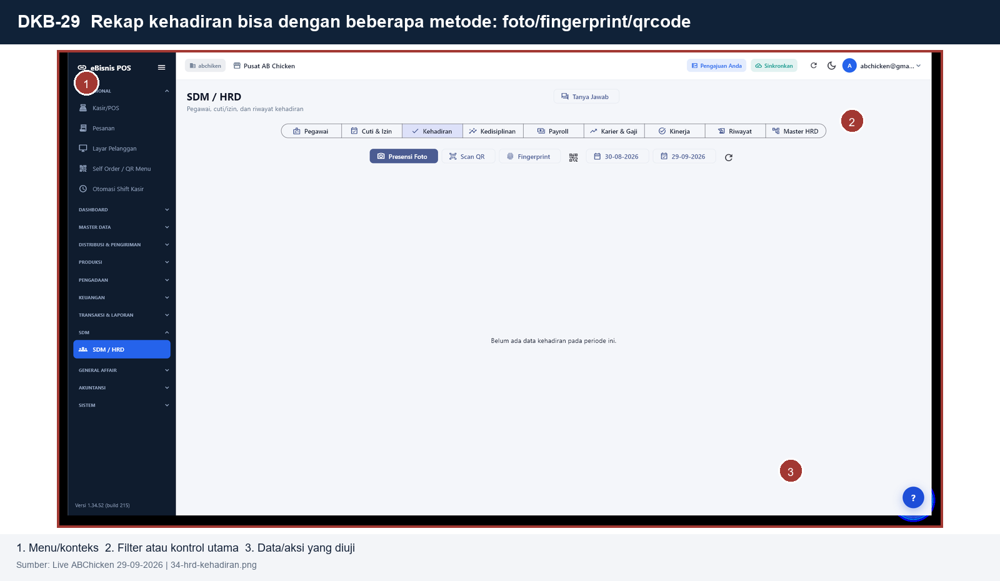

## DKB-30 Pengajuan Sakit dan Izin secara online, lalu ngelink approval dari atasan dan HRD

- Departemen: HRD
- Posisi menu: SDM / HRD > Cuti & Izin
- Status bukti: LAYAR FITUR + DATA UJI LIVE 50+
- Data pendukung: Resep dan BOM (60 record)
- Petunjuk: buka menu sesuai posisi, gunakan filter/kontrol yang ditandai, lalu periksa data dan tindakan pada area daftar.

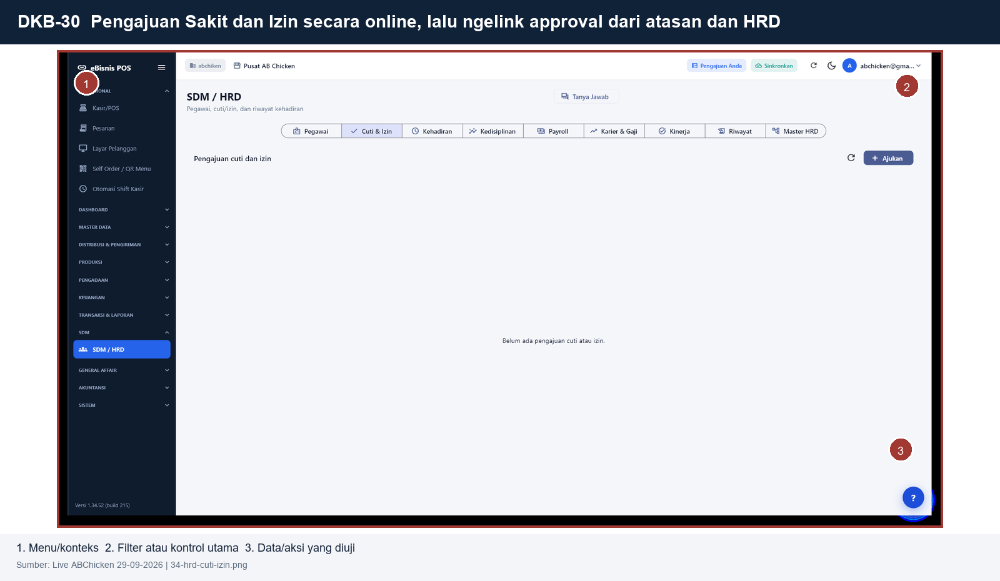

## DKB-31 Terdapat grafik kedisiplinan (Paling sering izin, Paling sering datang tepat waktu)

- Departemen: HRD
- Posisi menu: SDM / HRD > Kedisiplinan
- Status bukti: LAYAR FITUR + DATA UJI LIVE 50+
- Data pendukung: Penjualan POS (220 record)
- Petunjuk: buka menu sesuai posisi, gunakan filter/kontrol yang ditandai, lalu periksa data dan tindakan pada area daftar.

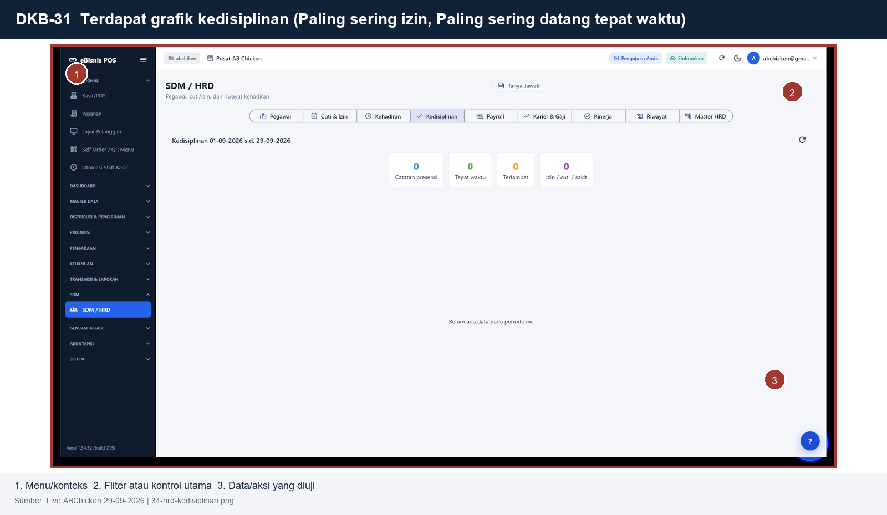

## DKB-32 Bisa tarik data riwayat kehadiran

- Departemen: HRD
- Posisi menu: SDM / HRD > Kehadiran
- Status bukti: LAYAR FITUR + DATA UJI LIVE 50+
- Data pendukung: Pesanan Outlet (170 record)
- Petunjuk: buka menu sesuai posisi, gunakan filter/kontrol yang ditandai, lalu periksa data dan tindakan pada area daftar.

## DKB-33 Untuk outlet absen di Aplikasi -> setiap karyawan dibuatkan akun dan WAJIB ABSEN di aplikasi tsb

- Departemen: HRD
- Posisi menu: SDM / HRD > Pegawai
- Status bukti: LAYAR FITUR + DATA UJI LIVE 50+
- Data pendukung: Resep dan BOM (60 record)
- Petunjuk: buka menu sesuai posisi, gunakan filter/kontrol yang ditandai, lalu periksa data dan tindakan pada area daftar.

## DKB-34 7 Pengajian dan lembur berdasarkan surat perintah/persetujuan atasan-> jika tidak ada, dianggap tidak lembur (tidak untuk pencairan lembur)

- Departemen: HRD
- Posisi menu: SDM / HRD > Payroll
- Status bukti: LAYAR FITUR + DATA UJI LIVE 50+
- Data pendukung: Penjualan POS (220 record)
- Petunjuk: buka menu sesuai posisi, gunakan filter/kontrol yang ditandai, lalu periksa data dan tindakan pada area daftar.

## DKB-35 Jenjang kenaikan gaji disesuaikan berdasarkan masa kerja atau persentase

- Departemen: HRD
- Posisi menu: SDM / HRD > Payroll > Jenjang Gaji
- Status bukti: LAYAR FITUR + DATA UJI LIVE 50+
- Data pendukung: Pesanan Outlet (170 record)
- Petunjuk: buka menu sesuai posisi, gunakan filter/kontrol yang ditandai, lalu periksa data dan tindakan pada area daftar.

## DKB-36 Bisa integrasi data kasbon dan segala bentuk potongan ke dalam slip gaji tanpa harus menginput manual

- Departemen: HRD
- Posisi menu: SDM / HRD > Payroll
- Status bukti: LAYAR FITUR + DATA UJI LIVE 50+
- Data pendukung: Resep dan BOM (60 record)
- Petunjuk: buka menu sesuai posisi, gunakan filter/kontrol yang ditandai, lalu periksa data dan tindakan pada area daftar.

## DKB-37 Sistem slip gaji mengakses mandiri di akun pribadi karyawan

- Departemen: HRD
- Posisi menu: SDM / HRD > Payroll > Slip Saya
- Status bukti: LAYAR FITUR + DATA UJI LIVE 50+
- Data pendukung: Penjualan POS (220 record)
- Petunjuk: buka menu sesuai posisi, gunakan filter/kontrol yang ditandai, lalu periksa data dan tindakan pada area daftar.

## DKB-38 Setiap karyawan mendapatkan ID User sehingga presensi bisa ter-record

- Departemen: HRD
- Posisi menu: SDM / HRD > Pegawai
- Status bukti: LAYAR FITUR + DATA UJI LIVE 50+
- Data pendukung: Pesanan Outlet (170 record)
- Petunjuk: buka menu sesuai posisi, gunakan filter/kontrol yang ditandai, lalu periksa data dan tindakan pada area daftar.

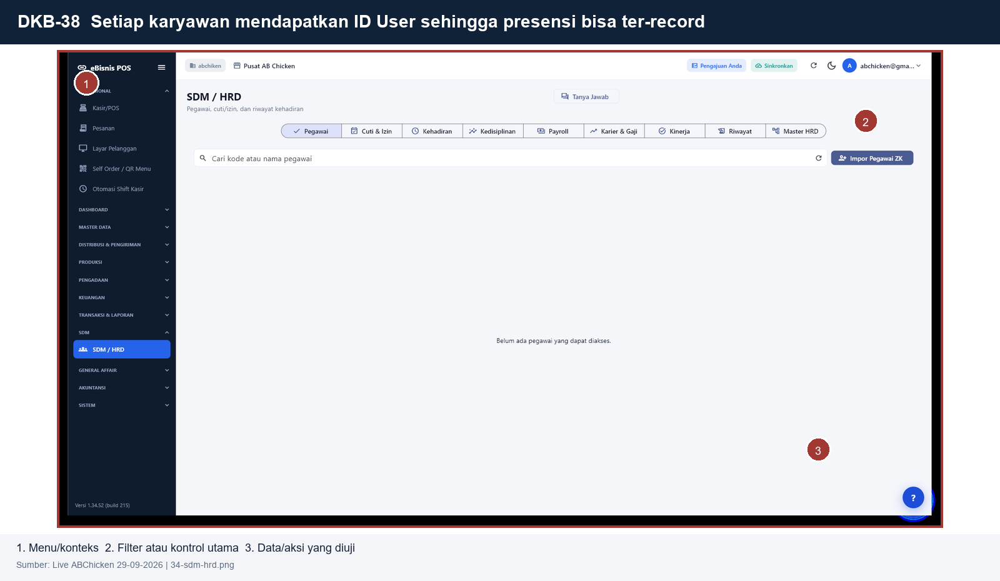

## DKB-39 12 Setiap tim lapangan yang visit ke outlet untuk pendampingan akan mendapatkan notes minusan secara otomatis setelah mendapatkan verifikasi audit

- Departemen: HRD
- Posisi menu: SDM / HRD > Aturan Potongan
- Status bukti: LAYAR FITUR + DATA UJI LIVE 50+
- Data pendukung: Resep dan BOM (60 record)
- Petunjuk: buka menu sesuai posisi, gunakan filter/kontrol yang ditandai, lalu periksa data dan tindakan pada area daftar.

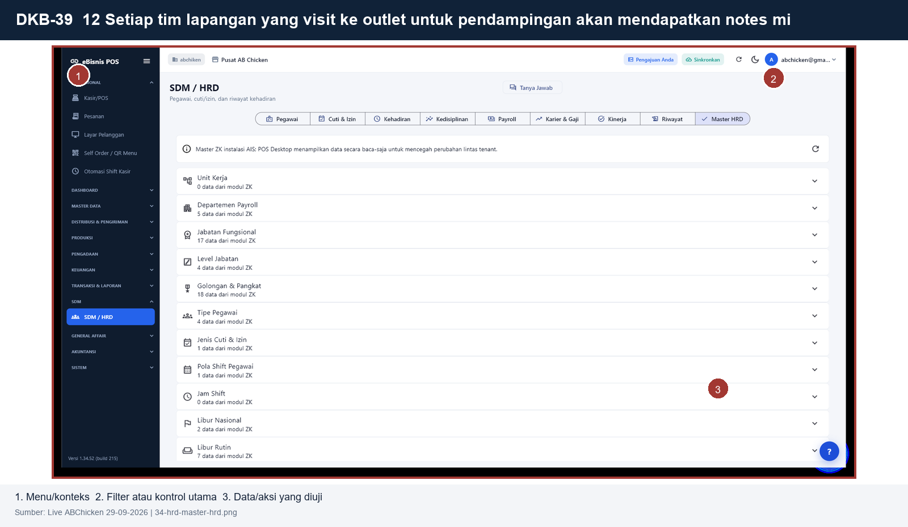

## DKB-40 Karyawan yang tercatat resign dadakan kena potong gaji 50%

- Departemen: HRD
- Posisi menu: SDM / HRD > Aturan Potongan
- Status bukti: LAYAR FITUR + DATA UJI LIVE 50+
- Data pendukung: Penjualan POS (220 record)
- Petunjuk: buka menu sesuai posisi, gunakan filter/kontrol yang ditandai, lalu periksa data dan tindakan pada area daftar.

## DKB-41 Karyawan masa kerja di bawah 10 hari tidak kena minusan

- Departemen: HRD
- Posisi menu: SDM / HRD > Aturan Potongan
- Status bukti: LAYAR FITUR + DATA UJI LIVE 50+
- Data pendukung: Pesanan Outlet (170 record)
- Petunjuk: buka menu sesuai posisi, gunakan filter/kontrol yang ditandai, lalu periksa data dan tindakan pada area daftar.

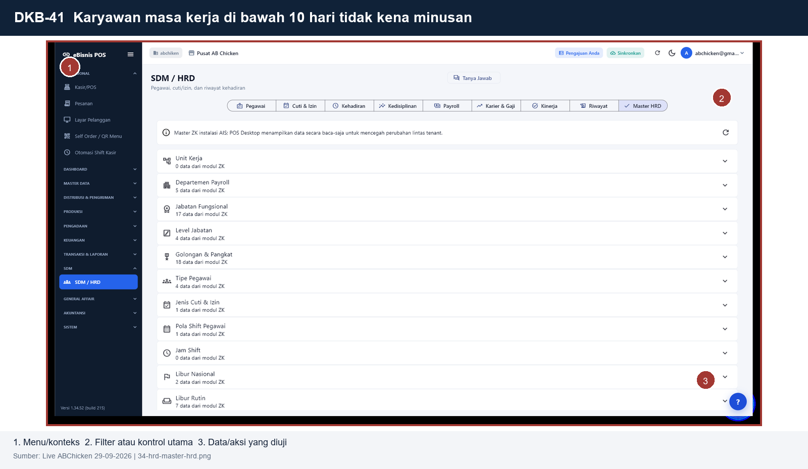

## DKB-42 Purchase Request (dari divisi gudang, packing, bd, rpa)

- Departemen: Purchase
- Posisi menu: Pengadaan > PR
- Status bukti: LAYAR FITUR + DATA UJI LIVE 50+
- Data pendukung: Pesanan Pembelian (170 record)
- Petunjuk: buka menu sesuai posisi, gunakan filter/kontrol yang ditandai, lalu periksa data dan tindakan pada area daftar.

## DKB-43 Laporan Purchase Request

- Departemen: Purchase
- Posisi menu: Pengadaan > Laporan PR
- Status bukti: LAYAR FITUR + DATA UJI LIVE 50+
- Data pendukung: Terima Tagihan Vendor (170 record)
- Petunjuk: buka menu sesuai posisi, gunakan filter/kontrol yang ditandai, lalu periksa data dan tindakan pada area daftar.

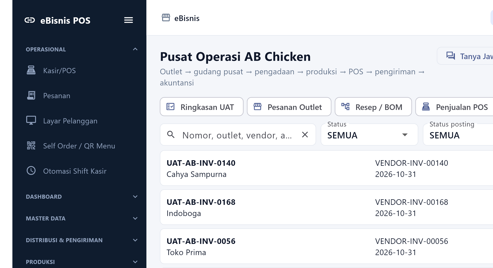

## DKB-44 List Data Supplier

- Departemen: Purchase
- Posisi menu: Master Data > Pemasok
- Status bukti: LAYAR FITUR + DATA UJI LIVE 50+
- Data pendukung: Pembayaran Vendor (170 record)
- Petunjuk: buka menu sesuai posisi, gunakan filter/kontrol yang ditandai, lalu periksa data dan tindakan pada area daftar.

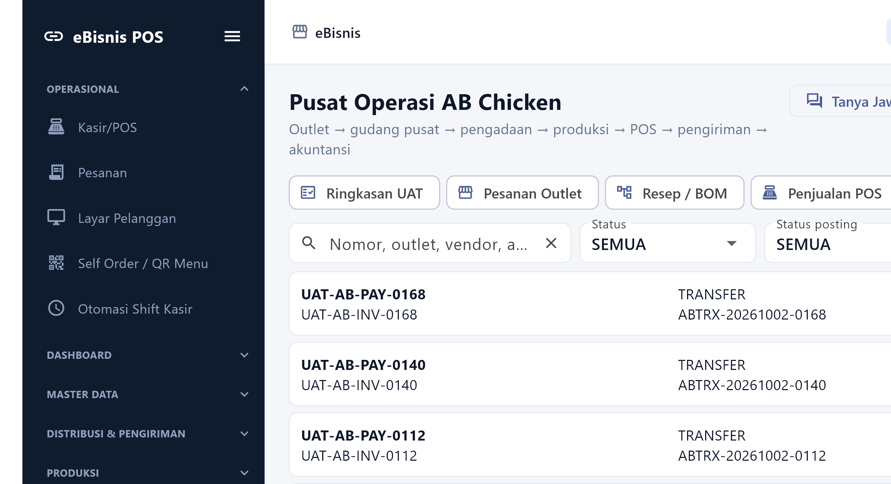

## DKB-45 Daftar Pembelian

- Departemen: Purchase
- Posisi menu: Inventory & Sales > Kulakan
- Status bukti: LAYAR FITUR + DATA UJI LIVE 50+
- Data pendukung: Permintaan Pembelian (170 record)
- Petunjuk: buka menu sesuai posisi, gunakan filter/kontrol yang ditandai, lalu periksa data dan tindakan pada area daftar.

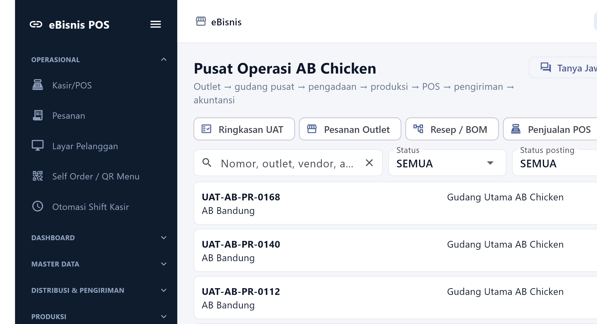

## DKB-46 Laporan Pembelian (Persupplier, Perjenis, Peritem)

- Departemen: Purchase
- Posisi menu: Inventory & Sales > Hutang Supplier
- Status bukti: LAYAR FITUR + DATA UJI LIVE 50+
- Data pendukung: Pesanan Pembelian (170 record)
- Petunjuk: buka menu sesuai posisi, gunakan filter/kontrol yang ditandai, lalu periksa data dan tindakan pada area daftar.

## DKB-47 Reminder Pembayaran Tempo

- Departemen: Purchase
- Posisi menu: Inventory & Sales > Hutang Supplier
- Status bukti: LAYAR FITUR + DATA UJI LIVE 50+
- Data pendukung: Terima Tagihan Vendor (170 record)
- Petunjuk: buka menu sesuai posisi, gunakan filter/kontrol yang ditandai, lalu periksa data dan tindakan pada area daftar.

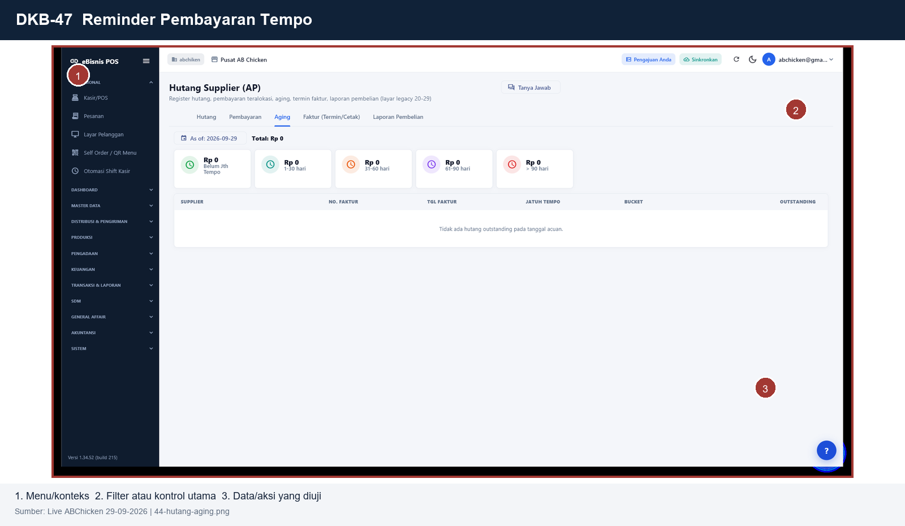

## DKB-48 Data Retur Supplier

- Departemen: Purchase
- Posisi menu: Inventory & Sales > Retur Pembelian
- Status bukti: LAYAR FITUR + DATA UJI LIVE 50+
- Data pendukung: Pembayaran Vendor (170 record)
- Petunjuk: buka menu sesuai posisi, gunakan filter/kontrol yang ditandai, lalu periksa data dan tindakan pada area daftar.

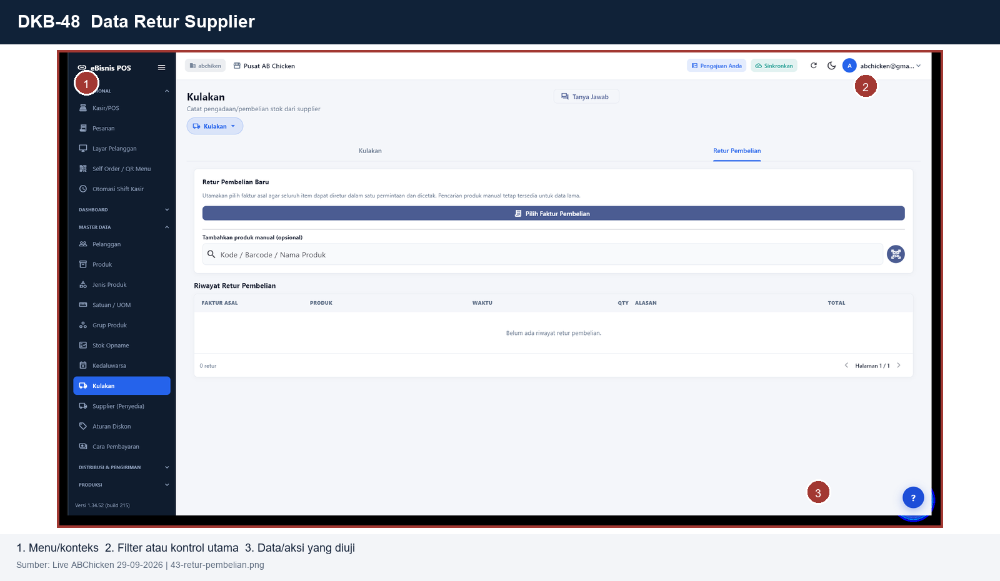

## DKB-49 PO di buat oleh SPV, Business Development, RPA dan divisi lain yang akan order barang langsung link tanpa gudang input manual

- Departemen: Supply Chain
- Posisi menu: Pengadaan > PO
- Status bukti: LAYAR FITUR + DATA UJI LIVE 50+
- Data pendukung: Pesanan Pembelian (170 record)
- Petunjuk: buka menu sesuai posisi, gunakan filter/kontrol yang ditandai, lalu periksa data dan tindakan pada area daftar.

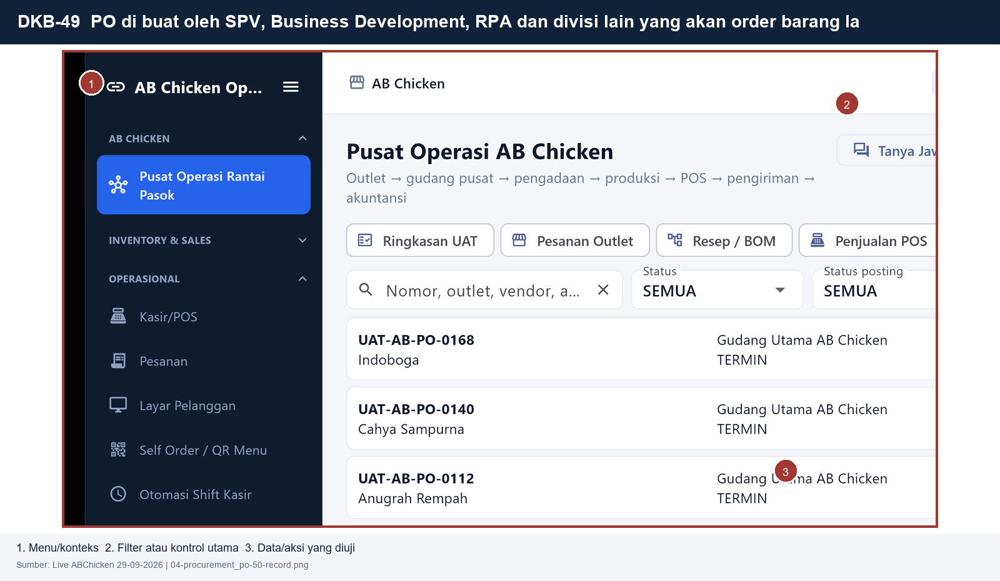

## DKB-50 Gudang (manager/adm) bisa edit PO untuk pengurangan barang

- Departemen: Supply Chain
- Posisi menu: Pengadaan > PO
- Status bukti: LAYAR FITUR + DATA UJI LIVE 50+
- Data pendukung: BAST Gudang Pusat (170 record)
- Petunjuk: buka menu sesuai posisi, gunakan filter/kontrol yang ditandai, lalu periksa data dan tindakan pada area daftar.

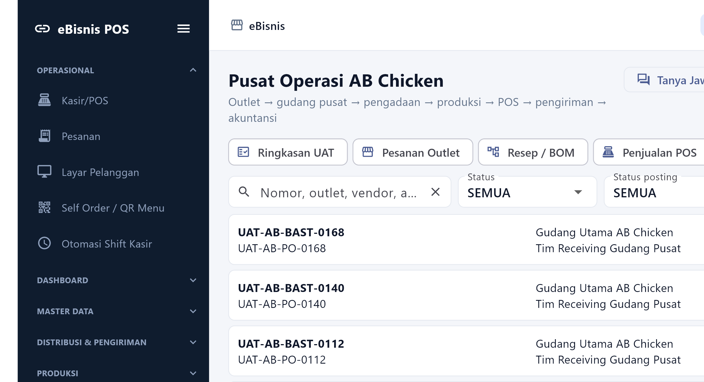

## DKB-51 PO bisa di print dalam bentuk surat jalan (ada kolom ceklist untuk gudang, checker, dan outlet) ada kolom TTD juga untuk gudang delivery dan outlet

- Departemen: Supply Chain
- Posisi menu: Distribusi & Pengiriman > Surat Jalan
- Status bukti: LAYAR FITUR + DATA UJI LIVE 50+
- Data pendukung: Delivery Order dan Pengiriman (270 record)
- Petunjuk: buka menu sesuai posisi, gunakan filter/kontrol yang ditandai, lalu periksa data dan tindakan pada area daftar.

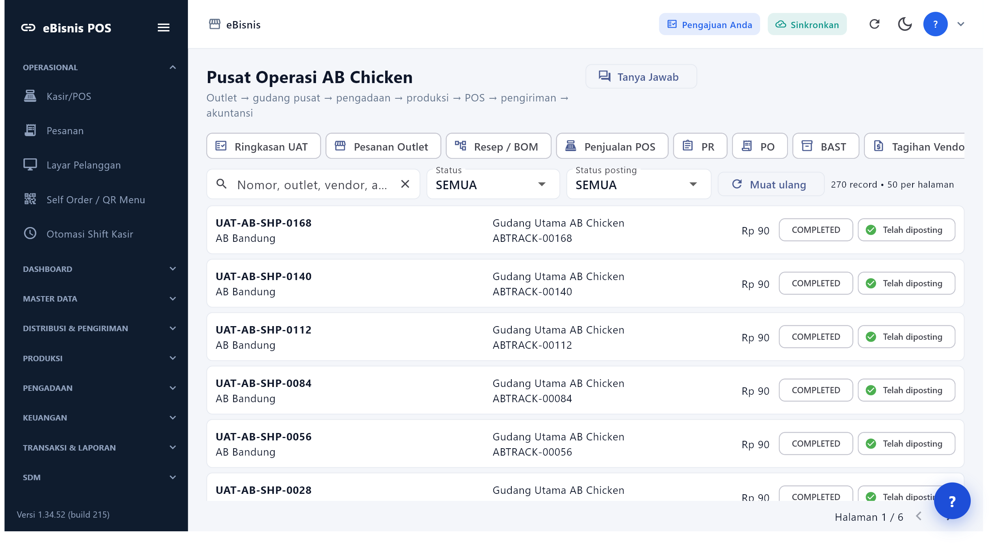

## DKB-52 Bisa menampilkan data pemakaian dan sisa stok outlet pada saat PO ke gudang

- Departemen: Supply Chain
- Posisi menu: Pengadaan > PO > Riwayat Stok Outlet
- Status bukti: LAYAR FITUR + DATA UJI LIVE 50+
- Data pendukung: Backorder Retur dan Klaim (120 record)
- Petunjuk: buka menu sesuai posisi, gunakan filter/kontrol yang ditandai, lalu periksa data dan tindakan pada area daftar.

## DKB-53 Bisa tarik data laporan pengiriman barang harian, mingguan, bulanan. Baik per item/outlet

- Departemen: Supply Chain
- Posisi menu: Distribusi & Pengiriman > Laporan
- Status bukti: LAYAR FITUR + DATA UJI LIVE 50+
- Data pendukung: Pesanan Pembelian (170 record)
- Petunjuk: buka menu sesuai posisi, gunakan filter/kontrol yang ditandai, lalu periksa data dan tindakan pada area daftar.

## DKB-54 Data return dari outlet

- Departemen: Supply Chain
- Posisi menu: Distribusi & Pengiriman > Retur Outlet
- Status bukti: LAYAR FITUR + DATA UJI LIVE 50+
- Data pendukung: BAST Gudang Pusat (170 record)
- Petunjuk: buka menu sesuai posisi, gunakan filter/kontrol yang ditandai, lalu periksa data dan tindakan pada area daftar.

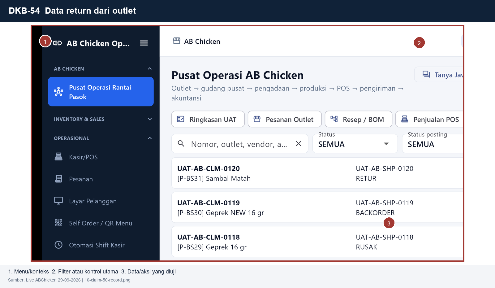

## DKB-55 Pengajuan inventaris toko lewat aplikasi POS, approval ke bagian General Affair dan di acc oleh Keuangan

- Departemen: General Affair
- Posisi menu: Inventaris GA > Pengajuan
- Status bukti: LAYAR FITUR + DATA UJI LIVE 50+
- Data pendukung: Permintaan Pembelian (170 record)
- Petunjuk: buka menu sesuai posisi, gunakan filter/kontrol yang ditandai, lalu periksa data dan tindakan pada area daftar.

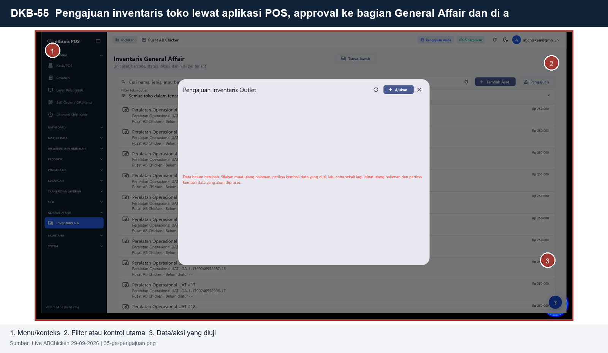

## DKB-56 List inventaris per toko

- Departemen: General Affair
- Posisi menu: Inventaris GA > Daftar Aset
- Status bukti: LAYAR FITUR + DATA UJI LIVE 50+
- Data pendukung: Delivery Order dan Pengiriman (270 record)
- Petunjuk: buka menu sesuai posisi, gunakan filter/kontrol yang ditandai, lalu periksa data dan tindakan pada area daftar.

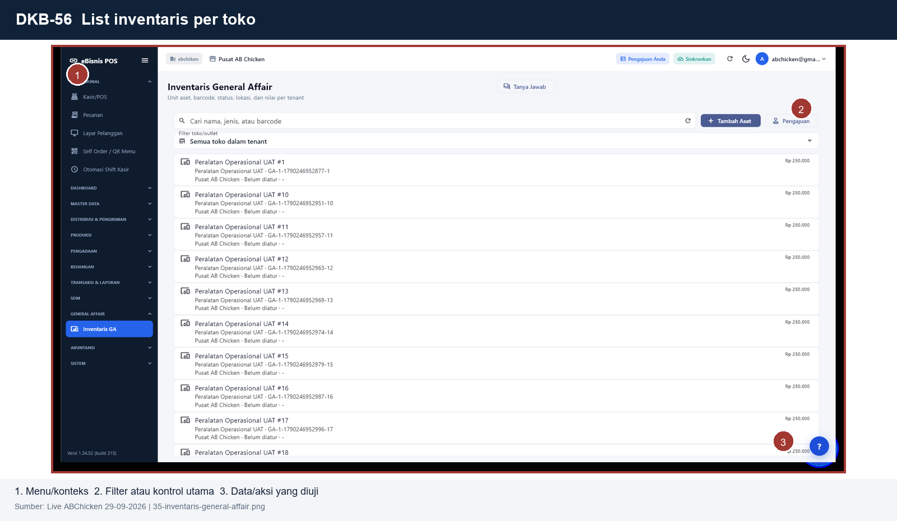

## DKB-57 Pengajuan retur inventaris

- Departemen: General Affair
- Posisi menu: Inventaris GA > Retur
- Status bukti: LAYAR FITUR + DATA UJI LIVE 50+
- Data pendukung: Backorder Retur dan Klaim (120 record)
- Petunjuk: buka menu sesuai posisi, gunakan filter/kontrol yang ditandai, lalu periksa data dan tindakan pada area daftar.

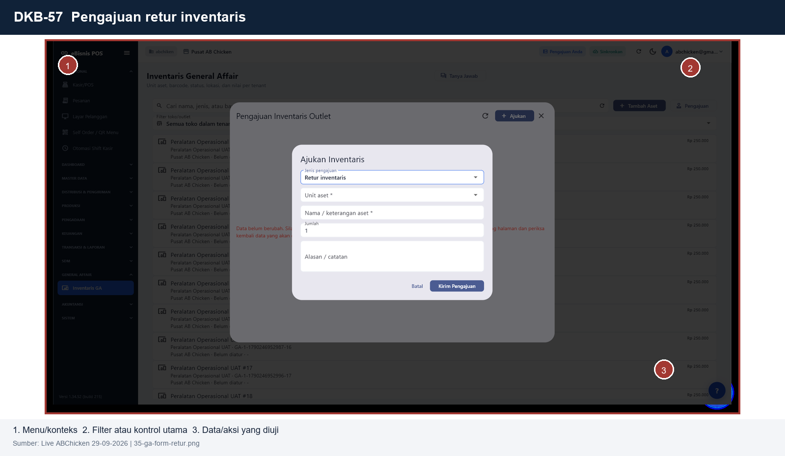

## DKB-58 Pengajuan perpindahan invetaris dari satu outlet ke outlet lainnya

- Departemen: General Affair
- Posisi menu: Inventaris GA > Perpindahan
- Status bukti: LAYAR FITUR + DATA UJI LIVE 50+
- Data pendukung: Permintaan Pembelian (170 record)
- Petunjuk: buka menu sesuai posisi, gunakan filter/kontrol yang ditandai, lalu periksa data dan tindakan pada area daftar.

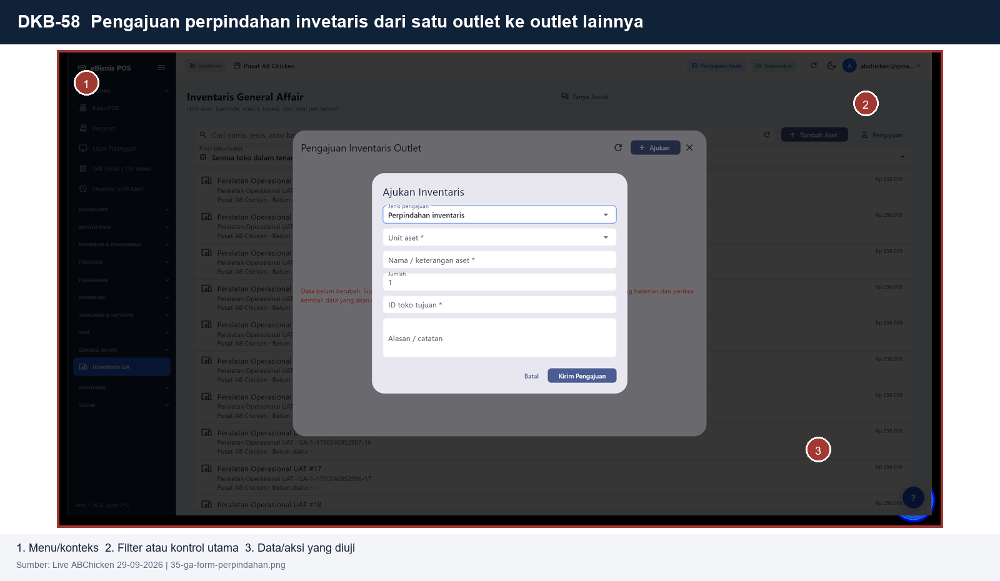

